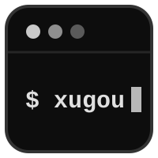

# XUGOU - 基于 CloudFlare 搭建的轻量化监控平台

XUGOU 是一个基于 CloudFlare 的轻量化系统监控平台，提供系统监控和状态页面功能。

## ✨ 核心特性

- 🖥️ **系统监控**

  - 实时监控 CPU、内存、Swap、磁盘、网络、TCP/UDP 连接数、进程数等系统指标
  - 四线路（电信/联通/移动/教育网）Ping 延迟与丢包率、IPv4/IPv6 双栈地址采集
  - Agent 默认每 1 秒采集、每 60 秒批量上报；样本按分钟打成列式压缩块存储
    （线上实测 23.9 B/样本，压缩比 66.7×），40 台规模下 1 秒精度可回溯约 76 小时，更长的窗口自动降到 1 分钟聚合层
  - v5 上报使用块级幂等 upsert（`agent_id + resolution + bucket_start` 唯一键 + 单调守卫）、持久化 Spool、容量上限和指数退避；网络中断或进程重启后继续投递，重传无副作用
  - 全平台支持（agent 由 go 编写，理论上 go 能编译的平台都可以支持）
  - agent 自管理命令：`xugou-agent update`（自升级）、`xugou-agent uninstall`（自卸载）、`xugou-agent status`（运行状态自检）

- ⚡ **WebSocket 实时推送**

  - 仪表盘与详情页通过 WebSocket 实时接收指标，秒级刷新、无需轮询
  - 基于 Cloudflare Durable Object 广播，支持断线重连与最近数据回放

- 🌐 **HTTP 监控**

  - 支持 HTTP/HTTPS 接口监控
  - 自定义请求方法、头部和请求体
  - 响应时间、状态码和内容检查

- 📊 **数据可视化**

  - 实时数据图表展示
  - 自定义仪表盘
  - 7 天历史趋势查询（SQL 降采样，单次查询响应可控）

- 💰 **账单与到期提醒**

  - 记录服务器价格、账单周期、到期时间
  - 到期临近自动提醒，避免忘记续费

- 🌍 **状态页面**

  - 自定义状态页面
  - 支持多监控项展示，可将指定客户端设为隐藏不对外展示
  - 响应式设计

- 🔔 **告警通知**

  - 支持 9 种通知渠道：Resend 邮件、Telegram、飞书、企业微信、钉钉、Bark、Server 酱、WxPusher、Gotify
  - 支持渠道内一键发送测试通知，验证配置有效性

## 🏗️ 系统架构

XUGOU 采用现代化的系统架构，包含以下组件：

- **Agent**: 轻量级系统监控客户端
- **Backend**: 基于 Hono 开发的后端服务，支持部署在 Cloudflare Workers 上
- **Frontend**: 基于 React + TypeScript 的现代化前端界面

当前文档入口见 [文档索引](./docs/README.md)。

## 🚀 快速开始

### 部署指南

首次部署先通过 `wrangler secret put ADMIN_INITIAL_PASSWORD` 配置至少 12 位的初始管理员密码；默认用户名为 `admin`。已有数据库继续使用原账号数据。

[部署指南](./docs/部署指南.md)

## ⭐ 支持一下作者

  

## 🤝 贡献

欢迎所有形式的贡献，无论是新功能、bug 修复还是文档改进。

## 🏢 赞助

感谢以下赞助商支持 XUGOU 的开发：

[Cloudflare](https://www.cloudflare.com/)

## 📄 开源协议

本项目采用 MIT 协议开源，详见 [LICENSE](./LICENSE) 文件。
