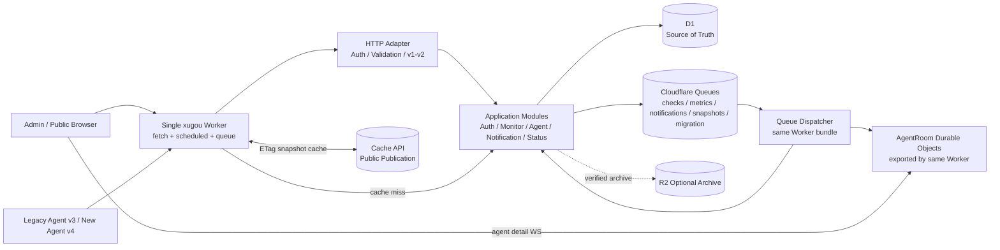
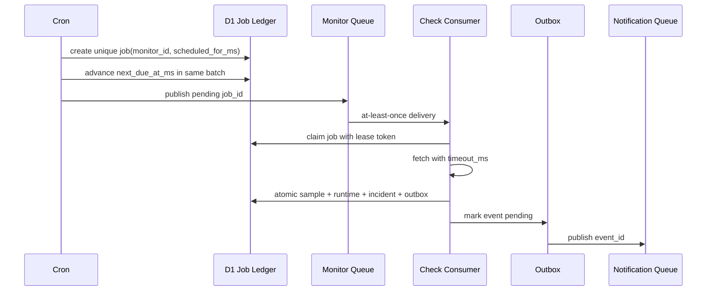

# XUGOU v2 颠覆性重构与兼容迁移方案

> **归档于 2026-08-09。** 本文保留完整设计与执行历史。当前剩余工作以 [`../../剩余问题与修复方案-2026-08.md`](../../剩余问题与修复方案-2026-08.md) 为准。

更新日期：2026-08-09
文档状态：执行中（目标架构：单 Worker 模块化单体）
适用范围：`backend/`、`frontend/`、`agent/`、D1、Durable Objects、Cloudflare Queues、部署流水线与项目文档
产品边界：单实例、单管理员；多租户、开放注册、角色权限不再进入目标模型。

---

## 零、重构执行进度

> 本节随代码重构持续更新。状态含义：✅ 已落地并验证；🚧 已进入兼容迁移；⬜ 后续批次。

### 0.1 当前总览（2026-08-09）

| 工作流 | 状态 | 已落地内容 | 后续收口 |
|---|---:|---|---|
| 单实例边界 | ✅ | 前后端多租户、用户列表、注册、角色和租户过滤链路已移除；保留固定主管理员 | 随 v2 模块迁移删除剩余命名兼容层 |
| 单 Worker 部署 | ✅ | 架构固定为一个 `xugou` Worker；HTTP、Cron、Queue、Assets、DO 已由同一默认导出和同一 Bundle 承载 | 后续 Queue 类型继续复用该入口，不增加 Worker |
| 公共状态止血（SEC-01/SEC-02） | 🚧 | Monitor/Agent 顶层 DTO 已改为白名单投影，`status_publications` 不可变发布物与活动指针已进入公开读路径；每类公开组件最多 100 个、日统计仅保留发布所需 90 天 | 独立复核发现序列化指标可绕过递归敏感键校验，首份 Publication 缺失时公开 GET 仍会现场组装并写 D1；需先修复 0.78 中 P0，再执行线上证据签核与 Contract SQL |
| 泄露凭据止血（SEC-07） | ✅ | Seed 不再创建带凭据渠道；`0018` 清空并停用旧默认 Telegram 渠道，同时清理旧公开快照 | Phase 2 完成全部通知 Secret 加密与轮换 |
| 分页与输入边界（API-05/SEC-06） | ✅ | Monitor、Agent、Credential、Notification History/Resource Setting、Queue Failure、Migration Anomaly 和 Security Audit 高增长 v2 列表均使用有硬上限的 Cursor Contract；Monitor/Agent/Notification Resource Setting 使用 `sort_order + id` 复合 Keyset Cursor，资源管理页分别一次只保留 50/25 条；Monitor History 强制单资源且最多 1440 点，Daily 强制单资源且默认 90/最大 366 天；Export 由 ReadableStream 背压逐页输出；Dashboard 改为精确 SQL 总计 + 两类各最多 200 条概览；v1 Adapter 保留明确硬上限；SQL 全部参数化 | 持续扫描新增查询，禁止重新引入未受限列表或全量导出内存聚合 |
| 管理会话（SEC-03/S5） | ✅ | `admin_sessions` 仅保存 256-bit 随机令牌的 HMAC-SHA256 摘要；登录签发 HttpOnly/SameSite Cookie；写请求校验 Origin + 双提交 CSRF；退出/改密码正确吊销会话；HTTP 与 WebSocket 都只接受不透明 Session；WebSocket 强制同源/显式 Origin Allow-list；凭据化 CORS 默认同源且忽略通配符；旧 JWT 生成、校验、命名、部署版本当密钥和前端 LocalStorage Bearer 读取全部删除；D1 原子限流与结构化审计已上线 | `CF_VERSION_METADATA` 只保留为日志/证据的发布版本标识，不参与认证 |
| 数据迁移门禁 | 🚧 | 旧多用户库逐迁移回放、SQL Export Preflight、Wrangler 本地完整回放和 CI 远程发布门禁已落地；十个迁移域具有租约 Checkpoint、异常隔离、稳定映射、链式 checksum 与显式守恒；`0042` 新增不可变 Contract 证据/活动指针，证据包升级 v2，一次性 SQL 渲染器已通过真实 Wrangler 回放；未验证 Raw Sample 会阻断 Contract | 在线完成实际 Backfill、归档与静默观察，冻结 Queue，重新编译 v2 证据并签核独立 Contract 发布 |
| Agent Credential / Enrollment | 🚧 | `0020` 新增凭据摘要、一次性 Enrollment 和软删除模型；旧 Token 支持 Expand 首次请求/Cron 回填；Contract 鉴权只读未吊销摘要，创建只写随机 Identity Anchor；每个 Agent 最多 5 份活动凭据，历史 metadata 使用 25 条默认、100 条最大值的倒序 Cursor Page；独立 SQL 将旧 `token` 重命名为不含凭据的 `anchor_nonce` 并删除其余宽表字段，删列后注册/导入/鉴权 Runtime 已验证 | 线上全量有效凭据对账与回滚窗口结束后执行独立 Contract SQL |
| 通知 Secret | 🚧 | `0021` 拆分 Endpoint 与 Secret；每渠道独立 DEK、AES-GCM 加密、KEK 包装；Contract 发送/管理只读 Endpoint + Secret，Channel/Template/Rule 不再双写旧 JSON/内容；独立 SQL 已覆盖 `config`、旧模板内容和旧设置/历史清理 | 对账、真实测试发送、KEK 版本与回滚窗口达标后执行独立 Contract SQL |
| v2 模块化目录与 Contracts | 🚧 | 唯一 Composition Root 位于 `worker.ts`；Auth/Profile 与 Dashboard 的真实 Handler 已从 `api/` 迁入模块，`api/` 仅留 v1 导出；Monitor、Agent、Notification、Status、Operations 同样具有版本化入口；模块边界门禁禁止任何 `modules/*` 反向依赖遗留 `api/*`；64 个 v2 Operation 已生成 OpenAPI 3.1；全部 HTTP/Cron/Queue Persistence 使用请求级 D1；管理与公开页面统一生成 Client，Operations UI 已接入 Security Audit 与 Credential Coverage；Contract 模式已返回 v1 `410`、拒绝旧认证协议、停止 Backfill/Legacy Read/Dual Write，并通过物理删表/删列后的 Worker Runtime | 线上静默窗口通过后执行独立 Contract；观察期结束再删除源码中的 v1 Adapter |
| Agent v4 上报 | 🚧 | `/api/v2/agents/register` 与 `/api/v2/agents/reports` 均使用 Bearer Credential，凭据不再复制进注册 JSON；Report 使用 UUID `report_id`、稳定 Payload Digest 和最多 100 条严格样本；Go Agent 已切换 v4、gzip、持久化有界 Spool、两阶段 Ack、崩溃恢复和指数退避；自升级使用 Ed25519 签名 Manifest、大小/SHA-256 校验、fsync 原子替换与健康失败回滚 | 旧活跃版本观察和 v1 退场时间待收口 |
| 异步数据面 | 🚧 | `0025` 建立 Agent Report、Job Ledger、Outbox、Inbox；`0026` 建立 Monitor 幂等样本；`0027/0028` 建立通知投递、不可变 Publication 和 DLQ Ledger；`0041` 建立 Raw Sample R2 归档账本与成员证据；Monitor/Agent 五分钟桶与 Monitor 日桶均从不可变原始样本精确重算 nearest-rank p95，不再以 max 冒充；同一 Worker 消费主 Queue 与 DLQ，并通过私有 R2 Binding 写内容寻址 JSONL；Operations 支持失败记录重放/终止；结构化 Logs/Traces、Readiness 自动核验、Queue 暂停恢复/DLQ 重放/D1 Bookmark 恢复 Runbook 已落地 | 在线验证归档对象与告警；回滚观察窗口结束后显式开启已验证 Sample 清理，并保存恢复演练证据 |
| 实时链路（ARCH-08） | ✅ | 同一 Worker 只导出按 Agent ID 分片的 `AgentRoom`；WebSocket 只允许单 Agent 详情页接入；Dashboard 使用 TanStack Query 投影刷新，公开页只轮询脱敏 Publication；旧 `METRICS_BROADCASTER` Binding/Class/源码/Env 类型已删除，Wrangler v3 DO Migration 明确销毁只含可丢失缓存的旧 Namespace | 发布前保存 `AgentRoom` 连接/错误率基线；发布后归档 DO Migration 执行结果 |
| 依赖与发布供应链 | 🚧 | 生产构建、Workers Runtime、Go Test/Vet 与签名 Manifest 基础链路已落地 | 2026-08-09 复核中 `pnpm audit --prod` 报告 1 critical / 29 high，`govulncheck` 确认 2 条可达漏洞；Agent R2 `latest/` 发布仍为多对象非原子覆盖，需按 0.78 修复并纳入 CI 阻断门禁 |

### 0.2 本轮已交付：管理端不透明会话 Expand

本轮采用兼容性优先的 Expand 步骤，未修改 `users` 旧数据，也未删除任何旧认证字段：

1. `0019_shiny_mysterio.sql` 新增 `admin_sessions`，包含令牌摘要、管理员外键、过期时间、最近使用时间、吊销时间及必要索引。
2. 会话令牌使用 Web Crypto 生成 32 字节随机数；D1 仅保存 `HMAC-SHA256(SESSION_HMAC_SECRET, token)`。
3. 管理端使用 `xugou_session` HttpOnly Cookie；`xugou_csrf` 与 `X-CSRF-Token` 构成双提交校验，状态修改请求同时验证 Origin。
4. 登录响应不再向新前端返回管理 Token；Axios 启用 Cookie，用户资料与管理 Token 均不再写入 `localStorage`。
5. 管理 WebSocket 由浏览器自动携带 Cookie；当前架构已在 0.48 收敛为仅 Agent 详情页接入单 Agent 房间，公开状态页不再使用 WebSocket。
6. 前端启动时只使用 HttpOnly Cookie 恢复会话，并删除早期版本在 LocalStorage 留下的 `token/user`；生成 Client 不读取、不发送该 Token。
7. 修改密码后保留当前 Cookie 会话并吊销同一管理员的其他 D1 会话；退出时立即标记当前会话为已吊销；每日清理任务删除过期会话。
8. 新增会话摘要测试和迁移回放断言；生成迁移清单已包含 `0019`。

部署此批次前置动作：

```bash
# 生成高熵值并通过 Wrangler Secret 注入，值不进入 wrangler.toml 或 Git
openssl rand -base64 48 | pnpm exec wrangler secret put SESSION_HMAC_SECRET

# 发布流水线先应用 D1 迁移，再发布同一个 Worker
pnpm exec wrangler d1 migrations apply D1_DATABASE_NAME --remote
pnpm exec wrangler deploy
```

兼容与回滚说明：`admin_sessions` 是纯新增表，旧 `users`、旧密码哈希和业务数据保持原样；回切旧 Worker 时该表可保留，后续版本继续复用。新 Worker 上线前需先配置 `SESSION_HMAC_SECRET`，并在回滚窗口内保持该 Secret 值稳定。迁移现由发布前 `wrangler d1 migrations apply` 统一执行。

### 0.3 下一批执行顺序

1. 持续扫描 Contract 模式剩余运行入口并扩充“物理删表后”Cron、Queue、管理 API 回归；破坏性 SQL继续只由已签核 v2 证据包渲染，不进入普通 Expand Migration 清单。
2. 持续观察 Raw Sample R2 归档、v1 管理/Agent 命中账本及 `AgentRoom` 线上连接指标；实际静默窗口、Bookmark 恢复演练与全域对账满足后，开启已验证 Sample 清理，重新编译证据并执行独立 Contract 清理发布。旧全局 DO 的代码/Binding 退场已完成，下次符合发布窗口的 Worker 部署会应用 v3 删除迁移。
3. 将其余高价值管理页面逐步纳入 Playwright 交互与视觉基线；Notification 渠道/模板/全局页已作为首个强制门禁。

### 0.4 本轮验证记录

2026-08-02 已通过：

- Backend TypeScript 编译、Wrangler Env 类型一致性和 Worker dry-run 构建。
- API/Problem Contract、Auth/Monitor/Agent/Operations Application、Agent Report/Monitor Check/Notification Consumer 幂等回放、DLQ 捕获与模块边界、0016 多用户数据折叠、0023 默认数据、0024 毫秒超时、0025–0028 异步数据面迁移、SQL Export Preflight、Wrangler 本地完整迁移及二次幂等回放测试。
- Session HMAC、Agent Credential HMAC、持久化限流/审计 metadata、Notification AES-GCM 信封加密与 KEK 重包装安全测试。
- Frontend TypeScript、Vite/PWA 1.3 生产构建、ESLint和零 Peer Dependency 检查；DLQ 管理 API Client、受保护路由、状态筛选、分页、重放与终止交互已进入生产 Bundle。
- Go Agent `go test ./...`、`go vet ./...`、`gofmt` 检查；新增 v4 gzip/Bearer 传输、配置响应、Spool 稳定 ID、容量清理、凭据排除、文件权限和 Ack 崩溃恢复测试。
- `@cloudflare/vitest-pool-workers` 在真实 Workers Runtime 中通过 4 组 Queue/D1 集成测试：Cron 重叠去重、过期租约接管与重复 Agent Job、批次内独立 Ack/Retry、DLQ 重复投递去重。
- Wrangler `4.118.0` 单 Worker dry-run已识别 D1、Assets、DO 与 `XUGOU_JOBS` Queue Binding；仓库 `git diff --check`。

### 0.5 第二安全批次：Agent Credential 与 Enrollment Expand

本批次先建立摘要读路径和完整回填能力，并保留旧 Worker 回切窗口：

1. `0020_messy_sir_ram.sql` 新增 `agent_credentials`、`agent_enrollment_tokens` 和 `agents.deleted_at`。
2. 长期凭据保存为 `HMAC-SHA256(AGENT_TOKEN_PEPPER, token)`；摘要唯一索引负责冲突检测，数据库只保留脱敏 hint。
3. 旧 Agent 首次注册或上报时先查摘要，缺失时再读一次旧列并回填摘要；旧列在 Expand 阶段继续保留，确保旧 Worker 回切后仍可鉴权。
4. 同一 Worker 的 Cron 每分钟最多回填 25 条旧 Token；单条失败保留旧数据供后续重试，不影响监控任务继续执行。
5. 管理端签发 `xge_` 一次性 Enrollment Token，默认 30 分钟过期；注册通过带 `used_at IS NULL`、`revoked_at IS NULL` 和过期条件的单条更新原子消费。
6. 为兼容当前 Go Agent，首次注册使用的 `xge_` Token 在注册后直接成为该 Agent 的长期凭据，Agent 本地无需改配置；重复注册先通过长期凭据识别并返回原 Agent ID。
7. Agent 导出改为非敏感配置白名单；导入文件缺少 Token 时，服务端生成 `xga_` 长期凭据并在响应中只返回一次，前端立即下载独立凭据文件。
8. 删除 Agent 改为软删除：吊销全部凭据、移出公开状态页、停止离线调度并保留指标和历史数据。
9. Agent Token 失效统一返回 401；凭据 pepper 配置缺失返回 503。
10. 旧 JWT Token 生成/校验工具、公开默认密钥及 HTTP/WebSocket 兼容门面已从代码全部删除。

部署此批次前需配置并固定 pepper：

```bash
openssl rand -base64 48 | pnpm exec wrangler secret put AGENT_TOKEN_PEPPER
pnpm exec wrangler deploy
```

兼容与回滚说明：`0020` 只新增表和 nullable 软删除列。Expand/Backfill 期间 `agents.token` 原值保持不动，旧 Worker 可直接回切；新 Worker 优先读取摘要。只有摘要覆盖率达到 100%、旧 Worker 回退窗口结束并完成最终导出后，才单独执行清空/删除旧列的 Contract 发布。

### 0.6 第三安全批次：通知 Secret 信封加密 Expand

本批次把通知渠道的运行读取切到加密模型，同时保留旧 Worker 回切所需的旧配置列：

1. `0021_lyrical_mephistopheles.sql` 新增 `notification_endpoints` 和 `notification_secrets`，两表均以 `channel_id` 级联关联旧渠道。
2. 非敏感地址、接收目标和展示参数写入 Endpoint JSON；Bot Token、API Key、Webhook、Device Key、SendKey、App Token 等按渠道类型进入 Secret JSON。
3. 每个渠道生成独立 256-bit DEK，Secret JSON 使用 AES-256-GCM 加密；DEK 再由 `NOTIFICATION_KEK` 使用独立 IV 和 AES-GCM 包装，D1 保存 ciphertext、IV、wrapped DEK 和 key version。
4. 管理 API 返回的敏感字段统一替换为 `********`；编辑时该占位符由服务端还原为现有 Secret，新值触发重新加密，空的可选 Secret 可显式清除。
5. 新建和更新渠道同时写旧配置与新加密模型；运行发送、测试通知和通知缓存优先组装 Endpoint + 解密 Secret，支持后续 Contract 清理旧列。
6. 同一 Worker 的 Cron 每分钟回填最多 10 个旧渠道；单渠道失败记录错误并留待下次重试，其他监控任务继续运行。
7. 未识别渠道类型按敏感字段名规则默认拆分，降低插件型渠道把 Token 写入 Endpoint 的概率。
8. 新增信封加密往返、错误 KEK、明文排除和迁移结构测试。

部署前生成固定的 256-bit KEK：

```bash
openssl rand -base64 32 | pnpm exec wrangler secret put NOTIFICATION_KEK
pnpm exec wrangler deploy
```

兼容与回滚说明：Expand/Backfill 阶段继续双写 `notification_channels.config`，因此旧 Worker 可直接回切。新 Worker 的发送链路已优先读取加密表。确认全部渠道均有 Endpoint/Secret 投影、测试发送成功且回退窗口结束后，再独立清空旧 JSON 中的敏感值；KEK 在此之前保持稳定并进入受控备份。

### 0.7 第四安全批次：持久化限流、审计与凭据控制面

本批次继续保持一个 Worker 和一个 D1，在现有管理 API 上完成安全控制闭环：

1. `0022_bumpy_earthquake.sql` 新增 `security_rate_limits` 与 `security_audit_events`；限流键和来源 IP 均使用 `SESSION_HMAC_SECRET` 做 HMAC 伪名化，D1 不保存原始 IP、用户名组合或凭据。
2. 登录采用 D1 `INSERT ... ON CONFLICT DO UPDATE ... RETURNING` 原子计数，固定窗口内允许 5 次尝试，第 6 次进入 15 分钟阻断；成功登录清除对应计数，响应包含 `Retry-After`。
3. Enrollment 签发和 Agent 长期凭据轮换使用每管理员/资源每小时 10 次的控制面限流；拒绝、成功、失败都进入结构化安全审计。
4. 审计覆盖登录、退出、资料/密码修改、Agent 注册/软删除、Enrollment 签发/吊销、长期凭据轮换/吊销和通知渠道增删改；metadata 写入前删除 Token、Secret、Password、Authorization、Cookie 等敏感键。
5. 新增受管理会话保护的 `/api/security/audit` 分页查询；查询页大小、页码、事件类型和结果均经过 Zod 硬边界校验。
6. 每日清理过期限流状态，并按 `SECURITY_AUDIT_RETENTION_DAYS`（默认 180 天）清理审计事件。
7. 摘要鉴权兼容路径只查询“从未创建过 Credential 行”的旧 Agent，避免已吊销凭据被旧 `agents.token` 回退链路重新激活。
8. Agent 详情页提供长期凭据元数据、一次显示的新凭据、轮换与吊销操作；新增 Agent 页改为显式签发一次性注册令牌，并提供最近令牌状态与吊销操作，避免页面重复挂载时自动浪费令牌。
9. 最后一个有效长期凭据受数据库条件更新保护；管理列表与 API DTO 都排除 Token 摘要和 Enrollment 摘要。
10. 新增安全 metadata、限流策略、审计查询契约和迁移结构测试；全套 Backend、Frontend 构建与安全测试通过。

兼容与回滚说明：`0022` 只增加持久化控制表；旧 Worker 回切时会忽略这些表。限流和审计故障不会改变 Agent/通知业务数据。审计保留期可通过 Worker vars 调整，密钥必须与管理 Session 使用的 `SESSION_HMAC_SECRET` 保持一致。

### 0.8 第五批次：初始化门禁与迁移 Preflight

1. 全新数据库取消代码内固定管理员密码；首次创建 `admin` 时必须读取至少 12 位的 `ADMIN_INITIAL_PASSWORD` Worker Secret，并使用 bcrypt cost 12 保存。已有管理员数据不改写。
2. 管理员创建迁入 Auth 登录用例：仅当 `users` 为空、用户名为 `admin` 且输入密码与 `ADMIN_INITIAL_PASSWORD` 经 bcrypt 校验一致时原子创建；请求与冷启动入口没有初始化 Promise、DDL 或 Seed。
3. 新增 `backend/tooling/migrations/preflight.ts`，可读取 SQLite 文件或 Wrangler D1 SQL Export 并生成机器可读 JSON，包含 quick check、外键、管理员数、非法通知 JSON、孤儿关联、凭据/通知回填覆盖率和旧历史表清单。
4. `readyForExpand` 与 `readyForCredentialContract` 分离；后者只有 Agent Credential 和通知 Endpoint 全量覆盖后才为真，避免在 Expand/Backfill 尚未完成时误执行明文字段 Contract。
5. 迁移回放测试直接调用同一 preflight 实现，防止发布说明与真实门禁逻辑漂移；部署指南补齐四个 Worker Secret 和升级前导出/预检命令。

兼容与回滚说明：已有库仍按原密码登录；`ADMIN_INITIAL_PASSWORD` 仅参与空库首次登录，也不会覆盖现有哈希。Preflight 只读本地导出副本，既不执行 DDL，也不更改线上 D1。

### 0.9 Phase 1 第一条纵向切片：Auth 模块

1. 新建 `backend/src/modules/auth`，按 `domain`、`application`、`persistence`、`http` 和 `composition` 组织；这些目录仍编译进同一个 Worker Bundle，不增加任何网络边界或部署单元。
2. `AuthUseCases` 只依赖 `AuthRepositoryPort`、`PasswordVerifierPort` 和领域 DTO；bcrypt 与现有 D1 Repository 由 Composition Adapter 注入。
3. 登录、`/me`、退出、会话升级、限流和审计路由实现已迁入模块 HTTP Adapter；原 `api/auth.ts` 与 `services/AuthService.ts` 只保留短期导入兼容门面，避免一次性修改所有调用方。
4. Wrangler 入口路径继续是 `backend/src/index.ts`，其内容只转发默认入口和 DO named export；唯一 HTTP/Cron/Assets Composition Root 已迁入 `backend/src/worker.ts`。
5. 新增 Auth Application 纯单元测试及模块依赖扫描：domain/application 层引入 Hono、Drizzle、config、db、api 或旧 repositories 时测试会失败。
6. 当前 persistence adapter 暂时复用已验证的单管理员 D1 查询；后续请求级 Db Port 落地后移除该 adapter 和旧兼容门面。

兼容与回滚说明：外部 `/api/auth/*` 路径、Cookie、CSRF 和响应 DTO 均保持不变；旧前端与已有 Session 数据不受目录迁移影响。此批次仅改变单 Worker 内部依赖方向。

### 0.10 第六安全批次：Notification KEK 渐进轮换与覆盖率对账

1. 通知信封记录的 `key_version` 进入真实读路径：解密时按记录版本选择当前 KEK 或轮换窗口内的 Previous KEK，未知版本直接报告配置错误。
2. `NOTIFICATION_KEK_VERSION` 指定当前版本；轮换期间由 `NOTIFICATION_KEK_PREVIOUS` 和 `NOTIFICATION_KEK_PREVIOUS_VERSION` 提供上一版本。只有显式设置 `NOTIFICATION_KEK_ROTATION_ENABLED=true` 后，Cron 才会每分钟最多重包装 10 个 DEK，不重新加密 Secret 明文和业务 ciphertext。
3. 重包装使用新的 AES-GCM IV，并通过 `channel_id + previous_key_version` 条件更新避免并发覆盖；成功批次写结构化日志与 `notification.kek.rotate` 系统审计。
4. 新增 `/api/security/migration-coverage` 管理接口，汇总有效 Agent 的 Credential 摘要覆盖率、通知 Endpoint 覆盖率、加密 Secret 行数和当前 KEK 版本覆盖率，只返回计数与门禁布尔值。
5. `readyForCredentialContract` 只有 Agent 凭据全覆盖、通知 Endpoint 全覆盖且所有 Secret 行均使用当前 KEK 时才为真。
6. 新增旧 KEK 解包、新 KEK 重包装、仅持有新 KEK即可解密、缺失旧版本配置时报错的加密测试。
7. 修复通用数值环境变量解析：缺失、`null` 或空字符串现在使用声明的 fallback，避免留存期、批大小、缓存 TTL、Agent 上报间隔等配置在变量缺失时被错误解析为下限值。

轮换顺序：先备份当前 KEK，将其配置到 `NOTIFICATION_KEK_PREVIOUS` 并设置 Previous Version；再设置新 `NOTIFICATION_KEK` 与递增的 `NOTIFICATION_KEK_VERSION`。覆盖率达到 100% 且完成解密/发送验证后删除 Previous KEK。回切旧 Worker 前需保留旧 KEK；旧 Worker 不识别新版本记录，因此轮换动作需安排在应用回切窗口结束后，或随旧版本兼容补丁一同发布。

### 0.11 Phase 1 迁移执行面：Wrangler 账本桥接

1. `wrangler.toml` 为唯一 D1 Binding 配置 `migrations_dir = "backend/drizzle"` 和 `migrations_table = "migrations"`。Wrangler 直接识别旧运行时迁移器记录的同名 SQL 文件，避免第二套账本重复执行 `0000`–`0022`。
2. Worker 请求与 Cron 入口已删除 `runMigrations`、`checkAndInitializeDatabase`、生成迁移清单和运行时 Seed；对应源文件与构建步骤均已移除。
3. `0023_runtime_bootstrap_defaults.sql` 把通知模板、全局通知设置、单例状态页和初始关联迁入幂等数据迁移，同时清理旧非主管理员记录；业务 Monitor/Agent 在 `0017` 已解除所有权列后完整保留。
4. GitHub Actions 在同一 Worker 发布前依次执行远程 D1 SQL Export、只读 Preflight、`wrangler d1 migrations apply --remote` 和 Worker deploy。临时 Export 在 Job 末尾清理，也不上传为 Artifact。
5. Preflight 支持 `--sql-export`，先在临时 SQLite 中恢复 Wrangler 导出再校验；`--allow-empty` 仅允许完全空的新库进入初始迁移，部分缺表仍触发 blocker。
6. 测试同时模拟旧 `migrations(id,name,timestamp)` 表与 Wrangler 的 `CREATE TABLE IF NOT EXISTS`/仅 name 插入行为，并真实运行完整 `wrangler d1 migrations apply --local`，第二次 list 必须没有待执行迁移。
7. `0017` 的外键迁移控制改用 D1 文档支持的 `PRAGMA defer_foreign_keys = true`；每个迁移失败由 Wrangler 回滚该迁移，前一个成功版本继续留在账本。

兼容与回滚说明：旧 Worker 仍可读取同一业务表；新迁移均保持 Expand 或兼容列。应用版本回切不回退迁移账本，后续采用前向修复。部署前 Export 和 Cloudflare 自动 migration backup 共同提供数据恢复点。

### 0.12 Phase 1 第二条纵向切片：Monitor v2

1. 新建 `backend/src/modules/monitors` 的 domain/application/persistence/http/composition 分层；Application 只依赖 `MonitorRepositoryPort` 和领域模型，Drizzle/Hono 分别位于 Adapter。
2. 新增 `/api/v2/monitors` CRUD。列表使用稳定 `sort_order + id` 复合 Cursor 与 `limit <= 100`，返回 `next_cursor/has_more`；请求 schema 为 strict Zod，URL 仅接收 HTTP(S)，Header 数量、键和值及 Body 大小都有硬上限。
3. v2 错误采用 `application/problem+json`，固定输出 type、title、status、code、trace_id，并支持字段级 errors；新增 Problem Contract 测试。
4. Monitor v2 Composition 每次请求通过 `createDb(env)` 注入 Drizzle 实例，未读取旧模块级可变 DB；Auth/Agent 等旧 Adapter 将随各自切片迁移逐步退出全局实例。
5. `0024_lying_johnny_storm.sql` Expand 新增 `monitors.timeout_ms` 并按 `timeout * 1000` 回填旧数据；旧秒字段继续双写，v1 前端与旧 Worker保持原语义。
6. 实际检查链路优先使用 `timeout_ms`，支持非整秒值；Abort Timer 在成功、网络错误和超时路径统一清理。v2 DTO 明确使用 `interval_seconds`、`timeout_ms`、`response_time_ms`。
7. Monitor 新增、更新和删除写安全审计；删除通过请求级 D1 batch 同步清理通知设置、热历史、每日统计、Rollup、Incident 和 Monitor 主记录。
8. Worker Binding 类型改由 `wrangler types` 生成，手写代码只补 Secrets；Wrangler、Workers Types、Hono、Drizzle 和 PWA 依赖已升级到当前兼容版本，Peer Dependency 检查通过，compatibility date 更新为 `2026-08-01`。

兼容与回滚说明：v1 `/api/monitors` 继续读写秒字段并同步毫秒列；v2 使用精确毫秒。旧 Worker 回切后会忽略新增列，期间 v2 写入同时维护旧列，所以监控仍按向上取整后的秒值执行。

### 0.13 Phase 1 第三条纵向切片：Agent v2 与 v4 Report

1. 新建 `backend/src/modules/agents` 的 domain/application/persistence/http/composition/queue 分层；管理列表、详情、更新和软删除由 `/api/v2/agents` 提供，DTO 从类型层排除 Token、Digest、地理精度和账单字段。
2. 管理列表使用稳定 `sort_order + id` 复合 Cursor 和 `limit <= 100`；更新请求使用 strict Zod，并在 Application 合并现值后校验 `report_interval_seconds >= collect_interval_seconds`；错误统一为 Problem Details。
3. 新增 `/api/v2/agents/reports`：Agent Credential 放在 Bearer Header，Body 不携带 Token；`report_id` 必须是 UUID，单批 1–100 个样本，时间、百分比、数组长度和字符串长度均有硬边界。
4. Agent 鉴权优先读取 `agent_credentials` HMAC Digest；兼容期仅对“从未产生 Credential 行”的旧 Agent 回读一次 `agents.token` 并写入摘要。已吊销 Agent 不经过旧列重新激活。
5. `0025_peaceful_tyrannus.sql` 新增 `agent_reports` 和 `agent_report_samples`。Report 保存规范化、去 Token 的 Payload 及 SHA-256 Digest；同一 `report_id`、同内容重投复用 Job，不同内容复用同一 ID 返回 `REPORT_ID_REUSED`。
6. HTTP 在 D1 batch 中写入 Report 与 `agent.report.process` Job 后同步等待 Queue `send`；投递异常时数据保持 pending，由 Cron Relay 补投，Agent 重试不会重复创建业务任务。
7. Queue Consumer 使用 `job_id + lease_token` 条件领取，重复消息、并发消息和租约过期接管均由 Job Ledger 控制；处理批次原子写不可变样本、最新指标、Agent Heartbeat、Outbox 和 Job 完成状态。
8. v4 最新指标仍双写现有 `agent_latest_metrics`，因此旧前端详情页继续工作；原始 v4 样本单独保存在 `agent_report_samples`，后续历史模型切换时无需从旧动态分区反推。

兼容与回滚说明：v1 `/api/agents/status` 与当前 Go Agent 协议继续保留，新 v4 路径为 Expand。旧 Worker 会忽略新增表；回切期间 Report/Job 行可保留，新版本恢复后由 Relay 继续处理。Go Agent 完成 Spool 与 v4 切换前不删除旧上报 Adapter。

### 0.14 Phase 3 第一批：同 Worker Queue、Job Ledger 与 Monitor 调度切换

1. `wrangler.toml` 新增 `XUGOU_JOBS` Producer，并把同一个 `xugou-jobs` Queue 的 Consumer 指向当前 Worker；`fetch`、`scheduled`、`queue`、Assets 和 DO 仍由一个默认导出与一个 Bundle 发布。重试耗尽进入 `xugou-jobs-dlq`。
2. `0025` 新增 `async_jobs`、`domain_outbox`、`processed_events`：`dedup_key` 唯一，Job 保存状态/尝试次数/可用时间/租约/最后错误，Outbox 以 `event_id` 去重，Inbox 以 `consumer + event_id` 去重。
3. Cron 的 Monitor 主路径已切换为 `scheduleDueMonitorChecks`：只读取到期记录，以 `monitor_id + scheduled_for_ms` 创建唯一 Job，并同步推进 `next_check_at`；Cron 不再批量执行外部 HTTP 请求。
4. `0026_previous_mantis.sql` 新增 `monitor_check_samples`，`job_id` 为主键。Monitor Consumer 以毫秒 Timeout 执行请求，在一个 D1 batch 中写 Sample、Runtime、5 分钟 Rollup、Incident、状态历史、Outbox 和 Job 完成状态。
5. Monitor 状态变化通知从旧 Cron 内联调用迁到 Outbox Consumer；供应商没有原生幂等键时仍保留极小的崩溃窗口重复语义，Inbox 和完整通知历史用于呈现与重放审计。
6. HTTP 首次 Queue 投递和 Cron Relay 共用版本化 Message Envelope；Relay 只查询 D1 中到期的 pending/retry Job 与 pending Outbox，不依赖 isolate 内存。
7. 新增 Agent Report 与 Monitor Check Consumer 的真实 SQLite 批次测试，覆盖重复 Job、不可变样本、最新状态、Outbox、Inbox 幂等；Wrangler 本地迁移回放覆盖 `0025`/`0026`，Worker dry-run确认 Queue Binding 和唯一 Consumer 入口。

部署顺序：先创建 `xugou-jobs` 与 `xugou-jobs-dlq`，再应用 `0025`/`0026`，最后发布同一 Worker。旧 Worker 回切前保留 Queue 和新增表；若回切，先暂停 Queue Consumer，避免旧 Cron 与新 Consumer 同时检查同一 Monitor。再次前滚后 pending/retry Job 可按账本安全补投。

### 0.15 Phase 3 第二批：Notification 与不可变 Status Publication

1. `0027_nappy_strong_guy.sql` 新增 `notification_events`、`notification_messages`、`notification_attempts` 和 `notification_cooldowns`；`0028_massive_shriek.sql` 为每条 Message 固化 `cooldown_minutes`，避免配置变更影响已提交事件的投递语义。
2. Monitor Outbox 不再由通用副作用函数直接调用供应商。`OutboxDispatcher` 按事件类型调用 `StatusPublicationConsumer` 和 `NotificationOutboxConsumer`，每个 Consumer 使用独立 `consumer + event_id` Inbox；一个 Consumer 失败不会回滚另一个已完成的安全投影。
3. Notification Consumer 先把领域事件投影为 `event_id + channel_id` 唯一 Message，再使用 60 秒租约调用渠道 Adapter。每次调用都写 Attempt、耗时、错误分类和 retryable；成功后在同一 D1 batch 中提交 Message、持久化 Cooldown 和旧历史兼容行。
4. 供应商失败使用指数退避。内部最大尝试耗尽后持续让 Queue 进入失败语义，由平台 `max_retries` 把原 Outbox Message 移入 DLQ；管理端重放会同时重置对应失败 Notification Message。
5. 新增 `status_publications` 与 `status_publication_state`。Publication 以 `source_event_id` 幂等生成、Payload 不可变、ETag 使用 SHA-256，活动指针单独更新；公开接口优先读取活动 Publication，旧 `public_status_snapshots` 仅作为回切兼容写。
6. 发布前对完整 JSON 执行递归敏感键检查，Token、IP、精确地理位置、请求 URL/Header/Body、密文包装字段即使出现在嵌套 Metrics 中也会阻止发布。
7. 状态页配置变化通过 `status.rebuild.requested` Outbox 进入同一 Queue；Monitor Check 与 Agent Report 事件也触发 Publication，因此公开页不在请求路径拼装大查询。
8. 每日清理保留活动 Publication，同时按 Worker Vars 清理旧 Publication、已处理 Inbox、已关闭 Queue Failure 和已完成 Notification Event；级联清理 Message/Attempt。

兼容与回滚说明：新发送路径仍调用现有加密渠道 Adapter，并继续写 `notification_history`，旧管理页可直接查看结果。回切旧 Worker 时新增投递表和 Publication 可保留；回切前暂停主 Queue，防止旧内联通知与新 Message Consumer 同时投递。

### 0.16 Phase 3 第三批：DLQ 持久化管理面

1. `xugou-jobs-dlq` 增加第二个 Consumer 配置，但 Consumer 仍是当前 `xugou-app` Worker。主 Queue 重试耗尽后，DLQ 入口只落 `queue_failures` 并显式 ack，不直接再次执行副作用。
2. Failure Ledger 保存 Queue/Message ID、版本化信封、业务源 ID、投递次数和 Job/Outbox 最后错误；`queue_name + message_id` 唯一，DLQ 自身重复投递不会产生重复工单。
3. 新增受管理 Session/CSRF 保护的 `/api/v2/operations/queue-failures` Cursor 列表，以及 `/:id/replay`、`/:id/terminate` 操作。API 返回 Problem Details，并为重放/终止写安全审计。
4. 重放先恢复源 Job/Outbox 的 pending 状态和租约，再等待主 Queue `send` 成功后关闭 Failure；Notification Outbox 重放同时恢复已耗尽的 Message。发送异常时 Failure 保持 open，Cron Relay 可继续补投源记录。
5. 终止会把源 Job/Outbox 和关联 Notification Message 置为终止状态，保留 Failure、Attempt 和业务 Payload 供审计，不删除历史。
6. SQLite Consumer 测试覆盖 Monitor 状态变化 → Notification Message → Attempt/Cooldown/History、重复消费零重复发送，以及 DLQ 信封落账；Operations Application 测试覆盖分页、重放、关闭冲突和终止。
7. 前端新增 `/operations/queue-failures` 受保护页面和类型化 API：支持 open/replayed/terminated 筛选、50 条 Cursor Pagination、错误详情、单条重放及带确认的终止；桌面与移动导航均已接入，中英文文案同步完成。

该管理面不调用 Cloudflare REST API，也不引入运维服务；所有查询、状态恢复、Queue Binding 调用和审计仍在单 Worker 内完成。

### 0.17 Phase 3 第四批：Go Agent v4 持久化上报

1. Go Reporter 已从旧 `/api/agents/status` 切换到 `/api/v2/agents/reports`，使用 Bearer Credential 和 `Content-Encoding: gzip`；信封显式携带 `protocol_version=4`、Agent 版本、UUID `report_id` 与最多 100 条样本。
2. 新增 `agent/pkg/spool`。每次采集先把不含 Token 的样本写入权限为 `0700/0600` 的目录和文件，再由最老样本组批；默认容量 64 MiB、默认单请求压缩上限 512 KiB。
3. 组批时原子写 `inflight.json`，网络错误、服务端 5xx 与进程重启都重用相同 Payload/`report_id`；2xx 后先把 inflight 原子改名为 acked manifest，再逐项清理，Ack 中途退出由下次启动完成。
4. 单轮按执行预算追赶最多 10 个批次；单批失败最多 5 次指数退避并加入随机抖动。服务端已持久化但 Queue 暂不可用时，重复请求按相同 Payload Digest 返回 duplicate 后安全确认本地 Spool。
5. 新增 `--spool-dir`、`--spool-max-bytes`、`--report-max-compressed-bytes` 与 `--token-file`；Unix 凭据文件要求 `0600`。旧 `--interval` 只补齐尚未通过新参数、环境变量或配置文件设置的间隔。
6. v4 请求体支持有上限的 gzip 流式解压：压缩体上限 1 MiB、解压后上限 2 MiB，未知 Content-Encoding 和超限 Payload 在 Zod 前终止解析。
7. v4 升级指令不再直接等同于 `auto_update`，而是使用上报的 Agent 版本与 `LATEST_AGENT_VERSION` 做语义版本比较，避免已是最新版时重复触发升级。
8. 原内存 Ring 已删除；Agent README 和根 README 已同步新默认间隔、凭据文件、Spool、gzip 与恢复语义。

兼容与回滚说明：新 Agent 使用 v2 Bearer 注册端点把 Enrollment Token 绑定为长期 Credential，随后使用 v4 数据面；旧二进制在 Expand 窗口仍可使用旧注册/状态协议。Spool 文件不含凭据，二进制切换时可原位复用。

### 0.18 Phase 3 第五批：Workers Runtime Queue/D1 集成门禁

1. Backend 引入 `vitest` 与 `@cloudflare/vitest-pool-workers`，`vitest.config.ts` 直接读取 Wrangler 配置和 `drizzle/` 迁移；每个用例在隔离 D1 中运行完整 0000–0028 迁移。
2. 测试直接调用生产默认导出的 `scheduled`/`queue` Handler，使用 Workers 官方 `createScheduledController`、`createMessageBatch`、`createExecutionContext` 和 `getQueueResult`，不维护第二套伪运行时。
3. Cron 重叠用例连续执行两次相同时刻的调度，真实 D1 中只产生一条唯一 Monitor Job。
4. Agent 用例预置过期 Processing Lease，同批投递两条重复消息；Consumer 接管租约后只生成一条不可变 Sample 和一条 Outbox Event，两条消息均安全 Ack。
5. 部分批次失败用例同时投递已终结 Job 和故意损坏的 Outbox Payload，断言前者独立 Ack、后者独立 Retry，已完成的 Status Inbox 不回滚。
6. DLQ 用例重复投递同一 Message ID，断言 Failure Ledger 仅保留一条 open 记录和最高投递次数。
7. `worker.ts` 的平台入口改为 `ScheduledController`、`MessageBatch<unknown>` 和 Workers `ExecutionContext` 的强类型签名；Backend 主 TypeScript 工程显式加载 Workers Types。
8. 新增 `pnpm test:workers` 根命令和 Backend 脚本，先对 Runtime Test 严格类型检查，再运行 Workerd 集成用例；本批 4 组用例、Backend Build 和现有 Module Suite 已全部通过。

该门禁只启动本地 Workerd 测试运行时和隔离存储，不产生新部署单元、新 Worker 或额外运维服务。

### 0.19 Phase 3 第六批：Agent 事件化通知与 Legacy Ledger 收敛

1. Agent Report Consumer 在同一 D1 Batch 中提交 Sample/Latest/Report/Job 之外，还以 `report_id` 生成确定性 `agent.metrics.observed` 和可选 `agent.status.changed` Outbox Event；资源阈值使用整个上报批次的峰值，而不是只看最后一条样本。
2. Agent 恢复上线只在原状态非 active 时产生一条状态事件；同一 Report 重放由 Outbox 主键、Notification Message 唯一键和 Consumer Inbox 三层去重。
3. Cron 离线判定已删除“先更新状态、再内联调供应商”的主路径。现在用条件 `INSERT ... SELECT` + 条件 `UPDATE` 的 D1 原子 Batch 同时提交 offline 事件和状态；并发上报先恢复 Agent 时，过期 Cron 候选不会误报。
4. Notification Consumer 已支持 `agent.status.changed` 和 `agent.metrics.observed`，复用资源级/global-agent 设置、Agent Template、加密 Channel Adapter、租约、Attempt、Cooldown 与 History；CPU/内存/磁盘同批超限合并为一条通知。
5. Status Publication Consumer 监听 Agent 状态事件，offline 切换后由同一 Queue 刷新不可变公开投影。
6. 旧 `/api/agents/status` 不再直接写 Agent/Metric/Rollup 或内联发送通知，而是先投影为严格 v4 Command，再复用 `AgentUseCases.acceptReport`、Credential 摘要、Report Ledger 和 Queue Publisher。
7. Legacy Adapter 使用“Credential SHA-256 摘要 + 规范化的旧 Payload + 无时间戳时的 Report Interval 窗口”生成 UUID 形式的确定性 `report_id`；Token 不进入 Report JSON，重试不重复入库，不同 Credential 不共用 ID。
8. Legacy 宽松指标在 Adapter 边界完成有限数、百分比、数组长度、Map 值和时间规范化，随后必须通过 v4 strict Zod；旧配置 MD5/204/`update=1` 响应协商保持。
9. SQLite Consumer 回放新增 Agent online + CPU/内存/磁盘聚合告警、重复消费零重复发送；Workers Runtime 新增 offline 事件与状态原子性用例；Legacy Adapter 单测覆盖稳定 ID、凭据隔离、Token 排除和时间窗口。

兼容与回滚说明：Expand 中 v1 URL 和原响应形式继续存在，旧 Agent 不需更改 Token 或重新注册。新主路径接受后即已把 Report/Job 持久化；Queue 短暂投递异常时返回 503 促使 Agent 重试，确定性 ID 保证重试命中同一账本。

### 0.20 Phase 1/3 收口：Notification/Status v2、生成 Contract 与 Queue Health

1. `modules/notifications` 建立 Domain Command、Application Port/Use Case、Compatibility Persistence Adapter、Composition 和 strict HTTP Route；Channel、Template、Setting、History 管理面全部暴露 `/api/v2/notifications/*`，错误统一为 Problem Details。
2. v2 Notification Setting 使用强类型 Channel ID 数组、固定 Target Type、百分比/冷却边界和 Global/Resource Target 交叉校验；History 从 page/offset 切为按 ID 降序的 Cursor Pagination。
3. Channel v2 继续复用已落地的 Endpoint/Encrypted Secret 合并与渠道类型校验；创建/修改/删除保留 Security Audit，管理响应仍只包含脱敏 Config。
4. `modules/status` 建立 Config/Public/Metrics Use Case 与 v2 Route。公开 `/api/v2/status/public` 优先直接读取活动不可变 Publication 的原 Payload 和 SHA-256 ETag，`If-None-Match` 命中返回 304，不在请求路径重建大投影。
5. Auth Middleware 的公开白名单显式加入 v2 Status Public/Data Metrics，其他 Notification/Status Config 路由仍由管理 Session + CSRF 保护。
6. Operations Application 新增 Queue Ledger Health：按状态汇总 `async_jobs`、`domain_outbox`、`notification_messages`，计算 Job/Outbox 最旧可用记录延迟并统计 open DLQ；前端在同一失败管理页展示四组卡片。
7. `backend/tooling/contracts/generate-openapi.ts` 生成 OpenAPI 3.1 Contract，并扫描 5 个 v2 Route 文件校验“实现与文档”双向零漏项；当前 32 个 Operation 全部进入 `backend/openapi/v2.json`。
8. `openapi-typescript` 生成 `frontend/src/api/generated/v2-schema.d.ts`；Operations、Status Config 与 Notification 已删除手写重复请求 DTO，直接引用生成 Component Schema。`openapi-fetch` 构建的 v2 Client 统一携带 Cookie、Legacy Token 兼容、CSRF 和 401 处理，Operations API 已切换该 Client。
9. Frontend 引入单一 QueryClient Provider，默认 Stale/GC/Retry 策略全局一致；Operations 列表/健康度/重放/终止与 Status Public/Config/Metrics 已切 TanStack Query，Mutation 通过 Query Key 失效刷新，登出会清空管理缓存。
10. Workers Runtime 新增 v2 Public Publication + ETag/304 用例，当前 Runtime Suite 累计 6 组；Notification/Status Application 新增纯 Port 单测，Backend/Frontend 生产构建与全部 Module Suite 通过。

兼容与后续收口：v1 Notification/Status Route 仍保留一个发布窗口，前端生产读写已切 v2。Compatibility Persistence Adapter 已在下一批被请求级 D1 Port 替代；旧 Route/Service 只服务 v1 窗口和剩余后台兼容调用，按引用图逐项删除。

### 0.21 Phase 1 收口：Notification/Status 请求级 D1 Port

1. Status v2 已删除 `StatusServiceAdapter`，Composition 直接注入 `D1StatusRepository`；配置读取、资源存在性校验、关联替换、Outbox 写入、活动 Publication、公开投影与 Agent 公共指标均使用当前请求 `env.DB`，不再读取 isolate 全局 `db`。
2. 状态页配置与 `status.rebuild.requested` 在同一 D1 Batch 提交；Queue 即时投递失败时事件保持 pending，由同一 Worker 的 Outbox Relay 继续投递。关联写入使用 `json_each(?)`，选中一万资源时仍保持固定 Statement 数。
3. Status Publication Consumer 改为复用同一 `D1StatusRepository` 构建白名单 DTO；匿名发布契约从旧 Service 移到 Status Domain，整个嵌套 Payload 在激活前执行递归敏感键校验。
4. 公开 Monitor、Agent 与 Latest/History/Rollup Metric 均采用显式列投影；URL、请求配置、Token、IP、城市坐标、账单字段始终排除在匿名响应之外。24 小时曲线优先读取聚合表，旧历史行仅作兼容回退且固定最多 288 点。
5. Notification v2 已删除 `NotificationServiceAdapter`，Channel、Template、Rule、History 的管理读写全部进入 `D1NotificationRepository`；配置聚合和 Cursor History 直接使用当前请求 D1。
6. 新 `D1NotificationChannelStore` 负责 Endpoint/Secret 装配：旧明文 Channel 首次读取时完成加密投影并清空旧列中的敏感值；新建和编辑只把公开字段写入兼容列，Secret 继续使用每渠道 DEK + KEK 信封加密。管理读取统一脱敏，Provider 投递读取完整解密配置。
7. Notification Channel 类型切换现在强制同时提交新 Config，避免旧类型 Secret 被错误解释；Rule 保存校验目标资源和全部 Channel ID，Global Target 统一持久化为 `NULL`。
8. Notification Consumer 的默认发送端改用请求级 Channel Store + 聚焦的 Provider Adapter；其幂等消息、租约、Attempt、Cooldown 与 History 逻辑保持不变。旧 Service 仅保留 v1/供应商函数兼容入口。
9. 本批 Backend TypeScript、全部 Module Suite 与 7 组 Workers Runtime Queue/D1 集成测试通过；新增通知用例验证 Secret 密文、管理脱敏、Provider 解密和 Rule 关联。Status/Notification v2 主路径已移除旧 Service Persistence API。

兼容与回滚说明：旧表结构、ID、模板、规则和历史均原样保留。旧 Channel 的 Secret 采用按读升级；配置更新和发送测试均能触发投影。`notification_channels.config` 继续保留非敏感公开配置供旧版本读取，回滚窗口结束后的 Contract 迁移再处理该列。

### 0.22 Phase 4 门禁：规模 Fixture 与 KEK Contract 对账

1. Migration Preflight 现在输出 Monitor、Agent、Channel、当前 Agent History、动态旧 History 和历史总行数；`agent_metrics_history_old` 与编号历史表由 `sqlite_master` 动态发现并纳入守恒基线。
2. `readyForCredentialContract` 除管理员单例、Agent Credential 和 Notification Endpoint 全覆盖外，新增目标 KEK 版本条件：任一 `notification_secrets.key_version` 偏离发布目标时保持关闭。
3. Preflight CLI 新增 `--notification-kek-version N`；部署流水线直接从 `wrangler.toml` 提取本次版本并校验非空，SQL Export 预检与 Worker 发布使用同一版本事实源。
4. 迁移测试生成 1,000,000 条 `agent_metrics_history` 与 10 条动态 `agent_metrics_history_old`，验证当前表、旧表、合计行数与表清单，并设置 30 秒普通 CI Runner 预算。
5. Contract Fixture 覆盖 Agent Credential/Notification Endpoint 全量回填、无 Secret Channel、旧 KEK 记录阻断与目标 KEK 切换放行；完整迁移测试及 Wrangler 二次回放通过。

后续收口：异常行处理与分批 Backfill Checkpoint 进入同一可查询账本。

### 0.23 Phase 4 门禁：生产 Migration Evidence Manifest

1. 新增 `tooling/migrations/manifest.ts`，把 Preflight、D1 Time Travel Bookmark、Git SHA、SQL Export 字节数/SHA-256 和 Wrangler Migration 输出组合为版本化 Manifest；Preflight 未通过或 Git SHA 非法时终止生成。
2. 部署流水线在远程 Migration 前获取 Bookmark 和 SQL Export，使用同一 Export 生成机器可读 Preflight；Migration 执行输出通过 `tee` 留存，再生成 Manifest。
3. GitHub Actions Artifact 只上传 Preflight、Bookmark、Migration 输出和 Manifest，保留 90 天；含业务数据的 SQL Export 只存在于当前 Job 临时目录，发布末尾统一删除。
4. 修正 `pnpm --dir backend` 的路径基准，CLI 输入显式使用 `../.preflight/*`，避免 CI 在 Backend 工作目录内查找错误路径。
5. Manifest 单测覆盖 Export 哈希/字节数、Bookmark、百万历史计数透传与 Git SHA 门禁；Backend 编译和 Diff Check 通过。

### 0.24 Phase 1 收口：Notification 生成 Client 与 Query/Mutation

1. OpenAPI 为 Notification 补齐 Channel、Template、Config、Monitor/Agent Rule、History Page、Mutation 与成功响应 Schema；列表、详情、创建、修改、测试和游标历史响应从宽泛 Object 改为生成类型。
2. `frontend/src/api/notifications.ts` 已移除 Axios 手写路径、`AxiosResponse` 和 URLSearchParams 拼接，全部 v2 操作通过统一 `openapi-fetch` Client；CSRF、Cookie、Legacy Session 升级和 Problem Error 复用全局 Middleware。
3. Rule 保存先生成 `NotificationSettingCommand[]`，Global Target 显式传 `target_id=0`，资源级 Target、阈值和 Channel ID 由生成 Contract 约束；History 的 Type/Status/Cursor 参数使用判别类型。
4. Notification 配置页的 Config、Monitor 和 Agent 首次读取已切 `useQuery`；后台刷新保留当前编辑中的本地 Rule Draft，避免 Query Refetch 覆盖未保存设置。
5. Rule、Channel、Template 的增删改统一进入 `useMutation`，成功后按 `notifications/config` Query Key 失效；测试发送使用独立 Mutation 和变量 ID，按钮只展示当前 Channel 的进行态。
6. 页面删除手写加载回调、重复服务端列表 State 与手工刷新链；`isPending` 只控制首次加载，Mutation Pending 统一控制保存/删除交互。Frontend TypeScript 与生产 PWA Bundle 通过。

### 0.25 Phase 1/3 收口：请求级 D1、Cron Outbox 与旧门面删除

1. Auth Composition Root 已改为 `createAuthUseCases(env)`；新增请求级 `D1AuthRepository`、`D1SessionStore`、`SecurityStore` 与 `D1ProfileStore`，旧 Auth/Profile Service、Session/Security/User Repository 已删除。管理员资料和密码修改保持旧响应契约，会话吊销仍使用同一请求的 D1 Binding。
2. Agent Credential/Enrollment 已迁入 `modules/agents/persistence/D1AgentCredentialStore`：摘要鉴权、按读升级、回填、一次性 Enrollment 消费/释放、凭据轮换/吊销和覆盖率查询全部直接使用当前 `env.DB`；Cron 不再依赖旧 Agent Repository 初始化。
3. Notification Secret 的纯加密实现迁入模块 `security` 层，回填、KEK 重包装和覆盖率由 `NotificationSecretMaintenance` 直接查询 D1；旧 Secret Service/Repository 已删除，Provider Adapter 已收敛到模块内聚焦实现。
4. Status v1/v2 读写均使用 `D1StatusRepository`；Agent 更新、删除、旧上报与 Monitor 兼容检查不再写旧 Snapshot 脏标记，而是持久化 `status.rebuild.requested` outbox 并由同 Worker Queue 构建不可变 Publication。同一聚合根在合并窗口内使用稳定事件桶去重。
5. WebSocket 公开订阅范围改为当前请求 D1 的白名单关联查询；旧 Status Service/Repository 与公开 Agent ID Repository Helper 已删除。
6. Cron 的每日 Monitor Rollup、数据保留清理、Agent 周历史轮换、离线判定和到期续费全部改为显式 `env.DB`。到期提醒新增 `agent.expiry.reminder` outbox，由现有 Notification Consumer 生成幂等消息；Cron 中不再直接调用通知供应商。
7. Monitor、Notification、Agent 的 v1 管理路径已改为进程内兼容 Adapter：CRUD 复用相同 v2 Use Case，历史、导入导出和旧分页由请求级 D1 Facade 提供；旧 Monitor/Notification/Agent Service 与全部旧 Repository 文件已删除。Monitor 手动检查只创建 `monitor.check` Job，不在 HTTP 请求中执行外部探测。
8. `config/db.ts` 只保留纯 `createDb(env)`，全局可变 `db`、`initDb` 及 Fetch/Scheduled/Queue 初始化调用全部删除。Dashboard Query 已改为请求级 D1 联表读取并剥离 Agent Token；源码扫描中不存在旧 Service/Repository 导入、`db: any` 或 `@ts-ignore`。
9. Agent v2 管理模型补齐主机元数据、账单、到期、流量、公开隐藏和升级字段；旧注册与导入由 `D1LegacyAgentFacade` 原子消费 Enrollment、写 Agent、创建摘要 Credential 并在失败时释放令牌。旧指标读取优先 `agent_report_samples`，再兼容历史分区旧数据。
10. Agent Report Processor 在 D1 Batch 成功后通过模块内 `MetricsBroadcastPublisher` 直接推送最新样本到同 Worker 导出的 Durable Object；删除旧全局批量定时器和 Broadcast Service，实时 WebSocket 仍保持原协议。
11. 模块边界门禁新增 Jobs 扫描：定时任务引入旧 `services`、`repositories` 或全局 `config` 时测试失败；Notification Crypto 从 Domain 移出，Domain/Application 继续保持框架独立。
12. 新增 Workers Runtime 到期续费/Reminder 去重用例；Backend Build、Contract 生成、Module/Security/8 组 Workers Runtime 测试、Frontend PWA Build 与 Go Agent 全套测试通过。本批次不改变既有表和 ID，旧 Credential、Session、Notification、Status 与历史指标记录均原位兼容。

后续收口：Monitor/Agent 前端仍通过 v1 管理 Adapter；下一批切换生成 Client + TanStack Query。数据面继续建立迁移异常账本、Backfill Checkpoint 和结构化可观测性。

### 0.26 Phase 4 门禁：迁移 Checkpoint、异常隔离与 Contract 阻断

1. `0029_tired_sphinx.sql` 新增 `migration_checkpoints` 与 `migration_anomalies`。Checkpoint 按稳定 `migration_key` 累计 phase、last PK、读取/写入/跳过/异常数、checksum、错误和完成时间；异常账本以迁移、源表、源主键和错误码唯一去重。
2. 新增平台级 `MigrationLedger`，批次完成时自动把存在异常的任务标记为 `completed_with_anomalies`；失败批次保留 `last_error`，后续批次在同一记录上继续累计，不用内存游标推断迁移进度。
3. Agent Credential 与 Notification Secret 回填已接入逐行隔离：单行摘要冲突或配置错误写入异常账本，其余行继续提交；异常原文只保存 Agent ID、Token Hint、Channel ID/名称/类型等非敏感上下文，未落库 Token、Secret 或明文 Config。
4. 待处理异常默认跳过，`retry_requested` 可重新进入候选集；重试成功后记录改为 `resolved`。Operations v2 新增 Checkpoint 列表、异常游标分页，以及 retry/ignore 操作，人工接受必须保存备注并进入现有安全审计。
5. OpenAPI 已增加 Migration Checkpoint、Anomaly、Page 和 Action Schema，v2 Operation 总数增至 35。管理接口继续由同一个 Worker 提供，未增加独立迁移服务或部署单元。
6. SQL Export Preflight 新增 `openMigrationAnomalies`、`incompleteMigrationCheckpoints` 与 `completedMigrationCheckpointsWithAnomalies` 计数。未处理异常、待重试异常、running/failed Checkpoint 会让 `readyForCredentialContract=false`；显式 ignore 视为已书面接受，Expand 完整性门禁保持独立。
7. 迁移矩阵新增账本阻断/接受测试；Workers Runtime 新增真实 D1 摘要冲突用例，验证冲突行隔离、正常行继续回填、累计 Checkpoint 和异常可查询。当前 Backend 迁移回放、生成 Contract、Build 与 9 组 Workers Runtime 测试通过。

兼容与回滚说明：`0029` 仅新增表和索引，不修改旧业务表。旧 Worker 会忽略这些表；新 Worker 的 Backfill 继续兼容旧明文列，并把异常留在可查询账本内。Contract 清理只在 Preflight 对账通过后单独发布。

### 0.27 可观测性收口：单 Worker Trace 与结构化入口日志

1. 新增平台级 `StructuredLogger`，统一输出 timestamp、level、trace_id、service、operation、result、schema_version、release_version，并按需附加 event/report/job/entity、duration、error_code 与受控业务计数。
2. Fetch 入口优先采用合法 CF-Ray/X-Request-ID，否则生成 UUID；内部 Trace Header 在 Worker 边界覆盖，Problem Details 与请求完成日志复用同一 trace_id，响应返回 `X-Trace-ID` 供前端排障。
3. HTTP 中间件记录 method、path、status 和 duration；Cron 记录 cron/scheduled_at 与完整 Tick 耗时；Queue 记录 Batch 和逐 Message 结果，重试任务标记 deferred，无效 Envelope 标记 rejected，异常记录稳定错误码。
4. `wrangler.toml` 已启用同一 Worker 的 Observability Logs 与 Traces 持久化，采样配置不引入额外采集服务。Version Metadata Binding 提供真实 release_version，本地 Runtime 使用 `local`。
5. 新增 Trace 输入约束与结构化字段测试；Backend Build、Module Test、Workers Runtime 测试和 Wrangler 单 Worker dry-run通过。后续逐模块替换遗留 Provider 文本日志，并在 Operations Health 中加入发布后阈值判定。

### 0.28 Phase 1 前端收口：Monitor v2 生成 Contract 与 Query/Mutation

1. Monitor v2 Contract 补齐完整 Monitor/Mutation/Update/Page Schema，并新增 history、daily、order、export、import、manual check 六个管理操作；OpenAPI 路由清单增至 41 个 Operation。
2. v2 Import 接受当前 snake_case 导出和旧版 interval/timeout 导出，统一转换为毫秒超时模型；Export 只包含配置白名单和 sort_order。已有 Monitor ID、历史、日统计及旧导入文件保持兼容。
3. `frontend/src/api/monitors.ts` 已删除 Axios 手写 v1 路径，CRUD、历史、统计、排序、导入导出和手动检查全部通过生成 `openapi-fetch` Client，Cookie/CSRF/Problem 行为复用统一 Middleware。
4. Monitor 列表用单一 TanStack Query 并行装配配置、日统计和 24 小时历史，每 60 秒后台刷新；排序使用乐观 Mutation 与失败回滚，删除和导入直接更新/失效统一 Query Cache。
5. Monitor 详情使用 Query 聚合配置、历史和统计；手动检查、删除使用 Mutation。创建和编辑表单使用 Mutation，编辑草稿只在首次载入初始化，后台刷新不覆盖未保存内容。
6. 列表 Row Key 已从随机数改为稳定 Monitor ID；管理 UI 使用 `interval_seconds`、`timeout_ms`、`response_time_ms` 新字段，公开状态页旧投影继续兼容原字段。Backend Build/Contract/Monitor Module Test 与 Frontend PWA 生产构建通过。

兼容与回滚说明：旧 `/api/monitors/*` 仍由单 Worker 内 Adapter 提供一个观察窗口；新前端只调用 `/api/v2/monitors/*`。v2 辅助查询继续读取原历史和日统计表，升级不搬迁、不重写已有数据。

### 0.29 Phase 1 前端收口：Agent v2 管理面、凭据与指标 Contract

1. Agent v2 Contract 补齐完整 Agent/Update/Page/Metric Schema，并新增排序、导入导出、指标历史/最新值、Enrollment 签发/列表/吊销、Credential 列表/轮换/吊销共 11 个管理操作；OpenAPI 路由清单增至 52 个 Operation。
2. v2 列表可显式请求 latest metrics，通过单次 ID 集合查询装配最新指标，不做 N+1；Agent 详情和历史继续优先读取 `agent_report_samples`，无 v4 样本时回落旧历史表。
3. Agent v2 Export 使用非敏感配置白名单，Credential/Token 不进入文件；Import 同时接受新 snake_case 数组/布尔字段和旧 collect/report、0/1、逗号标签格式，缺少凭据时仍只在响应中签发一次并由前端立即下载独立凭据文件。
4. `frontend/src/api/agents.ts` 已删除 Axios 手写 v1 路径，管理 CRUD、指标、排序、导入导出、Enrollment 与 Credential 全部通过生成 `openapi-fetch` Client。新前端不再调用 `/api/agents/*` 管理路径。
5. Agent 列表已切 TanStack Query 60 秒后台刷新，排序使用乐观 Mutation/失败回滚，删除与导入更新统一 Cache；表格直接消费 `ip_addresses[]`，不再在渲染中反复猜测 JSON 字符串。
6. Agent 详情用 Query 并行装配配置、历史与最新指标，WebSocket 在线时把 REST 兜底刷新延长至 5 分钟；Credential 使用独立 Query，轮换/吊销/删除使用 Mutation。实时样本仍按时间戳仲裁，旧图表 DTO 仅在组件边界做显式兼容映射。
7. Agent 编辑页使用 Query 初始化一次本地草稿，后台刷新不覆盖输入；更新提交 `collect_interval_seconds`、`report_interval_seconds`、布尔开关与标签数组。Create Agent 的 Enrollment 列表、签发和吊销均切 Query/Mutation。
8. Agent v2 更新/删除补齐 Status Publication 重建事件；软删除的同一 D1 Batch 现在同时清理状态页关联和 Agent 通知规则。Backend Build/Contract/Module/9 组 Workers Runtime、Frontend PWA Build 与 Diff Check 通过。

兼容与回滚说明：旧 `/api/agents/*` 管理 API 仍保留观察窗口；旧 Agent 的 register/status 协议在 Expand 中按命中账本退场。新 Go Agent 已使用 v2 register/report，现有 Credential 和 Agent ID 原位复用。

### 0.30 可观测性收口：模块日志结构化与可恢复失败标识

1. Backend 源码中的散落 `console.log/info/warn/error/debug` 已全部清理，唯一输出点保留在平台级 `StructuredLogger`；日志级别、版本、Trace 和受控错误字段由同一实现生成。
2. Agent Report 的 Durable Object 广播、Agent/Monitor/Status/Expiry Outbox 首次发布失败不再静默吞掉：记录稳定 operation/error code，并明确标记 `deferred`；D1 中的 pending 记录仍由同一 Worker Cron Relay 恢复。
3. Agent Credential 回填、Notification Secret 回填/KEK 重包装和历史轮换均输出 migration 结构化事件；审计表写失败也进入脱敏的安全操作日志。
4. Notification Provider 的响应错误继续作为 Message Attempt 事实写入 D1，避免在日志中重复输出渠道 Secret 或完整远端响应；发送器注册表移除无行为的空分支。
5. Cron Handler 改为强类型 `ScheduledController/Bindings/ExecutionContext`，最外层入口负责统一成功/失败日志；模块内部只记录可恢复的局部失败。
6. Backend Build、Module Suite 和 9 组 Workers Runtime 测试通过；源码扫描仅在 `StructuredLogger.ts` 内存在平台日志调用。

### 0.31 Phase 4/5 门禁：发布后对账与 v1 命中审计

1. `0030_robust_captain_universe.sql` 新增 `api_compatibility_hits`，按日期、稳定路由组、HTTP 方法和状态族聚合命中；不保存来源 IP、User-Agent、Query、Header 或请求正文。
2. 单 Worker HTTP 中间件在响应完成后使用 `waitUntil` 原子 UPSERT 命中计数；管理 Monitor/Agent/Notification/Status 与旧 Agent register/report 分开统计，审计写失败只影响观测，不改变业务响应。
3. 新增 `/api/v2/operations/compatibility-hits`，支持 1–365 天窗口；默认保存 400 天并由现有每日清理任务淘汰，无需日志采集服务或第二个 Worker。
4. 新增 `/api/v2/operations/release-readiness`，同一次 D1 查询联合检查 Job/Outbox/Notification 积压与延迟、DLQ、迁移异常/Checkpoint、Agent Credential、Notification Endpoint/KEK 和活动 Publication 新鲜度。
5. Readiness 分别给出 `release_ready`、`credential_contract_ready`、`management_v1_sunset_ready` 和 `agent_v1_sunset_ready`；阈值、管理静默 7 天和 Agent 静默 60 天窗口均由 Wrangler Vars 配置。
6. Operations 前端通过生成 Client 并行加载 Queue Health、Readiness 与 30 天兼容聚合，直接呈现发布版本、各门禁实际值/阈值和 v1 命中数量；OpenAPI v2 总数增至 54 个 Operation。
7. Workers Runtime 新增真实 HTTP 命中、`waitUntil` 落账与 Release Query 用例，当前 Runtime Suite 累计 10 组；Backend/Frontend Build、Contract 生成和 0000–0030 完整 Wrangler 迁移回放通过。

兼容与退出说明：`0030` 是纯新增聚合表，旧 Worker 回切时忽略。Compatibility 计数为 Sunset 的证据而不是自动删路由开关；只有对应窗口命中为零、回切演练通过并保存发布证据后，才在独立版本删除 Adapter。

### 0.32 Phase 4：旧 Agent History 可恢复 Backfill 与运行时 DDL 退场

1. `0031_green_bruce_banner.sql` 新增 `legacy_id_map`，以 `source_table + source_id` 为主键保存目标 Report、Payload SHA-256 和时间；同一旧行重放只更新同一映射。
2. 新 `LegacyAgentHistoryBackfill` 动态发现 `agent_metrics_24h`、`agent_metrics_history`、`agent_metrics_history_old` 和历史编号表，但只有固定白名单正则通过后才插值表名；按 ID Checkpoint 每批最多 500 行读取。
3. 旧行规范化为单样本 v4 Payload，以 `agent_id + collected_at + canonical payload checksum` 生成确定性 UUID Report；当前表、24h 表和 old 表的相同样本落同一不可变目标行，低优先级副本计入 `rows_skipped`，每个来源仍各自保留映射。
4. 合法行的 Report/Sample/映射、异常行及 Checkpoint 在同一个 D1 Batch 提交；Checkpoint 累计 source/migrated/deduplicated/anomaly 和链式 checksum。`source_rows = mapped_rows + active_anomaly_rows` 已进入 Preflight 与 Release Readiness。
5. 非法时间、数值、百分比、JSON 形状和孤立 Agent 按源行隔离，完整指标原文进入迁移异常账本；管理端标记 retry 后，Cron 会重新读取该源行，成功时补映射并把异常改为 resolved，ignore 仍作为有记录的守恒结果。
6. `0032_petite_mindworm.sql` 为 Checkpoint 增加 5 分钟租约；重叠 Cron 只能有一个实例领取同一源表，目标写入与累计计数不会双增。执行中断保持 running，租约过期后从已提交 last PK 接管。
7. 原每周 `DROP/ALTER/CREATE agent_metrics_history[_old]` 任务和整个 `rotation-task.ts` 已删除；Cron 不再执行运行时 DDL，也不再为了改表窗口暂停 Agent 离线判断。新 v4 样本只写 `agent_report_samples`。
8. 兼容读取在迁移窗口内合并不可变 Report Sample 与所有已发现旧表并按规范化指标去重，避免部分 Backfill 时历史曲线缺段；Contract 后可直接删除该 legacy 合并支路。
9. Agent Report Consumer 恢复原有服务端流量语义：按时间有序的网络累计计数计算实时上下行速度、月累计、重启回绕和重置日，并与最新指标原子提交；派生速度同时进入不可变 Sample，旧历史中的速度字段也完整迁移。
10. Workers Runtime 用例覆盖当前/24h 重复样本、非法 JSON 隔离、来源映射、守恒、人工重试修复、并发 Backfill 计数和相邻网络样本速度/月流量；Runtime Suite 保持 11 组通过。0000–0032 Wrangler 回放、Backend Build 与 Contract 测试同步通过。

兼容与退出说明：所有旧历史表保持原位只读，Backfill 不更新或删除源行。只有每张表守恒为真、未处理异常为零、最终 Export/Bookmark/Manifest 已保存且 v2 历史读取稳定满一个发布周期后，才在独立 Contract 迁移移除 `history_partition_id` 与旧表。

### 0.33 Phase 4：Monitor/Notification 历史守恒与规范读取切换

1. `LegacyMonitorHistoryBackfill` 将 `monitor_status_history_24h` 逐行规范为不可变 `monitor_check_samples`；已有 Queue 样本按 Monitor、时间、状态、响应和错误精确去重，每个源 ID 仍写稳定映射。非法时间、状态、响应码和孤立 Monitor 进入异常账本，retry 修复与重叠 Cron 租约已由 Runtime 覆盖。
2. `LegacyNotificationHistoryBackfill` 将旧 `notification_history` 投影为 completed Event、Message 和 Attempt；新 Consumer 双写形成的旧行会映射到已有 Message，不重复生成通知事实。旧 JSON/plain text 内容、成功/失败、错误与发送时间均可追溯。
3. v2 Notification History 在守恒成立后查询 `notification_attempts + notification_messages + notification_events`；迁移期间仍查询旧 History，避免部分回填造成分页缺口。
4. `0033_useful_red_shift.sql` 为 Monitor Rollup 补齐真实 `response_time_min`；`LegacyMonitorDailyStatsBackfill` 把旧日统计写入 `bucket_size_seconds=86400` 的规范桶，保留 total/up/down、avg/min/max、派生 availability、映射和 checksum。v2 日统计与 Status Publication Builder 在守恒后切到规范桶，5 分钟曲线显式只读 300 秒桶，避免粒度混算。
5. Monitor 每日任务只生成兼容投影，不再整日删除旧样本；通用保留任务不再提前删除 `monitor_daily_stats` 或 `notification_history`。细粒度与日桶采用独立 90 天/3650 天保留策略，Backfill 源在最终 Contract 发布前保持原位。
6. `0034_magenta_albert_cleary.sql` 为 Notification Channel/Template 增加软删除时间。管理删除会停用渠道、擦除 Endpoint/Secret 并移出规则，但保留 Channel/Template 主行、旧 History 和新 Message/Attempt 外键链；默认模板选择、设置校验、Secret 回填和覆盖率只考虑活动记录。
7. Release Readiness、SQL Export Preflight 和 OpenAPI 增加 Monitor 日统计覆盖率；Contract 门禁现在联合 Agent History、Monitor Sample、Monitor Daily 和 Notification History 四类守恒结果。
8. Workers Runtime 新增 Monitor 日统计已有目标去重、新目标写入、异常隔离、并发租约、修复重试、规范读取测试；累计 14 组通过。0000–0034 Wrangler 完整回放、Contract、Module、Security、Backend/Frontend Build 与 ESLint 同步通过。

兼容与退出说明：所有迁移均为 Expand/Backfill，旧源行和 ID 保持不变；软删除仅改变管理可见性并停止后续投递。规范读切换由数据库守恒自动决定，旧 Worker 回切仍能读取原表。旧表物理清理继续作为有独立 Bookmark/Export/Manifest 的 Contract 发布。

### 0.34 Phase 5/6：单 Worker 运维闭环与发布门禁

1. 新增 `docs/单Worker运维与回滚手册.md`，固定发布前测试、D1 Bookmark/Export/Preflight/Manifest、发布后 Readiness、Queue 暂停/恢复、DLQ 逐条重放、Worker Version 回切、D1 Time Travel 恢复和 Contract 签核顺序。
2. 新增 `operations:verify-readiness` 机器门禁，接受 Operations API Envelope 或裸 Readiness JSON，支持 release、credential-contract、management-v1-sunset、agent-v1-sunset 与 all 五种模式；失败时输出所有未达标 checks 并返回非零状态。
3. GitHub Actions 在单 Worker 发布前执行 Frontend ESLint、Contract、Migration、Module、Security、Workers Runtime、Go Test/Vet/Gofmt 和 Diff Check；迁移证据仍在代码发布前生成并留存，SQL Export 在 Job 完成后删除。
4. 平台告警基线已明确映射到结构化 `trace_id/release_version/operation/error_code`、Queue/Outbox/Notification backlog/lag、Open DLQ、Migration Anomaly 和 Publication age；业务事实继续以 D1 账本为准。
5. 移除生产 `prettyJSON` 中间件、前端 Monitor 日状态随机 Row Key 和后端注册响应的 `any` 状态码断言；源码扫描已无 `Math.random()`、`prettyJSON`、`as any` 和 `@ts-ignore`。

外部证据说明：真实 Cloudflare 告警触发、线上 Bookmark 原位恢复和 v1 静默周期依赖目标实例运行时间；仓库已提供执行步骤、自动门禁和证据格式，实际结果随对应发布 Manifest 保存。

### 0.35 Phase 4/5：Monitor 配置与运行态拆分

1. `0035_opposite_vanisher.sql` 新增 `monitor_definitions`、`monitor_runtime`，并为旧 `monitors` 增加软删除时间；URL、方法、Header/Body、毫秒间隔与超时进入 Definition，高频状态、响应时间和下次调度进入 Runtime。
2. `LegacyMonitorModelBackfill` 使用租约 Checkpoint、稳定 ID 映射、Payload SHA-256、异常隔离和人工重试；完成首轮后仍会逐条追赶缺失投影或 `updated_at` 晚于映射时间的旧行，兼容窗口内的旧 Worker 写入不会永久丢失。
3. v2 Repository 在 `source_rows = mapped_rows` 后读取新表；创建、更新、排序、调度、检查结果与软删除同时写旧表和新表。运行态写入不再更新旧表的配置版本时间，避免心跳/检查覆盖管理员配置。
4. Monitor Scheduler、Processor、Dashboard 与 Status Builder 已切换规范读取；手动检查补齐 `scheduled_for_ms`，软删除保留 Sample、Rollup、Incident 和全部旧历史。
5. Coverage 同时返回 `read_ready` 与 `conserved`：人工忽略异常只能形成有记录的守恒，仍不会触发缺行读切换。Release Readiness、SQL Export Preflight 和 OpenAPI 均纳入该门禁。

兼容与回滚说明：旧 `monitors` 及其主键、配置和运行态在观察窗口内继续双写，新表只做 Expand。旧 Worker 回切可直接继续使用旧表；最终 Contract 需等待完整映射、静默窗口和恢复证据。

### 0.36 Phase 4/5：Agent Node 与 Runtime 拆分

1. `0036_tense_nightshade.sql` 新增 `agent_nodes` 和 `agent_runtime`。管理配置、分组/标签、账单、流量策略、显示与更新策略进入 Node；状态、主机元数据、心跳、离线截止、版本和地理运行信息进入 Runtime。Credential 继续由独立摘要表管理。
2. `LegacyAgentModelBackfill` 不读取或记录旧明文 Token；按租约 Checkpoint 小批量迁移，生成稳定映射和 checksum，非法 JSON/时间/枚举进入异常账本，支持 retry，并在首轮完成后持续追赶缺失或较新的旧投影。
3. Agent v2 Repository 在完整映射后读取 Node/Runtime；管理更新、排序、旧注册、导入、软删除、Report Consumer、离线 Cron 和到期续费均保持旧表与新表双写。Report/离线运行态不再改动旧 `agents.updated_at` 配置版本时间。
4. Dashboard、Status Publication、公开指标鉴权、公开 WebSocket 范围、Agent 通知投影与 Report Consumer 在 `read_ready` 后读取新模型；Credential 鉴权和旧 Agent 协议在兼容窗口内继续复用稳定 Agent ID。
5. 软删除会在同一批次吊销 Credential、清理状态页与通知关联、标记旧 Agent/Node 删除并停止 Runtime 离线调度；Report/Sample/Current Metrics 和历史事实保持原位。
6. Release Readiness、SQL Export Preflight、OpenAPI 和迁移 Fixture 已加入 Agent Model 覆盖率。Workers Runtime 新增并发回填、异常隔离/重试、规范读取、双写更新与软删除验证；Runtime Suite 累计 16 组通过，0000–0036 迁移回放、Backend Build、Module Suite 与生成 Contract 同步通过。

兼容与回滚说明：Agent ID、旧 `agents` 宽表和现有本地 Credential 均保持有效，新表不改变注册信息。只有 `read_ready=true` 才切换规范读取；旧 Worker 回切后产生的配置变化会被持续追赶，最终旧列清理由独立 Contract 发布执行。

### 0.37 Phase 4/5：Agent Current Metrics 规范化

1. `0037_colossal_jetstream.sql` 新增 `agent_current_metrics`，保留稳定 Agent ID，把 collected/reported/updated 时间统一为 Unix 毫秒；当前标量指标、可达性、实时速度、月流量累计和周期起点不再依赖旧文本时间宽表。
2. `LegacyAgentCurrentMetricsBackfill` 在 Agent Node/Runtime 完整映射后启动；按 Agent ID 使用租约 Checkpoint、稳定映射、checksum、异常隔离和 retry，首轮完成后继续追赶缺失投影或兼容表较新写入。
3. Report Consumer 在同一个 D1 Batch 中双写 `agent_latest_metrics` 与新表，并同步更新映射时间；目标 Node 尚未建立时保持旧事实成功提交，后续 Backfill 自动补齐，避免 Expand 发布顺序阻断 Agent 上报。
4. 流量累计计算、Dashboard、Agent 最新指标 API 与 Status Publication 在 `read_ready` 后读取新表；旧表仍是回切兼容投影，历史 Sample/Report 不受当前指标迁移影响。
5. Release Readiness、SQL Export Preflight、OpenAPI 和 Worker Env 类型加入 Current Metrics 覆盖率与批量配置。Workers Runtime 新增并发回填、非法 JSON 隔离、人工修复、持续追赶和规范读取验证；Runtime Suite 累计 17 组，0000–0037 迁移回放、Module Suite、Backend Build 与 Contract 生成通过。

兼容与回滚说明：旧 `agent_latest_metrics` 在观察窗口内继续完整双写；新表只在目标行全量映射后成为规范读取。旧 Worker 回切可直接沿用原表，恢复后由持续追赶重新同步到新模型。

### 0.38 Phase 4/5：Status Page 与统一 Component 模型

1. `0038_clever_power_man.sql` 新增 `status_pages` 与 `status_components`；原 Monitor/Agent 两张关联表收敛为带 `component_type`、`component_id`、稳定排序和复合主键的单一模型，状态页配置时间统一为 Unix 毫秒。
2. `LegacyStatusPageBackfill` 把配置和两类关联组成稳定排序源流，使用租约 Checkpoint、映射、checksum、异常隔离和 retry。覆盖率同时比较源、映射和目标行数，陈旧目标会让 `read_ready=false`，避免旧 Worker 删除关联后公开页继续展示已移除组件。
3. 首轮完成后的持续追赶既补齐缺失组件和旧配置更新，也逐条删除源关联已不存在的陈旧目标及映射；兼容期内旧 Worker 对状态页的增删改均可重新收敛。
4. Status Repository 的初始化、保存、选择列表和 Publication Builder 已双写/读取新模型；Monitor/Agent 软删除同步移除统一组件，公开 Agent 指标鉴权和 WebSocket 公开订阅范围在完整映射后使用新关联。
5. Release Readiness、SQL Export Preflight、OpenAPI 与 Worker Env 类型加入 Status Page 守恒门禁。Workers Runtime 新增并发回填、规范读取、双写保存和陈旧目标追赶验证；Runtime Suite 累计 18 组，0000–0038 迁移回放、Backend Build、Module Suite 与 Contract 生成通过。

兼容与回滚说明：`status_page_config`、`status_page_monitors`、`status_page_agents` 和不可变 Publication 在观察窗口内保持原位；新管理写入同时更新两套关联。旧 Worker 回切只读取原表，恢复新版本后持续追赶会自动修正目标组件。

### 0.39 Phase 2/3：Agent 签名自升级与原子回滚

1. Agent 新增严格 `schema_version=1` 发布清单：版本、发布时间和每个平台的 URL、字节数、SHA-256 由原始 JSON 的 Ed25519 签名覆盖；签名以同名 `.sig` 独立发布。
2. 发布公钥由 Release Workflow 通过 `ldflags` 嵌入二进制；私钥只从 `AGENT_UPDATE_PRIVATE_KEY_B64` Secret 解码并在内存/临时文件范围内使用，签名完成立即清理。缺少或长度不符的公钥会阻断构建。
3. Agent 仅接受 HTTPS；本机集成测试允许 loopback HTTP。Manifest/Signature 有独立大小上限、禁止 URL 用户凭据、重定向再次验证协议，JSON 拒绝未知字段、重复平台、非法版本/时间/大小/摘要和不匹配平台。
4. `--check` 只下载并验证签名 Manifest，不执行远端程序。实际升级在目标目录下载，按清单精确字节数流式计算 SHA-256、校验 ELF/Mach-O/PE，并在写入后执行文件与目录 fsync。
5. 替换保留 `.old`，使用同文件系统 rename；新目标执行机器可读版本启动检查，版本与签名清单一致后才删除备份。替换、目录同步、启动或版本检查任一步失败都会恢复旧二进制。
6. 服务端 `update=1` 改读 `XUGOU_UPDATE_MANIFEST_URL`，不再接受未签名二进制下载地址；Release Workflow 为 6 个 OS/Arch 产物生成确定清单、签名并与二进制一同上传 R2。
7. Go 测试覆盖合法签名/下载、篡改签名拒绝、平台选择、大小/哈希校验和健康检查失败回滚；`go test ./...` 与 gofmt 通过。

发布前需在 GitHub Actions 配置一对 Ed25519 密钥：`AGENT_UPDATE_PUBLIC_KEY` 为 32 字节原始公钥 Base64，`AGENT_UPDATE_PRIVATE_KEY_B64` 为 PKCS#8 PEM 私钥文件的 Base64。轮换时先发布同时信任新公钥的过渡 Agent，再切换签名私钥，避免已安装版本失去升级链路。

### 0.40 Phase 4/5：Notification Rule 与 Endpoint 关联规范化

1. `0039_messy_mantis.sql` 新增 `notification_rules` 与 `notification_rule_endpoints`。规则 ID 继续使用旧 `notification_settings.id`；原 `channels` JSON 数组展开为带稳定顺序和复合主键的渠道关联，现有渠道、历史和 Message 外键均保持不变。
2. `LegacyNotificationRulesBackfill` 把每条设置和 JSON 数组元素组成稳定源流，使用租约 Checkpoint、稳定映射、Payload SHA-256、链式批次 checksum、异常隔离和人工 retry。非法 JSON、非整数/不存在/重复渠道、非法阈值、目标类型和孤立目标均有独立异常代码。
3. 覆盖率同时核对源行、映射、目标和源更新版本；陈旧源投影或多余目标会令 `read_ready=false`。首轮完成后持续补齐新旧 Worker 写入、更新规则，并删除源设置/渠道关联已消失的陈旧目标。
4. Notification Repository 保存规则后立即同步旧宽表与新规则/关联；删除渠道会同步清理 JSON、规范关联、加密 Secret/Endpoint 和旧映射。Monitor/Agent 软删除同时移除两套资源级通知规则，通知历史事实继续保留。
5. 管理配置聚合与 Notification Outbox Consumer 在完整映射后读取规范规则和有序 Endpoint 关联；迁移期间继续读取旧宽表，旧 Worker 回切后产生的变更由持续追赶收敛。
6. Release Readiness、SQL Export Preflight、OpenAPI、Worker Env 类型和 Cron 均加入 Notification Rule 守恒门禁。Workers Runtime 新增脏 JSON 隔离/修复、并发租约、读切换和管理双写验证；Runtime Suite 累计 19 组，0000–0039 完整迁移回放、Backend Build 与 Contract 生成通过。

兼容与回滚说明：`notification_settings` 与 `channels` 在观察窗口内继续保留并作为旧 Worker 事实源，新表只在 `read_ready=true` 后承担读取。所有旧设置 ID、Channel ID 和 Notification History 均原位兼容；最终删除宽表/JSON 列仍由独立 Contract 发布执行。

### 0.41 Phase 4/5：Notification Template 不可变版本模型

1. `0040_neat_the_fury.sql` 新增 `notification_template_definitions` 与 `notification_template_versions`。Definition 保留旧模板 ID、名称、类型、默认/删除状态和当前版本指针；Subject/Content 进入以 `template_id + version` 为主键的不可变版本。
2. `LegacyNotificationTemplatesBackfill` 使用租约 Checkpoint、稳定 ID 映射、Payload SHA-256、链式 checksum、异常隔离和 retry；兼容最初迁移中误写成文本的 `CURRENT_TIMESTAMP` 默认值，并持续追赶旧 Worker 新增、修改和软删除。
3. 内容变化会追加新版本并原子推进当前版本；仅名称、类型、默认状态或删除状态变化时复用当前内容版本。旧版本不覆盖、不删除，已发送 Message/History 继续引用稳定的旧模板 ID。
4. Template 管理 Repository 同时写旧表和新定义/版本；列表、详情和 Notification Outbox Consumer 只有在定义、当前版本、映射与旧内容完全对账后才切到规范读取，部分 Backfill 仍安全回读旧表。
5. Coverage 会校验每个 Definition 的当前版本存在且 Subject/Content 与旧源一致，多余 Definition、内容漂移或较新的旧写入均阻断 `read_ready`；持续追赶会追加正确版本或清理源已不存在的陈旧目标。
6. Release Readiness、SQL Export Preflight、OpenAPI、Worker Env 类型和 Cron 已加入 Template 守恒门禁。Workers Runtime 覆盖非法类型隔离/修复、并发租约、稳定 ID、内容追加版本、管理读取和双写；Runtime Suite 累计 20 组，0000–0040 完整迁移回放、Backend Build 与 Contract 生成通过。

兼容与回滚说明：`notification_templates` 在观察窗口内继续双写，旧 Worker 与 `notification_history.template_id`、`notification_messages.template_id` 均不受影响。版本表只扩展内容审计能力；旧表清理由独立 Contract 发布处理，版本历史作为事实记录保留。

### 0.42 Phase 1/5：前端生成 Client 单一入口与 Session/Profile 版本化

1. 同一个 Worker 新增 `/api/v2/session/*`、`/api/v2/profile` 和 `/api/v2/dashboard` 版本化入口，复用既有 Auth/Profile/Dashboard 模块 Handler，不复制领域逻辑、数据库或部署单元；登录公开白名单同步覆盖 v2 路径。
2. OpenAPI 增加 Login、Session、Admin Profile/Password、Dashboard 和公开指标精确 Schema，Operation 总数从 54 增至 60；Auth/Profile 的请求与响应类型、管理员 DTO、Dashboard/Public Status DTO 均由生成文件约束。
3. Frontend Auth、Profile、Dashboard、Status Config/Public/Metrics 全部切到统一 `openapi-fetch` Client；Session Cookie、CSRF 和 401 清理只保留一套 Middleware，Client 不再从 LocalStorage 读取 Bearer。
4. 删除 Axios Client、拦截器、Barrel 导出和 `axios` 依赖；Operations 错误提示改读统一 `OpenApiRequestError`。Lockfile 同步移除 Axios 依赖子图，新生产 Bundle 不再包含第二套 HTTP 栈。
5. 手写 Login/Admin User DTO 改为生成 Schema 别名；公开 Monitor/Agent、Dashboard 和 Metric Contract 补齐字段、空值与枚举，避免页面通过双重断言猜测响应形状。
6. 管理员密码更新 bcrypt cost 与初始化策略统一为 12。Workers Runtime 新增 v2 登录签发 Cookie、CSRF Profile 更新和单 Worker 路由验证；Runtime Suite 累计 21 组，Frontend TypeScript/PWA Build、Backend Contract/Module Suite 通过。

兼容说明：旧 `/api/auth`、`/api/profile`、`/api/dashboard` 在 Expand 中仍可通过同一不透明 Session 使用；新前端已无旧路径、Axios 或 LocalStorage Bearer 调用。

### 0.43 Phase 1/6：Theme Shim 与重复 UI Primitive 清理

1. 删除 `theme-shim.tsx` 命名及全部引用；仍需兼容既有页面间距语义的 Tailwind 布局 Primitive 明确收敛为 `components/ui/layout.tsx`，文件只负责 Box/Flex/Grid/Text/Heading/Container/Code，不再伪装第三方 Theme Provider。
2. 删除布局层重复实现的 `Theme`、`Card`、`Table`、`TextArea` 和 `IconButton`；Card/Table/Textarea 统一使用现有 shadcn 组件，图标操作统一使用标准 `Button size="icon"`、`ghost`/`destructive` 语义和焦点样式。
3. Notification Template 编辑器已切换标准 `Textarea`；Agent/Monitor 列表及 Header 编辑操作已切换标准 Button，不再维护 `soft`、`color="red"`、数字 size 等旧组件方言。
4. 同步修正生成 Dashboard/Public Status Contract 与页面 View Model 的 nullable/optional 边界；Status Config PUT 的 OpenAPI 响应从开放对象收紧为 `StatusConfigView`，生成 Client 不再依赖宽泛对象断言。
5. 已验证仓库中无 `theme-shim`、`TextArea`、`IconButton` 或布局层重复 Card/Table 导出；Frontend ESLint、TypeScript 与 PWA 生产构建通过，OpenAPI 仍稳定生成 60 个 Operation。

兼容说明：本批只删除无调用的重复 Primitive，不改变路由、持久化或业务 DTO；保留的布局 Primitive 直接生成 Tailwind class/style，后续页面可按功能切片逐步内联而无需再引入 UI 框架兼容层。

### 0.44 Phase 1/5：MonitorForm 单一实现与 v2 Problem Details 闭环

1. Create/Edit Monitor 的两份手写状态、Header Array、转换和 300 余行重复 JSX 合并为 `features/monitors/MonitorForm.tsx`；页面只负责 Query/Mutation、初值投影和导航。
2. 表单统一使用 React Hook Form + Zod，约束 HTTP(S) URL、Method、间隔、超时、状态码、Body 大小、最多 50 个 Header、Header 名长度/非法字符/大小写去重；请求转换只保留一份并输出生成 `MonitorMutation`。
3. Header 行使用 `useFieldArray` 的稳定 ID 作为 JSX key；Method 墐加此前 UI 漏掉的 PATCH；dirty state 同时阻止浏览器误关闭并在取消时提示，Mutation 失败保留草稿、成功后统一失效 Query。
4. v2 Session/Profile 不再复用 v1 错误外形：校验、登录限流、无效凭据、Session 配置、Profile 冲突、当前密码错误等均映射 RFC 9457 Problem Details；认证中间件的 401/403/503 和 Worker 未捕获异常也按 v2 路径输出统一 Problem。
5. OpenAPI 自动为 Cookie 保护的非 GET Operation 补全 CSRF 403 Contract；Runtime 增加 v2 校验、未认证和 CSRF 错误的 Content-Type/错误码断言，Workers Runtime Suite 累计 22 组通过。
6. Frontend 新增 `react-hook-form` 与 `@hookform/resolvers`，ESLint、TypeScript、PWA 生产构建通过；Backend Build、Contract 生成/测试和 Workers Runtime 通过。

兼容说明：v1 Auth/Profile 仍输出旧 `{success,message}` 响应，新路径仅收紧错误 Contract；Monitor API Payload 与旧数据完全不变。表单默认值由已生成 Monitor DTO 投影，升级不会覆盖后端或本地已有业务数据。

### 0.45 Phase 1/6：AgentForm、生成 DTO 派生类型与前端 Contract 门禁

1. Agent 编辑页的 500 余行手写状态/校验/转换拆为页面 Query 容器与 `features/agents/AgentForm.tsx`；表单统一使用 React Hook Form + Zod，dirty/关闭保护、Mutation 草稿保留和成功失效 Query 与 MonitorForm 使用同一模式。
2. Agent Schema 与后端边界对齐：名称、采集/上报间隔及其大小关系、价格/货币/周期/到期日、最多 50 个 64 字符标签、流量上限、重置日、计费方式、自动升级/续费/公开隐藏全部在提交前验证；转换只输出生成 `AgentUpdate`。
3. Form Schema 与 Payload 转换移入无 DOM 依赖的 `form-contract.ts`，新增纯 Contract Test，覆盖 PATCH Monitor、大小写重复 Header、HTTP(S) URL、毫秒转换、Agent interval 关系、账单/标签/流量字段及清空为 null 的兼容语义。
4. Dashboard、Public Status、Monitor/Agent Metric、Notification Settings 等 UI 类型改为 OpenAPI 生成 Schema 的直接别名或显式派生 View；删除未引用的 API Barrel、手写 Response/Request DTO、重复组件/路由 Props 类型。Public Agent Metric Schema 改为独立精确对象，消除 OpenAPI `allOf` 生成的 `Record<string, never>` 漂移。
5. 中英文插值分隔符统一为运行时配置的 `{name}`；新增双语言 Key 集合、嵌套资源、插值变量集合和实际渲染测试，阻止缺词条、变量漂移及残留模板占位符进入 Bundle。
6. CI 发布门禁加入 `test:frontend` 并启用 frozen lockfile；Agent Release 上传删除 7 个 `ryand56/r2-upload-action@latest` 浮动第三方步骤，改由 Runner AWS CLI 通过 R2 S3 Endpoint 逐一上传 6 个签名目标二进制和 2 个 Manifest 文件。
7. Frontend Form/i18n Contract Test、ESLint、TypeScript 与 PWA Build 通过；Backend OpenAPI 稳定生成 60 个 Operation。

兼容说明：Agent Form 仍向同一 v2 API 写相同字段，既有 D1 行和 Go Agent 配置不受影响；前端 View Model 只改变编译期来源。Release Object Key 继续保持 `latest/<原文件名>`，签名 Manifest URL 无需变更。

### 0.46 Phase 1/6：Notification 表单 Contract 与 Dialog 切片

1. Notification Channel 的 10 种已支持 Provider 收敛到 `features/notifications/form-contract.ts`：统一 Channel Type 判别、字段长度、按类型必填规则、WXPusher 目标组合和 OneBot 数字 Target 校验，不再由页面维护多套命令拼装分支。
2. 保存命令按 Provider 白名单投影 Config，只发送当前 Channel Type 使用的 Key；切换 Provider 后旧输入不会泄漏到新渠道 Payload。管理 API 返回的 `********` Secret 占位符在无关编辑中原样往返，后端继续按既有语义保留密文。
3. Template 的名称、类型、Subject 和 Content 上限进入同一纯 Zod Contract；Form Contract Test 新增 Telegram、WXPusher、OneBot、Provider Key 隔离、Secret 占位符和 Template 上限用例。
4. 渠道/模板 Dialog、列表、删除确认和全局/资源规则面板已拆为 7 个 Notification Feature Component。Channel 字段采用类型化描述表渲染并增加 Label/ARIA 关联；Monitor/Agent 规则复用同一强类型字段组件，消除全局与逐资源阈值/冷却/渠道的重复 JSX。
5. `NotificationsConfig.tsx` 从 1990 行降至 535 行，只保留 Query/Mutation 编排、Draft 和 Dialog 生命周期；设置、Channel 和 Template 草稿在浏览器关闭时统一保护，Dialog 取消会确认未保存变更，Mutation 失败继续保留输入。
6. Notification API Facade 删除 `{success,message}` 二次错误信封和本地 `console.error`，直接传播统一 `OpenApiRequestError` 给 TanStack Query；Channel/Template/History 返回精确数据而非 optional 旧 Response View，页面删除 `Api*` 兼容别名。
7. Frontend Form/i18n Contract Test、ESLint、TypeScript 与 PWA 生产构建通过；Notification 页面生产 Chunk 从约 39.90 kB 降至约 33.62 kB（未压缩）。浏览器级组件交互和截图基线已在 0.49 补齐，不再仅依赖纯 Contract Test。

兼容说明：本批没有修改 Notification API、D1 Schema、Channel ID、Template ID 或加密格式；所有提交仍通过同一 Worker 的 v2 Notification Use Case。字段投影只移除服务端本就忽略的无关空字段，旧 Channel/Template 数据可直接编辑。

### 0.47 Phase 4/6：全域守恒与 Contract 发布证据编译器

1. Migration Preflight 新增十个迁移域的结构化守恒数组，逐域输出 `sourceRows = migratedRows + deduplicatedRows + archivedRows + anomalyRows`、有符号 `difference` 和 `conserved`；Contract Gate 不再使用 `max(0, source-target)` 隐藏多余映射。
2. Preflight 同时执行并记录 `PRAGMA quick_check`、`PRAGMA integrity_check` 和 `pragma_foreign_key_check`；任一完整性错误阻断 Expand/Contract。规模 Fixture 继续覆盖百万行与动态 `agent_metrics_history_*` 表。
3. Migration Manifest 升级为 v2，把完整守恒数组和 SQLite 检查结果固化到发布证据；新增回归用例证明“源 0 行、映射 1 行”的 Target Inflation 会阻断 Contract。
4. 新增 `contract:prepare` 编译器：交叉核验 Git SHA、Manifest v2、SQL Export 字节数/SHA-256、Bookmark、Readiness 四类 Gate、全部运行检查、十域守恒、Cleanup Plan 与 Retention Policy。任一文件漂移或证据时序倒置均退出非零；成功摘要固定以 `0600` 写出。
5. `backend/contract/cleanup-plan.json` 固定单 Worker 独立 Contract 发布顺序，明确先部署去 Legacy Read/Dual Write 的同一 Worker，再冻结 Queue、重建保留稳定 ID/FK 的 Identity Anchor、清理旧源并验证后恢复；破坏性 SQL 不混入当前 Expand Migration 清单。
6. `backend/contract/retention-policy.json` 明确完整 SQL Export 为敏感归档、禁止上传普通 CI Artifact、要求 SHA-256/Bookmark、加密限权存储至少 400 天；逐表定义 Rollup、通知事实、Audit、Inbox/DLQ、Publication、兼容命中与迁移证据的保留条件。Raw Agent/Monitor Sample 只有在 0.50 的私有 R2 对象通过 SHA-256、大小和 HEAD 校验，且删除开关显式开启后才进入保留期清理。
7. CI 加入 `test:contract-release`；单 Worker 运维手册补齐编译命令和证据保管边界。Backend Build、Contract Release Fixture、0000–0040 完整迁移、SQL Export 回放、百万行门禁与 Wrangler 二次迁移测试通过。

兼容说明：本批只增加证据格式、守恒检查和发布计划，不执行 DROP/REBUILD，不改变任何现有 D1 行。Manifest v1 历史文件仍可作为 Expand 记录查看，但最终 Contract 必须重新生成 v2 证据，因此不会拿旧计数误删当前数据。

### 0.48 Phase 3/6：按 Agent 分片的单 Worker 实时链路

1. 新增 `AgentRoom extends DurableObject`，同一 Worker 通过 `AGENT_ROOM.getByName(String(agentId))` 为每个 Agent 建立独立协调单元；每个实例只保存本 Agent 最近一包可丢失缓存和本房间 Hibernatable WebSocket，不再维护全局千 Agent `Map`。
2. Agent Report 在 D1 事务完成后由 `MetricsBroadcastPublisher` 直接向对应 AgentRoom 的 `/push` 发送单 Agent Update；消息继续复用既有 `batchUpdate` Wire Envelope，详情页升级不需要迁移本地历史或修改指标 DTO。
3. `/api/ws` 在进入 DO 前强制校验 WebSocket Upgrade、管理员会话和**恰好一个**正整数 Agent ID；`all`、空值、多 ID 和非法 ID 均在 Worker 入口拒绝。鉴权完成后请求只会被转发到该 ID 的房间，不再计算公开 Agent 列表或向全局实例附加授权集合。
4. 前端 `createLiveSocket` 的 Contract 从 `"all" | number[]` 收紧为单一 `number`，且只由 Agent Detail 使用。Dashboard 删除全局 WebSocket和本地指标覆盖 Map，改由 TanStack Query 每 60 秒刷新 Dashboard 查询投影；公开 Status Page 每 60 秒读取带 ETag 的脱敏不可变 Publication，不加入任何 AgentRoom。
5. `AgentViewsSection` 的实时覆盖变为可选输入；无实时连接时直接展示查询投影中的最新 CPU/RAM/速度，避免列表页因为移除全局 WebSocket 而退化为空指标条。
6. Wrangler v1 历史记录保留 `MetricsBroadcaster` 的创建事实，v2 创建 `AgentRoom`，v3 通过 `deleted_classes` 销毁旧 Namespace；当前 Binding、Worker Export、实现源码和生成 Env 已只剩 `AgentRoom`。这些类始终与主应用处于同一 Worker Bundle，不增加 Worker 或微服务。
7. 架构门禁固定单 ID 解析、Publisher 分片、Dashboard/Status 禁止 WebSocket、Wrangler v2 创建与 v3 删除迁移，并明确拒绝旧 Binding/Export 回归；Workers Runtime 覆盖房间状态隔离与非法 Update。Backend Build、Module Suite、Worker Env 重生成与 Wrangler 单 Worker dry-run 均已通过。

兼容与回滚说明：本批不修改 D1 业务表、Agent ID、指标记录或 API DTO；旧 DO 只保存已从业务流量中切断的内存/存储缓存，v3 销毁不涉及需迁移的业务事实。v3 一旦在远端应用，只能回切仍使用 `AgentRoom` 的 Worker 版本；因此发布前必须先确认新链路观察窗口达标，并将这个 DO Migration 作为显式破坏性变更审批。

### 0.49 Phase 1/6：Notification 浏览器交互与视觉回归门禁

1. Frontend 新增 Playwright Chromium 门禁，使用生产 Vite Bundle、真实 React Router/Auth/Query/Theme 组合和网络级 API Mock 运行 Notification 页面；测试不绕过页面状态机，也不把纯函数测试冒充组件交互。
2. Channel 用例覆盖 Telegram 空表单三项错误、Label/ARIA 定位、有效输入和 dirty 取消保护；首次取消拒绝确认后 Dialog 保持，第二次接受确认后关闭，验证未保存草稿没有被 Radix Dialog 生命周期误清除。
3. Template 用例在 textarea 中间设置真实光标，点击变量后断言 `${name}` 精确插入位置，并捕获 POST 请求校验生成 Payload 的 name/type/subject/content/is_default；同时验证成功 Mutation 后 Dialog 关闭。
4. 浏览器用例发现基础 `Textarea` 没有 `forwardRef`，导致 TemplateDialog 的 ref 永远为空、变量按钮在真实页面静默失效。组件已改为 `React.forwardRef<HTMLTextAreaElement>`；变量按钮在 pointerdown 保留 selection，键盘 click 仍可单独触发，光标和键盘可访问性均受测试保护。
5. 固化 Notification 全局页、Channel Dialog、Template Dialog 三张 PNG 基线；禁用动画、隐藏 caret，并以固定 Chromium/viewport/locale/theme 运行。CI 在非容器 Ubuntu Runner 安装同版本 Playwright Chromium 后执行，继续遵守无 Docker 部署边界。
6. 根脚本新增 `test:frontend:e2e`，Deploy Gate 在 Build、Form/i18n 后执行三组浏览器测试；本地 `playwright test` 已连续通过 3/3，Frontend ESLint、TypeScript 和 PWA Build 同步通过。

兼容说明：浏览器测试只 Mock 网络并读取生产 Bundle，不写 D1；`Textarea` 转发原生 ref 属于向后兼容的基础组件修复，既有调用方 Props、样式和 DOM 元素保持不变。PNG 基线和测试源码进入仓库，升级依赖或视觉样式时必须显式审查差异后更新。

### 0.50 Phase 4/6：Raw Sample 可验证 R2 归档与删除门禁

1. `0041_raw_sample_archive.sql` 新增 `raw_sample_archive_batches` 与 `raw_sample_archive_members`。Batch 记录领域、对象键、SHA-256、字节数、源行数、时间范围、尝试次数、R2 Version/ETag 和验证状态；Member 以 `domain + source_key` 唯一关联每条 Agent/Monitor 原始样本，账本与成员证据永久保留。
2. 同一 Worker 每 5 分钟分别读取至少 1 天前且尚未有 Member 的 Agent Report Sample 与 Monitor Check Sample，生成确定性 JSONL；对象键使用 `raw-samples/v1/<domain>/YYYY/MM/DD/<sha256>.jsonl`，内容寻址使重试、Cron 重叠和进程重启复用同一对象，而不是创建不可追踪副本。
3. Worker 通过私有 `RAW_SAMPLE_ARCHIVE` R2 Binding 直接写入，不调用 Cloudflare REST API，也不增加 Worker。上传同时提交 SHA-256，并在强一致 `HEAD` 后核验对象大小、R2 checksum、自定义 checksum 和源行数；全部一致后才将 Batch 与所有 Member 在同一个 D1 Batch 中提交为 `verified`。
4. Pending/Failed Batch 不产生可删除资格；失败会保存截断错误并在下一轮以同一内容摘要重试。并发尝试不会把已经验证的 Batch 降级为 pending/failed，Member 的外键与唯一键阻止悬空或重复归档证据。
5. 每日清理使用双重门禁：源行必须超过各自保留期，且存在指向 `status=verified`、`verified_at` 非空 Batch 的 Member。Agent Report 原始 `payload_json` 只有在所有 Sample 已移除且已验证 Member 数覆盖 `sample_count` 后才擦除，Report ID、Digest、状态和处理时间继续保留用于幂等与审计。
6. `RAW_SAMPLE_ARCHIVE_DELETE_ENABLED` 默认 `false`：Expand 与线上观察期只归档、不删除 D1 源样本，旧 Worker 回切仍可读取完整旧数据。R2 对象计数、SHA-256 抽检、恢复演练和一个完整回滚窗口通过后，再独立配置发布为 `true`；Agent/Monitor 默认保留期分别为 30/90 天。
7. Release Readiness 与 SQL Export Preflight 新增未验证 Batch、Member 指向未验证 Batch两项检查；Pending/Failed 或证据关系异常会阻断 Contract。Retention Policy 和 Contract 编译器固定 Raw Sample 的 `R2 HEAD + SHA-256 + size + member` 删除规则，并禁止清理 Archive Ledger/Member。
8. Deploy Gate 在发布前确认 `xugou-raw-sample-archive` 私有 Bucket 已存在；运维手册记录创建、对象抽检、开关启用和故障恢复步骤。Workers Runtime 用例验证 JSONL、R2 对象、D1 账本、默认只归档、Verified-only 删除、未归档行保留和 Report Payload 延迟擦除；Backend Build、Contract、Migration、Module 与目标 Runtime 门禁均通过。

兼容与回滚说明：`0041` 只新增表和私有 R2 对象，默认不删除任何 D1 Sample；旧 Worker 回切时会忽略新表和 Bucket。删除开关只在真实实例证据与回滚窗口完成后启用；归档对象、Batch 和 Member 不设置自动生命周期，Contract 清理旧结构后仍可按稳定 Source Key 校验和恢复历史原始样本。

### 0.51 Phase 5/6：Contract-compatible 单 Worker 与旧读/双写退场

1. `DATA_COMPATIBILITY_MODE` 固定 `expand | contract` 两态，默认仍为 `expand`。Contract 下未版本化 `/api/auth|profile|monitors|agents|status|notifications|dashboard` 统一返回 RFC 9457 `410 LEGACY_API_RETIRED`；`/api/v2`、`/api/security` 与按 Agent 分片的 `/api/ws` 保持同一 Worker 入口。
2. Expand 与 Contract 管理认证都只接受 D1 不透明 Session；Scheduled 入口在 Contract 下不调用任何 Legacy Backfill/持续追赶函数。KEK 轮换、Raw Sample 归档、Monitor/Agent 当前任务和保留任务仍由同一 Worker 执行，不引入第二个 Worker 或服务。
3. Monitor/Agent 的管理读取、更新、排序、调度、检查/上报 Consumer、离线/到期任务和 Dashboard 已强制使用 `monitor_definitions/runtime`、`agent_nodes/runtime/current_metrics`；Contract 写入不再刷新旧宽表、旧历史、旧 Current Metrics 或 `legacy_id_map`。新实体只借旧表取得稳定外键 ID，并写入不含业务配置/明文凭据的 Anchor。
4. Notification 的 Channel Endpoint/Secret、Rule/有序 Endpoint、Template Definition/不可变 Version、Event/Message/Attempt 已成为唯一运行事实。Contract 创建模板时真实 Subject/Content 只进入 Version；Channel 的 Secret 只进入信封加密表；发送成功/失败不再写 `notification_history`。
5. Status 管理配置、统一 Component、Publication Builder 和公开 Agent 指标全部切到规范表；Monitor 原始兜底改读 `monitor_check_samples`，Agent 原始兜底改读 `agent_report_samples`。Publication Consumer 只推进 `status_publication_state`，不再更新 `public_status_snapshots`。
6. `0042_vengeful_dazzler.sql` 只新增 `contract_release_evidence` 与 `contract_release_state`，仍属于无破坏 Expand。证据包升级为 v2并内嵌 Readiness Snapshot；Contract Readiness 在旧表清理后验证 Bundle SHA-256、活动指针和冻结守恒，不再查询已删除源表，同时继续实时检查 Queue、DLQ、凭据、KEK、归档和 Publication Age。
7. `backend/tooling/contract/render-migration.ts` 只接受 Gate 全绿、单 Worker 架构、Git SHA、合法动态历史表名和完整静态清理集合的 v2 Bundle，输出权限 `0600` 的一次性 SQL；SQL 首先复核 Identity Set 与冻结后的零活动队列，再落不可变证据、清理旧表/列并激活指针。动态表名采用严格 allow-list，Bundle JSON 全量转义，生成物不进入 Git。
8. D1 在隐式事务中始终启用外键，`defer_foreign_keys` 也不会阻止 `ON DELETE CASCADE`。因此 Contract 不再采用“DROP 父表再重命名”的危险方案，而使用原位 `ALTER TABLE DROP COLUMN`：`agents.token` 先覆写为 `contract-anchor:<id>` 再重命名 `anchor_nonce`，Monitor 宽表裁剪为 ID/时间 Anchor，Channel/Template 仅删除旧敏感/内容列，所有 Sample、Report、Rollup、Credential、Message 外键事实原位保留。
9. `ContractSchemaPlan` 是渲染器和 Workers Runtime 测试共享的纯语句清单。Node 门禁在完整 0000–0042 本地 D1 上执行真实 `wrangler d1 execute`，断言旧表消失、Anchor 列精确、动态表被清理、外键零异常、Evidence Active；Runtime 门禁物理删表/删列后继续创建 Monitor、导入/鉴权 Agent、创建版本模板、保存/发布 Status、读取历史与 Readiness，并断言旧事实未被级联删除。
10. 本切片已通过 Backend TypeScript、OpenAPI 63 Operation 生成/Contract、0000–0042 Migration 回放、Contract Bundle/SQL 回放，以及 Contract-compatible/物理清理后 Workers Runtime。独立 SQL 尚未对线上实例执行；实际执行仍要求 Queue 冻结、最终 Bookmark/SQL Export、十域守恒、v1 静默窗口、R2 归档抽检和书面签核全部满足。

兼容与回滚说明：普通部署只应用 `0042` 两张证据表，旧数据、旧表和旧 Worker 均保持可用。先部署 Contract-compatible Worker 并观察，再冻结数据面生成最终证据；破坏性 SQL由该证据一次性渲染。执行前可直接回切 Expand Worker；执行后回滚数据库使用同一证据绑定的 Bookmark/SQL Export，避免把已裁剪 Anchor 当作可逆列迁移。

### 0.52 Phase 2/5：Agent v2 Bearer 注册闭环

1. 新增 `POST /api/v2/agents/register`，使用 `Authorization: Bearer <Enrollment-or-Credential>` 承载一次性 Enrollment 或已绑定 Credential；JSON 只包含名称、主机、IP、OS 和版本等非敏感身份字段。
2. 注册复用摘要鉴权和 Enrollment 原子消费：新节点返回 `201 {data:{agent_id,created:true}}`，已有长期凭据幂等返回 200，失效/过期令牌返回 RFC 9457 `401 AGENT_ENROLLMENT_INVALID`。
3. Go Agent 已从 `/api/agents/register` 切换到 v2 路由，注册 JSON 删除 `token`，并与 v4 Report 统一 Bearer 身份传递；Reporter 测试同时断言 URL、Authorization 和 Body 中没有凭据。
4. 当批生成 OpenAPI/Frontend Schema 增至 61 个 Operation；Contract 物理删列 Runtime 使用真实 Worker HTTP 入口消费 Enrollment，并验证新 Anchor、Node/Runtime 与 Credential Digest 在旧宽表裁剪后仍完整可用。

兼容说明：Expand Worker 继续接收旧 Agent 的 v1 注册/上报并记录命中；当前 Go Agent 二进制与 Contract Worker 只使用 v2 注册和 v4 Report。凭据摘要、Agent ID 与既有本地 Token 不变，升级不需重新绑定。

### 0.53 Phase 2/5：管理 JWT 退场与 Contract Cron 实入口验证

1. HTTP 认证中间件删除 `hono/jwt` 校验支路，管理 API 只接受 `xugou_session` Cookie 或 `xgs_` 不透明 Session Bearer；WebSocket 入口进一步只允许 HttpOnly Cookie，删除 URL Query 和 Subprotocol 的任何认证令牌支路。
2. `CF_VERSION_METADATA.id` 不再当作认证密钥，只用作结构化日志、Compatibility Hit 和 Release Evidence 的发布版本标识；部署方式和 Binding 不变。
3. `openapi-fetch` 请求中间件删除 LocalStorage Token 读取和 Authorization 注入，仅保留 Cookie、CSRF 与启动时一次性清理早期数据。安全门禁扫描 HTTP、WebSocket 和前端 Client，阻止 JWT/版本密钥/LocalStorage Bearer 回归。
4. 物理删表/删列 Runtime 新增完整 `worker.scheduled()` Tick 与真实 `worker.queue()` Outbox Batch，验证 Monitor Scheduler、Queue Relay、KEK Maintenance、Agent Offline、保留任务、Status Publication 和 Queue Ack 均不访问旧表。Cron 入口记录失败后现在继续抛出异常，Cloudflare Invocation 不再把失败 Tick 标记成成功。

### 0.54 Phase 1/6：游标审计与背压导出收口

1. 新增通用 `streamJsonDataArrayResponse`，通过 `ReadableStream.pull()` 按消费端背压每次读取一页 Cursor 数据，流式生成仍兼容现有导入器的 `{"data":[...]}` JSON；不再把所有 Monitor/Agent 行收集到 Worker 内存。
2. Monitor/Agent v2 Export 分别使用 Application Use Case 的 100 条 Cursor Page，逐页剥离 ID、运行状态、最新指标和时间字段；返回 `nosniff`/`no-store` 与固定附件名。测试使用 205 条 Fixture 断言三次拉页与完整 JSON 结果。
3. Operations v2 新增 `/security-audit`，以 `created_at + UUID` 组合 Cursor 稳定倒序翻页，支持 Event Type/Outcome 过滤且 `limit <= 100`；非法 Cursor 返回 400，不执行 Offset 扫描。Workers Runtime 已通过真实 Cookie Session 连续读取两页审计事件。
4. Operations v2 同步新增 `/credential-coverage`，把 Agent Digest 和 Notification Endpoint/KEK 覆盖率纳入生成 Contract；当批 OpenAPI/Frontend Schema 为 63 个 Operation，0.61 新增 Notification Resource Setting 分页后当前为 64 个。旧 `/api/security` 在 Expand 中仅作有硬上限的 v1 Adapter。

### 0.55 Phase 3/4：不可变样本驱动的真实 p95

1. Monitor 五分钟聚合删除 `response_time_p95 = max(...)` 的伪分位数累加。检查 Sample 先插入，随后在同一个 D1 Batch 内按 `monitor_id + [bucket_start,bucket_end)` 重读有界原始样本，并以 `ceil(0.95 * N)` nearest-rank 精确重建 count、up/down、last、avg/min/p95/max；重投、乱序和同桶重算都不会累计漂移。
2. Monitor 日聚合不再把五分钟桶的 max 复制到 p95，也不尝试从已丢失分布的桶二次估算；每日 00:05 直接从前一 UTC 日的 `monitor_check_samples` 使用 Window Function 分区排序，生成真实日 p95。20 个响应时间为 1–20 ms 的 Fixture 明确断言 p95=19、max=20，重复执行仍只有一个日桶。
3. Agent v4 Sample 入库前统一把任意合法 RFC3339 Offset 规范化为 UTC ISO，避免文本索引把同一时刻的 `Z` 与 `+08:00` 排错。每个受影响五分钟桶从 `agent_report_samples` 精确重建 CPU/Memory avg/min/max/p95、Disk max、Load avg，并保留桶内最新 Network Counter 供相邻桶计算速率。
4. Agent 历史 Backfill 与异常重试复用同一个 Rollup Rebuilder；Sample、映射、精确桶和 Checkpoint 同批提交。旧历史重复源被去重后不会重复计数，新报告事务失败时桶、Report 状态和 Job 完成状态一并回滚。
5. 实现只使用当前单 Worker 的 D1 Binding；依据 D1 Batch 顺序执行且整体回滚的语义，让前一条 Sample Insert 对后一条精确聚合可见，不增加服务或外部统计组件。Backend TypeScript、Node D1 Fixture、Migration 回放及 Workers Runtime Queue Suite 已通过；Runtime 当前 23/23，其中 20 点 CPU/Memory 分布分别断言 p95=19/38、max=20/40。

### 0.56 Phase 1/2：管理边界命名、CORS 与请求体硬上限

1. 管理认证上下文从遗留 `JwtPayload/jwtPayload/jwtMiddleware` 全量重命名为 `AdminSessionPrincipal/admin/adminSessionMiddleware`；类型、Composition Root、v1 Adapter 和全部 v2 Handler 不再用 JWT 术语掩盖不透明 Session 语义。安全扫描门禁阻止这些旧符号回归。
2. CORS 删除“未配置时反射任意 Origin + Credentials”的默认行为。前端与 API 同 Worker 发布时只允许请求 URL 的同源 Origin；确有独立管理前端时必须通过 `ALLOWED_ORIGINS` 列出规范化完整 Origin，`*` 在凭据模式下一律忽略，未知/非法/`null` Origin 不返回 Allow-Origin/Allow-Credentials。
3. WebSocket Upgrade 不经过普通 CORS Response Header，但现在在 Session 鉴权前复用同一精确 Origin Policy；因此浏览器即使带上 Cookie，也不能从未知站点建立 AgentRoom 连接。
4. 所有 `/api/*` 请求在路由 JSON 解析前应用 2 MiB 流式 Body Limit；缺少 `Content-Length` 时仍按 Stream 累计并在越界后返回 413。Agent v4 在此基础上继续执行 1 MiB 压缩体与 2 MiB 解压体双重上限，避免 gzip 扩张绕过全局门禁。
5. Profile 真正 Handler 已迁入 `modules/auth/http`；Dashboard 新增 Domain Projection、Application Query Port、请求级 D1 Adapter、Composition 与 HTTP Adapter，`api/profile.ts`、`api/dashboard.ts` 只保留 v1 路径导出，不形成新部署单元。
6. Backend Build、Module/Security Suite 与 Workers Runtime 均通过；Runtime 当前 25/25，新增同源/恶意 Origin Preflight 和无 Content-Length 超大 Body 的真实 Worker 入口断言。

### 0.57 Phase 1/5：Dashboard 有界概览与精确全局统计

1. Dashboard 明确定位为概览投影，不再把全部 Monitor、Agent 和最新指标一次性读入 Worker；两类卡片各使用稳定排序和 `LIMIT 201` 探测，响应最多返回 200 条并显式携带 `monitors_has_more` / `agents_has_more`。
2. 新增 `DashboardSummary` Contract。Monitor 总数、up/down/pending 和 up 状态平均响应时间由 D1 聚合全部有效资源；Agent 总数、在线/离线、按各自 `traffic_calc_type` 计算的月流量与实时上下行速率同样使用全量 SQL 聚合，不受卡片截断影响。
3. 四条 Dashboard 读取通过一次 D1 Batch 顺序执行，兼容 Expand 的旧表读路径与 Contract 的规范表读路径；返回值不包含 Agent Token 或已删除字段。
4. 前端统计条改为只消费服务端精确 Summary；分组标题显示“当前概览条数/全局总数”，发生截断时提示并链接到已有 Cursor 分页的完整 Monitor/Agent 列表。
5. OpenAPI 为概览数组声明 `maxItems: 200` 并生成前端类型；Workers Runtime 使用 205 个 Monitor + 205 个 Agent 的规模 Fixture 验证 200 条硬上限、截断标记和未被截断的精确聚合。

兼容说明：本批仅给 v2 Dashboard 响应增加字段并限制概览数组；已有完整资源仍通过 `/api/v2/monitors` 与 `/api/v2/agents` 游标读取。旧数据不搬迁、不改写，Expand 与 Contract 两种物理模型均保留等价统计口径。

### 0.58 Phase 2/6：安全审计与凭据覆盖率前端闭环

1. Operations 生成 Client 补齐 `/api/v2/operations/security-audit` 与 `/credential-coverage`，Security Audit 保留 Event Type、Outcome、Cursor 和 `limit <= 100` 的完整查询 Contract；前端不再存在“后端有控制面但管理员看不到”的断层。
2. 凭据覆盖率 OpenAPI 删除 `additionalProperties: true` 的弱类型对象，拆出 `AgentCredentialCoverage` 与 `NotificationSecretCoverage`，明确 Agent covered/total、通知 Endpoint、加密 Secret、当前 KEK 行数及各自 ready 状态。
3. Operations 页面新增 Contract 门禁卡，直接显示 Agent 有效摘要、通知 Endpoint 和当前 KEK 密文的对账分子/分母，并以最终 `ready_for_credential_contract` 显示通过或阻断。
4. 同页新增安全审计表，支持 success/failure/denied 筛选、10 条一页的稳定 Cursor 前后翻页、刷新、操作者/对象和发生时间显示；不渲染请求正文、Cookie、Authorization 或原始来源 IP。
5. Frontend TypeScript、生产构建、ESLint、i18n Contract 以及 Backend OpenAPI/Problem Contract 均已通过；两种语言新增文案保持项目的单花括号插值约定。

### 0.59 Phase 1/6：Monitor/Agent 管理列表真正有界化

1. 修复“后端虽然分页、前端却循环拉完全部页”的伪分页：Monitor 与 Agent 管理页现在每次只请求并保留 50 条，提供前后翻页；60 秒刷新也只刷新当前页，不再随资源总数线性放大请求数、响应体和浏览器内存。
2. 原数字 ID Cursor 会忽略手工 `sort_order`，导致分页顺序与界面顺序不一致。两类列表统一改为 `sort_order:id` 复合 Keyset Cursor，SQL 使用 `(sort_order > ? OR (sort_order = ? AND id > ?)) ORDER BY sort_order,id`，相同排序值也不会漏行或重复。
3. OpenAPI 把 MonitorPage/AgentPage 的 `next_cursor` 改为有格式和 64 字符硬上限的字符串；Zod 在查询进入 Application 前拒绝畸形 Cursor，Application 再执行一次解析防御，生成 Client 全量同步。
4. Monitor 管理卡片改为紧凑当前状态投影，列表页不再额外拉取“全部 Monitor 的全部日统计 + 24 小时历史”；完整状态条与响应曲线只在单 Monitor 详情页按资源读取。
5. 跨页局部拖拽会破坏全局排序，因此资源超过一页时界面显式关闭拖拽；单页资源仍保留原排序功能。删除、导入和排序后按列表 Query 前缀失效缓存，不把上一页数据错误写入当前页。
6. Workers Runtime 使用重复 `sort_order` 的 205 条规模 Fixture 验证两页复合 Cursor 顺序；Backend Build/Module/Contract、Frontend Build/ESLint/i18n/Form Contract 和 `git diff --check` 已通过。

兼容说明：数据表和旧 `sort_order` 值均不改写；只升级 v2 Cursor 表示。前端与 Worker 在同一个部署单元同步发布，v1 兼容入口继续使用相同 Application 分页器遍历完整集合，流式导出仍逐页输出全量配置。

### 0.60 Phase 1/5：Status 配置与 Publication 规模硬边界

1. 状态页配置从每类最多 10,000 个资源收紧为 100 个；Zod 与 OpenAPI 同时声明 `maxItems: 100` 和唯一项约束，前端在提交前阻止超限选择并给出明确提示。
2. 配置候选查询按“当前已选优先、ID 稳定排序”最多读取 501 条并返回 500 条，使用 `monitors_has_more` / `agents_has_more` 显式提示截断；因此已选项不会被普通候选挤出，管理响应也不随资源总量无限增长。
3. Public Publication 的 Monitor/Agent 子查询各固定最多 100 个组件；五分钟历史天然最多为 `100 × 288` 点，Raw 兼容历史仍有全局 10,000 点硬上限，最新 Agent 指标最多 100 行。
4. Monitor 日统计只读取最近 90 天，避免十年留存乘以组件数进入每次发布；公开状态页仍保留最近状态、24 小时曲线和季度可用率所需数据。
5. 修复保存响应与 OpenAPI 漂移：`PUT /api/v2/status/config` 完成事务和 Outbox 发布尝试后重新读取并返回真实 `StatusConfigView`，不再用“保存成功消息”冒充配置 DTO。
6. Workers Runtime 使用 505 个 Monitor、505 个 Agent 和对应 Component Fixture，断言候选响应各 500 条并标记截断、Publication 各仅 100 个组件；Backend/Frontend 全套目标构建与 Contract 门禁通过。

兼容说明：现有状态页关联行不删除；超过 100 个的旧配置会按既有 `sort_order + component_id` 确定性发布前 100 个。管理员保存时需要把每类选择收敛到 100 个以内，旧业务资源和历史数据保持原样。

### 0.61 Phase 1/6：Notification 资源规则分页与配置聚合拆分

1. Notification Config 聚合不再读取全部 Monitor/Agent 资源级规则，只读取至多四条 global-monitor/global-agent 规则；`specific_monitors` / `specific_agents` 在聚合响应中保持兼容字段但固定为空，消除资源数量线性放大的控制面查询。
2. 新增 `GET /api/v2/notifications/resource-settings`，以 `target=monitor|agent`、`limit <= 50` 和 `sort_order:id` 复合 Keyset Cursor 分页返回资源名称、描述及可选规则；SQL 使用 `LIMIT (limit + 1)` 探测下一页，默认每页 25 条。
3. Repository 同时兼容 Expand 旧宽表和 Contract 规范表：资源来自旧 Monitor/Agent 或 Definition/Node，规则来自旧 `notification_settings` 或规范 Rule + 有序 Endpoint 关联；规则缺失返回 `setting: null`，不会伪造数据库记录。
4. Notification 配置页删除 `getAllMonitors/getAllAgents` 全量循环，Monitor 与 Agent 规则分别维护当前 Cursor 和前页栈；后台刷新、翻页和保存后失效只重取相关页，浏览器常驻资源从 O(全量) 收敛为 O(25)。
5. 页面编辑时优先显示本地 Draft，其次显示当前资源页的持久化规则，最后从对应全局规则派生默认值；保存只提交显式编辑过的资源项，未出现在当前页的既有规则保持原样，因此分页不会造成隐式覆盖或删除。
6. OpenAPI/Frontend 生成 Schema 增至 64 个 Operation；Module Contract、OpenAPI/Problem Contract、505 条资源 Fixture 的 Workers Runtime 两页游标用例、Frontend TypeScript/PWA Build、ESLint、i18n/Form Contract 和 `git diff --check` 均已通过。

兼容说明：本批不改表、不迁移 ID，也不删除旧规则。旧 Config 响应仍保留资源规则 Map 字段，前端与同一个 Worker 同版本切换到分页端点；Expand/Contract 两种数据模型复用同一 Application Cursor Contract。

### 0.62 Phase 2/6：Agent 凭据历史分页与活动数量上限

1. `GET /api/v2/agents/{id}/credentials` 从无界数组升级为按 Credential ID 倒序的 Cursor Page；查询使用 `id < cursor ORDER BY id DESC LIMIT (limit + 1)`，默认 25 条、最大 100 条，并返回 `next_cursor/has_more`。
2. Agent 详情页只保留当前凭据页，提供前后翻页；Query Key 包含 Agent ID 与 Cursor，切换 Agent 时清空 Cursor/一次性明文，轮换和吊销后按前缀刷新所有已访问页。
3. 每个 Agent 同时最多保留 5 份活动凭据。轮换插入使用单条 `INSERT ... SELECT ... WHERE active_count < 5` 在 D1 内判断，达到上限返回 `409 AGENT_CREDENTIAL_LIMIT_REACHED`；避免并发“先 COUNT 后 INSERT”突破限制。
4. 凭据摘要、旧 Agent Anchor、ID 和已吊销历史均保持原位；限制只作用于新轮换，管理员先吊销已完成切换的旧凭据后即可签发新凭据，最后一份活动凭据仍受现有事务条件保护。
5. v1 兼容入口固定最多返回最新 100 条 metadata，并复用同一活动数量限制；v2 OpenAPI 新增精确 `AgentCredentialPage`，生成 Client 与 UI 同版本切换。
6. 505 Agent 规模 Runtime Fixture 为单 Agent 注入 30 条凭据，验证 25/5 两页、5 份活动凭据阻断、吊销一份后重新轮换成功；Backend Build、OpenAPI Contract 与 Frontend PWA Build 已通过。

兼容说明：本批不修改 D1 Schema 和 Token 摘要格式，不吊销任何现存凭据。旧库若已有超过 5 份活动凭据，认证继续有效，但新轮换会保持关闭，直至管理员把活动数量收敛到上限。

### 0.63 Phase 1/6：Monitor 关联历史单资源边界与日窗口

1. v2 Monitor History/Daily 不再接受缺少 `monitor_id` 的全资源请求；两条路由在读取事实前先验证目标 Monitor 存在，避免管理 API 被当成无界跨资源扫描入口。
2. 24 小时 History 保留单 Monitor 最多 1440 点的既有下采样硬上限，并在 OpenAPI 响应数组声明 `maxItems: 1440`；前端函数签名把 Monitor ID 改为必填，调用方在编译期即受约束。
3. Daily 增加 `days` Contract，默认 90、最小 1、最大 366；规范 Rollup 和旧 `monitor_daily_stats` 均先按 UTC 日期下界过滤，再以倒序 `LIMIT` 取得最新窗口并在返回前恢复日期升序，响应声明 `maxItems: 366`。
4. v1 兼容聚合仍可读取跨资源 Daily，但固定只扫描最近 90 天且全局最多 10,000 行；当前 v2 管理页面已完全退出该聚合路径，不再把全量 Daily 复制到 Monitor 列表卡片。
5. 数据不删除、不改写；多年旧日统计继续留在 D1，详情页按需读取窗口。需要更长时间范围时使用归档/导出路径，而不是在一次 Worker 管理响应中聚合所有年份。
6. Monitor Schema 单测覆盖缺失 ID、默认 90 天和 367 天拒绝；Backend Build/Module/OpenAPI Contract、26 个 Queue/Contract-schema Workers Runtime 用例与 Frontend PWA Build 已通过。

兼容说明：前端和 v2 Worker 在同一 Bundle/版本中切换必填参数；v1 Adapter 保持旧响应形状并增加服务端窗口，不涉及 Monitor ID、Sample、Rollup 或旧 Daily 行迁移。

### 0.64 Phase 1/2：Notification 渠道/模板字典硬上限

1. Notification Channel 与 Template 明确为低增长控制面字典，每类最多 100 条活动记录；列表 SQL 固定 `LIMIT 100`，OpenAPI 对 Config 和独立列表响应同步声明 `maxItems: 100`，不再依赖“管理员通常不会建很多”的隐含假设。
2. 创建使用单条 `INSERT ... SELECT ... WHERE active_count < 100` 原子判断，达到上限返回 409；删除仍为软删除并释放活动名额，避免并发请求通过分离的 COUNT/INSERT 突破边界。
3. Config 增加 `channels_has_more/templates_has_more`。旧库若已经超过上限，前 100 条按稳定 ID/默认模板顺序显示，页面显式提示先清理旧项目；超出的行不删除、不改写，既有通知事实和历史外键继续保留。
4. Channel Config 聚合同时消除规范数据的 N+1 读取：Channel、Endpoint 与 Secret 使用一次有界 LEFT JOIN 取得，AES-GCM 解密在内存中并行完成；只有尚未完成 Expand 读升级的旧行才执行单行 Endpoint 投影。
5. 全局与资源规则最多接受 100 个 Channel ID，因而选项字典、规则 Command 和单次 Config 响应具有一致规模上限；资源规则分页不会扩大 Channel 查询。
6. 规模 Runtime Fixture 注入 105 条 Channel 与 105 条不可变 Template Version，验证 Config 各只返回 100 条、两类截断标记为真且继续创建返回 409；Backend Build/Module/OpenAPI Contract、Frontend Build/ESLint/i18n 与 `git diff --check` 已通过。

兼容说明：D1 Schema、Channel/Template ID、Endpoint/Secret 密文和 Template Version 均不变化。限制只约束活动字典与新建动作；删除继续保留软删除主行及 Message/Attempt 历史链。

### 0.65 Phase 1/6：v1 资源兼容面有界化与根数组流式导出

1. Expand 窗口中的 v1 Monitor/Agent 列表各固定最多 500 条；Contract 模式的兼容遍历同样最多读取 5 个 100 条 v2 Cursor Page，旧列表请求不再随总资源数无限占用 Worker 内存。
2. v1 Monitor/Agent Export 改为复用 v2 Application Cursor，每页 100 条并由 `ReadableStream.pull()` 背压输出；新增根 JSON 数组流式编码器，保持旧导入器所需的 `[...]` 文件形状，同时避免先构建全量数组。
3. v2 Export 继续使用 `{"data":[...]}` 生成 Contract；两种 Envelope 共用同一 Cursor 前进、防停滞和 JSON 序列化实现，响应统一带附件、`no-store` 与 `nosniff` Header。
4. Monitor/Agent Import 不再为了判断最多 500 个候选名称而读取全库；先对本次输入去重，再通过参数化 `json_each(?)` 只查询命中的现有名称，同一导入文件内新建名称继续加入内存 Set 防重复。
5. 前端删除未引用且会循环拉取所有 Cursor Page 的 `getAllMonitors/getAllAgents` Helper；管理页、Notification 配置和 Status 配置均使用自身有界 Query，不为未来调用者留下易误用的全量 API。
6. 流式 Contract Test 使用 205 条 Fixture 同时验证 v2 Data Envelope 与 v1 Root Array 完整输出；Backend Build/Module Suite、Frontend Build/ESLint/Form Contract 和 `git diff --check` 已通过。

兼容说明：v1 导出文件名、根数组、字段名和导入格式不变；列表仅增加 500 条保护边界。完整资源管理和新 UI 均使用 v2 Cursor，v1 静默窗口结束后仍按既定 Contract 发布移除 Adapter。

### 0.66 Phase 3/6：Cron/Consumer 控制面批处理边界

1. 每日 Agent 到期/续费任务从一次读取全部有效到期日改为 `id > cursor ORDER BY id LIMIT 100` 的进程内 Keyset Batch；每轮最多保留 100 行，逐批完成续费 CAS、幂等 Outbox 和 Queue 发布，不增加 Worker 或外部调度服务。
2. 批次游标按稳定 Agent ID 前进；更新 `expire_date` 不改变游标字段，空批次结束。Runtime 在首批前注入 105 条无效日期并把真实提醒目标放到第二批，验证跨批扫描、提醒落账和重复执行去重。
3. Expand 删除 Notification Channel 时，不再先把所有引用该渠道的 Rule ID 读入内存；每次读取 100 条、批量移除旧 JSON 关联并逐条同步规范 Rule，再处理下一游标，最后软删 Channel/Secret/Endpoint。
4. Notification 单事件 Message 读取增加 100 条上限，与 Rule Command 的 `channels.max(100)` 和 Channel 字典上限保持一致；异常旧数据也不会让单次 Consumer 投影无限扩张。
5. Migration Checkpoint 管理读取固定最多 100 条，Compatibility Hit 对账窗口固定最多 10,000 条；OpenAPI 为 Checkpoint 数组声明 `maxItems: 100`，所有运维控制面读取均有显式预算。
6. Backend Build/OpenAPI Contract 与完整 Queue Workers Runtime 25/25 通过；到期规模 Fixture 在断言后清理，避免污染同一 Runtime Suite 后续 Backfill 守恒用例。

兼容说明：Cron 仍在同一个 Worker 的同一次 Scheduled Invocation 内遍历全部批次，业务日期、续费规则、Event ID 和通知内容不变；批处理只改变内存与查询形态，不改变数据结果。

### 0.67 本轮全仓回归门禁（2026-08-09）

1. Backend TypeScript、64 Operation OpenAPI 生成/Problem Contract、全部 Module/Security Suite 通过；生成的 Frontend Schema 与当前 Worker Route 集合一致。
2. 0000–0042 Migration、Migration Manifest、真实 Wrangler 本地迁移回放与 Contract Release Bundle/SQL 门禁通过；普通 Expand Migration 仍不包含破坏性清理。
3. Workers Runtime 全套 6 个 Test File、36 个用例通过，覆盖 HTTP、Cron、Queue、DLQ、D1、R2、AgentRoom、兼容模式、物理 Contract Schema、规模分页和控制面上限。
4. Frontend TypeScript/PWA 生产构建、ESLint、Form/i18n Contract 全部通过；Playwright Chromium 3/3 通过，Notification Channel、Template 与视觉基线保持一致。
5. Go Agent `go test ./...`、`go vet ./...` 与全仓 `gofmt -l` 零输出通过；发现的 `pkg/spool/spool.go` 格式漂移已执行 gofmt 并重新验证。
6. `git diff --check` 通过；仓库内 Dockerfile、Compose、`.dockerignore` 和 Docker Workflow 均保持删除状态，部署/测试链只保留 Wrangler、Workers Runtime 与非容器 GitHub Runner。

本轮结论：代码侧新增的规模边界、兼容导出、凭据控制和 Notification 配置切片已经进入全仓门禁。线上 Backfill/静默窗口、R2 抽检、Bookmark 恢复演练与最终 Contract SQL 仍属于真实实例发布阶段，不在本地代码重构中伪造完成证据。

### 0.68 Phase 1/2：Application 边界与模块依赖方向收口

1. Agent、Monitor、Notification Resource Setting/History、Queue Failure、Security Audit 与 Migration Anomaly 在 HTTP Schema 和 Repository 之外，再由 Application/管理 Port 强制校验分页预算；直接调用 Use Case 也只接受各自的 `1..50` 或 `1..100` 上限，避免未来新增入口绕过路由校验。
2. Status 配置同时在 Schema 与 Use Case 强制每类最多 100 个组件且 ID 唯一；重复 ID 不再依赖数据库复合主键静默覆盖，过量输入也不会在 Publication 构建前进入内存。
3. Auth Credentials、Profile、Password Schema 从遗留 `api/schemas.ts` 迁入 `modules/auth/http`；Notification Provider Config Contract 迁入 `modules/notifications/http`，v1 Adapter 只向内复用模块 Contract，模块本身不再反向引用 `api/*`。
4. `module-boundaries.test.ts` 新增 `modules/* -> api/*` 禁止规则；当前扫描无反向依赖，单 Worker Composition Root 仍是唯一装配点，没有增加服务、进程或部署单元。
5. Notification Channel 写 Contract 将 Provider Type 收紧为十种已实现类型；OpenAPI、v2 Route、v1 Adapter 与生成前端 Command 使用同一枚举。读取 DTO 仍保留字符串兼容旧库未知值，编辑表单会把未知旧值降级为受支持类型后再保存。
6. Provider Config 增加 URL、Token、Address、Target 等逐字段长度/格式上限；Frontend Mutation 参数直接使用生成的 `NotificationChannelCommand/Mutation`，不再从宽泛展示 DTO 反推写入类型。
7. 本批修正 Contract 测试的依赖入口后，Backend Build、Module Boundary/Application Suite、64 Operation OpenAPI/Problem Contract、Frontend TypeScript/PWA Build、ESLint、Form 与 i18n Contract 全部通过。

兼容说明：本批不迁移或删除数据，不改变现有 Channel 输出形状；未知旧 Provider 记录仍可读取和展示，只有新建/修改命令进入已实现 Provider 白名单。分页与 Status 防线只拒绝此前超出公开 Contract 的直接调用。

### 0.69 Phase 3/6：日聚合按 Monitor 分批与 Queue 类型判别收口

1. Monitor 日统计不再一次性把所有 Monitor 的窗口聚合结果装入 Worker；`generateDailyMonitorStats` 以 `monitor_id` Keyset 游标逐批读取，默认每批 25 个、最大 100 个，并按 D1 Batch 50 条写入切片，保持精确 nearest-rank p95、旧日投影双写和幂等 Upsert。
2. 日聚合批次仍在同一个 Worker Cron 中运行，不引入额外服务；每个批次只返回固定数量的聚合行，D1 在选定 Monitor 集合内完成样本排序与统计。Runtime 测试以单 Monitor/批次 1 重复执行验证游标推进、重复 Upsert 和 p95 结果不变。
3. Queue Dispatcher 不再根据 `job_id` 字符串前缀猜测处理器；收到 Job Envelope 后先从 `async_jobs.kind` 事实列选择 Monitor/Agent Processor。已删除的作业直接确认，未知 kind 记录为失败并确认，避免错误处理器重试和未来新增 Job 类型误投 Agent 流程。
4. v1 Notification Adapter 的 Channel/Template 写入校验改为直接复用 `modules/notifications/http` 的同一套 Schema；类型切换必须同时提交新 Config，旧路径与 v2 路径不再存在配置规则漂移。
5. Backend Build、Module/Boundary、64 Operation Contract、Workers Runtime 6 文件 36 用例、Frontend Build/ESLint/Form/i18n 与 `git diff --check` 均通过。

兼容说明：日统计输出表、日期边界、p95 算法、旧 `monitor_daily_stats` 投影与历史 ID 均保持不变；Queue 仅改变处理器选择依据。旧 Job ID 前缀仍可被数据库 `kind` 正确路由，历史队列消息无需重发格式。

### 0.70 Phase 1/6：类型逃逸清理与安全源码门禁

1. Release Readiness 与 Contract Release 工具不再使用 `as unknown as` 读取外部 JSON；新增字段/类型运行时解析，逐项校验 Boolean、时间、版本和 Check 数组后再构造内部快照。
2. API Contract 安全投影测试改用显式 `PublicAgentSource`/`PublicMonitorSource` 交集类型，移除 `as any`；当前 `backend/src`、`frontend/src` 与生成 Client 均无 `as any`、双重断言或 `@ts-ignore`。
3. Security Controls Suite 递归扫描前后端 TypeScript 源码，阻断后续提交重新引入类型逃逸；该门禁与 Session、Credential、Notification Secret 安全测试一起执行。
4. v1/v2 Notification 写 Schema 复用与类型逃逸门禁均通过 Backend Build、Security Suite、Module Suite、OpenAPI Contract 与 Frontend Build/ESLint。

兼容说明：外部 Readiness JSON 的字段形状未改变；新增解析只把原先会被类型断言掩盖的畸形证据转为明确门禁错误，不影响合法迁移证据和运行时数据。

### 0.71 Phase 2/3：外部响应体有界化

1. Go Agent 注册响应改为 `io.LimitReader`，最大 64 KiB；超大响应在 JSON 解码前失败并保持原 Spool/注册重试语义，`null` 响应也不再触发空指针。
2. Notification Provider 对第三方 JSON 响应统一使用 64 KiB 流式读取器，先检查 `Content-Length`，再按 Reader 背压读取并在超限时取消；Gotify、OneBot 与通用 Provider 解析均不再直接调用无界 `response.json()`。
3. 新增 Go Reporter 超大注册响应测试；Go `test`、`vet`、`gofmt` 与 Backend Build 通过，单 Worker 部署形态不变。

兼容说明：正常 Provider/Agent 响应的字段与错误提示保持一致；仅超过既有合理控制面预算的恶意/异常响应被截断，客户端按照原失败重试与队列账本流程继续处理。

### 0.72 Phase 3/6：AgentRoom 内部推送体边界

1. 单 Agent Durable Object 的内部 `/push` 不再直接调用无界 `request.json()`；请求先检查 `Content-Length`，再以 Reader 读取最多 256 KiB，超限立即取消并返回 400。
2. 该限制位于 DO 边界，即使未来增加新的同 Worker 推送调用方，也不会把超大实时缓存写入 Durable Object 内存；实时缓存仍是可丢失投影，不改变 D1 事实源、Agent ID 分片和 WebSocket 协议。
3. Workers Runtime AgentRoom Suite 新增超大内部推送测试，3/3 通过；Backend Build 与既有 Queue/Realtime Contract 门禁通过。

兼容说明：正常 Agent 单样本推送远低于 256 KiB，消息格式和房间隔离保持不变；失败请求只丢弃临时实时缓存，不影响已持久化 Report/Sample。

### 0.73 Phase 1/2：资源 ID 安全整数边界

1. v1/v2 Monitor、Agent、Notification、Status、Operations 的资源 ID、游标 ID、关联渠道 ID 和排序 ID 均限制在 JavaScript `Number.MAX_SAFE_INTEGER` 内；超出范围的字符串/JSON 数值在 Schema 层拒绝。
2. 该边界避免大整数在 URL、JSON、D1 Bind 参数之间发生舍入后指向错误资源；现有正整数 ID、分页 Cursor 和旧导入文件保持兼容。
3. Module Contract 测试新增超安全整数输入断言；Backend Module Suite、Build、OpenAPI Contract 和前端生成类型门禁通过。

兼容说明：数据库仍使用 SQLite INTEGER；本批只明确 API 可表达的安全 ID 范围，不迁移现有主键，也不改变资源排序或外键关系。

### 0.74 Phase 1/5：OpenAPI 路径参数与生成 Client 类型对齐

1. OpenAPI `pathId()` 默认改为安全整数资源 ID，并为整数路径/查询参数声明 `maximum: Number.MAX_SAFE_INTEGER`；只有 Queue Failure 的字符串 ID 显式保留字符串长度边界。
2. Monitor、Agent、Credential、Notification 的前端生成 Client 调用改为传递 number 路径参数，避免把安全整数重新转成宽泛字符串；Queue Failure 仍使用字符串故障 ID。
3. Notification Setting 的 `target_id` 与 `channels`、Monitor/Agent Order、Migration/History/Resource Setting Contract 同步声明数量与安全整数上限，生成 Schema 与运行时 Zod 规则一致。
4. OpenAPI 仍稳定生成 64 个 Operation，Frontend TypeScript/PWA Build、Backend Contract/Module Suite 通过。

兼容说明：HTTP URL 的序列化仍由 Client/Fetch 完成，线上 URL 文本保持数字字符串；仅静态 Contract 类型更精确，不改变路由地址或数据库主键。

### 0.75 Phase 1/3：Agent v4 指标 Map 与 Runtime Queue 测试收口

1. Agent v4 报告中的 `disks`、`network` 单项指标 Map 增加最多 128 个字段，`ping` 增加最多 128 个目标；每个值继续限制为有限数值、布尔值、空值或最多 1024 字符串，避免合法的 2 MiB 请求体内部仍携带无界对象键。
2. OpenAPI `AgentReportV4` 不再以 `additionalProperties: true` 粗略描述样本；新增精确的 `AgentReportSample` 组件，补齐 CPU/Memory/Load/Swap/Network/Ping 的字段、数组、字符串、数值范围与 `additionalProperties: false`，生成 Client 与 Zod Contract 同步。
3. Cron Runtime 测试把 Scheduled 调度账本与 Queue Consumer 解耦，注入完成型 Queue Producer 并等待 ExecutionContext；不再让 Miniflare 在测试销毁阶段继续投递 Cron 产生的历史消息，完整 Workers Runtime 门禁不再出现未捕获的内部异步异常。
4. 新增 Agent Module 超限 Map 与 Ping 目标断言；OpenAPI 仍稳定生成 64 个 Operation，Workers Runtime 6 文件 36/36、Backend Build、Module/Contract/Security Suite 通过。

兼容说明：正常 Agent v4 样本字段和 JSON 形状不变，128 字段/目标上限只拒绝异常膨胀的单项指标；已存 `agent_reports`、Spool 文件与历史样本不改写。测试 Producer 仅存在于测试夹具，生产仍由同一 Worker 绑定真实 Queue。

### 0.76 Phase 1/2：v1 输入边界与旧协议兼容收口

1. v1 Monitor Schema 的 Header Map 增加 50 个键、键名 128 字符、值 8192 字符上限，Body 与 v2 对齐为 1 MiB；OpenAPI Monitor Mutation 同步声明 `maxProperties`、`propertyNames` 与值长度，避免 v1 Adapter 成为绕过 v2 Contract 的大对象入口。
2. 旧 Agent status 的 Disk/Network 列表最多 128 项，Ping 最多 128 个目标、单目标最多 16 个字段，Rollup/Threshold Event 也有字段和条目预算；保留 Ping 丢包 `latency_ms=-1` 语义，既兼容现有 Go Agent 又限制异常嵌套对象。
3. v1 Status Page 与 Notification Settings 复用安全整数、100 个资源/渠道和唯一 ID 规则，旧路径不再静默覆盖重复组件或接受超大关联数组。
4. API Contract 新增 v1 Monitor Body、旧 Agent Ping Map 与重复 Status ID 的拒绝断言；Backend Build、Contract、Module Suite 与生成 Client 通过。

兼容说明：旧协议正常字段、Ping 丢包值和响应形状保持不变；仅超出既有 v2 资源预算的异常输入被拒绝，数据库中的旧配置、历史报告和凭据不迁移、不改写。

### 0.77 Phase 1/2：客户端外部响应边界与最终本地门禁复核

1. 前端 GitHub Release 版本检查不再直接调用无界 `response.json()`；先校验 `Content-Length`，再通过 `ReadableStream` 分块读取，响应体上限 64 KiB，超限立即取消并丢弃本次缓存。
2. Release JSON 经过 `unknown`、对象形状和 `tag_name` 字符串校验后才进入语义版本比较；网络错误、空响应、非法 JSON 和超限响应均保持原有静默检查语义。
3. 前端配置读取增加无 Vite Runtime 时的空环境回退，使版本 Contract 可以在独立 Node 测试中运行；新增 `version-contract.test.ts` 覆盖语义版本、正常 Release 响应和 65 KiB 超限响应。
4. Contract Release readiness fixture 补齐 `direction` 字段，与 Release Readiness 运行时解析器和证据包 v2 结构一致；`test:contract-release` 重新通过。
5. 本轮最终本地门禁复核通过：Backend Build、Contracts、Migrations、Modules、Sessions、Security、Contract Release、Workers Runtime 6 文件 36/36；Frontend Build、ESLint、Forms、i18n、Version Contract、Playwright Chromium 3/3；Go `test`/`vet`/`gofmt`；`git diff --check`。

兼容说明：正常 Release API 响应、现有版本缓存键和前端行为保持不变；仅异常大响应或畸形 JSON 被拒绝，不影响 Agent、Worker 或 D1 数据迁移。代码侧重构与测试门禁已收口；真实 D1 Backfill、R2 抽检、Bookmark 恢复、静默观察和 Contract SQL 仍按发布 Runbook 在目标实例执行，并以证据包作为最终切换依据。

### 0.78 独立复核：尚未收口与实现缺口

2026-08-09 不依赖“已完成”记录重新审计源码、迁移、单 Worker 入口、Queue/DO、Agent 发布链路和测试门禁。结论是本地构建与现有回归集全绿，但代码侧仍有高优先级缺口，且线上 Contract 阶段仍未执行。

#### P0：公开数据边界仍可绕过

1. `agentV4ReportSchema` 对 `disks[]` / `network[]` 使用任意键 Map，当前指标又把这些对象二次 `JSON.stringify` 为字符串。`parsePublicStatusSnapshot` 只递归检查外层 JSON 键，因此 `disk_metrics='[{"token":"..."}]'` 会通过校验并进入公开 Publication。修复方案：v4 磁盘/网卡改为严格字段白名单；公开 Metric DTO 使用结构化数组而非 JSON 字符串；旧数据先解析、白名单投影，再做递归敏感键校验；增加字符串内 `token/api_key/access_token/secret` 回归用例。
2. `StatusUseCases.getPublicData()` 在活动 Publication 缺失时直接执行 `buildPublicData()`；后者调用 `ensureConfig()` 写 D1，并在匿名 GET 路径执行多表大查询。这与“公开状态只读取版本化 Publication”和“请求路径不 Seed/Backfill”的验收定义冲突。修复方案：迁移/Cron 创建首份 rebuild Outbox；公开 GET 在指针缺失时返回可监控的暂时错误，不进入 Builder。
3. `/api/v2/status/public/agents/:id/metrics` 仍直读 Rollup/Sample/旧 History，未读取版本化公开投影，也丢失 v1 已有的 Cache API、ETag 和 `PUBLIC_METRICS_CACHE_TTL_SECONDS`。修复方案：将公开历史并入独立不可变 Metric Publication，或并入主 Publication 的有界子集；公开路由只读指针服务。

#### P1：发布、依赖与调度缺口

1. `pnpm audit --prod` 报告 61 条（1 critical、29 high、24 moderate、7 low）。其中包含 `tar@7.4.3` 的 critical 构建供应链问题、`@remix-run/router@1.23.0` 高危问题和 `hono@4.12.33` 已有修复版本的问题。`@tailwindcss/vite` 和 `shadcn` 还被放在前端生产依赖，扩大了生产审计面。修复方案：升级直接依赖和 lockfile，把构建/CLI 包移入 `devDependencies`，以实际 Bundle 复核可达性，并在 CI 增加按严重度阻断的 audit。
2. `govulncheck ./...` 确认 Agent 存在 2 条可达漏洞：当前 Go `crypto/tls` 标准库问题和 `mapstructure/v2@2.2.1` 敏感信息日志问题。Agent 发布工作流仍锁定已退出当前支持窗口的 Go 1.24。修复方案：构建切到当前受支持的最新补丁版，升级 Viper/Mapstructure、`x/text` 与 `x/sys`，将 `govulncheck` 加入发布门禁。
3. Agent 发布清单和 6 个二进制都逐个覆盖 R2 `latest/`，不存在多对象原子切换；当前排序还会先上传 Manifest，客户端在窗口内可见新清单/旧签名/旧二进制的任意组合。`workflow_dispatch` 的 Build 版本是 `dev-<sha>`，Upload Job 却重算为 `refs/heads/<branch>`，会生成 Agent 拒绝的版本号并覆盖 `latest`。修复方案：使用 `releases/<version>/<artifact>` 不可变 Key，先上传并校验二进制，最后原子切换有签名的小指针；手工构建复用同一合法预发布版本。
4. Monitor Cron 每分钟只取一个 `LIMIT MONITOR_CHECK_BATCH_SIZE` 批次，默认 10，没有分页追赶。在默认 5 分钟间隔下，稳态只能保证约 50 个 Monitor 按时调度；更多资源会持续延迟，且未被选中的资源没有 Job Ledger，Readiness 不会统计这部分 scheduler lag。`MONITOR_CHECK_CONCURRENCY` 仅存在配置与生成类型中。修复方案：Cron 使用 Keyset 连续分批直到达到执行预算，将最早 due lag 写入 Readiness，Queue 消费依赖平台弹性并仅在有基准后增加有界批内并发。
5. 自动部署在迁移前导出/预检并应用 D1 Migration，但应用后没有重新导出、完整性/守恒复检或自动调用 Release Readiness；工作流成功只证明迁移命令返回成功。修复方案：增加 post-migration Export/Preflight/Manifest delta，部署后使用专用发布凭据调用 Readiness，失败时停止发布并进入明确回切流程。

#### P2：一致性、平台支持与清理项

1. 通知设置使用多个并行 `PUT /settings` 保存 Global 与资源规则，任一请求失败都会留下部分已提交状态。增加 Bulk Command 和单次 D1 Batch，以一个幂等键实现整体成功/整体失败。
2. 根 `package.json` 缺少文档声明的 `lint` / `typecheck` / `test` 聚合脚本，后端也没有 ESLint/no-floating-promises 门禁；现有 GitHub Workflow 通过手写命令覆盖了大部分测试，但本地契约与文档不一致。
3. Playwright 当前 3 个用例覆盖渠道校验/取消、模板提交和视觉基线，未实际提交渠道创建/修改、全局/资源通知设置、错误恢复与部分失败。文档中“渠道/模板/全局页已作为强制门禁”的表述需按实际覆盖修正。
4. Windows 产物会被构建和发布，但 `update` 命令及服务端 `update=1` 都只输出手工替换提示；README 对“自升级”的描述没有说明这一边界。确定 Windows 是完整支持平台后，应使用 helper process 完成退出后替换/健康检查/回滚；在此之前明确平台能力表。
5. TypeScript/Go 的“语义版本”比较对预发布段做字典序比较，例如 `rc10` 会被判定早于 `rc2`。改用共享 SemVer 用例集和成熟实现，确保 Worker 触发决策、Manifest 验证和 Agent 替换一致。
6. 仍有无调用的旧 `DownloadToFile` / `ReplaceExecutable` / `DownloadURL`、无使用 Env（`STATUS_SNAPSHOT_DIRTY_COALESCE_SECONDS`、`MONITOR_CHECK_CONCURRENCY`）、`AgentRoom` 的无调用 `X-Echo-Protocol` 透传和 Outbox 未知事件默认标记 processed 行为。Phase 6 需删除死代码/死配置，未知事件改为显式失败并进入 DLQ。

#### 本次复核门禁结果

- 通过：Frontend/Backend Build、64 Operation OpenAPI Contract、Migration/Contract Release、Module/Session/Security、Workers Runtime 6 文件 36 用例、Frontend ESLint/Form/i18n/Version、Playwright Chromium 3/3、Go Test/Vet/Gofmt、`git diff --check`、Wrangler Env Types / Deploy Dry Run / Startup Check。
- 阻断：`pnpm audit --prod` 因上述 61 条漏洞返回失败；`govulncheck ./...` 因 2 条可达漏洞返回失败；根目录 `pnpm run lint` / `pnpm run typecheck` / `pnpm test` 因缺少聚合脚本未形成可执行门禁。
- 线上待执行：真实 D1 Backfill、R2 对象抽检、Bookmark 恢复演练、v1 静默窗口、Queue 冻结、最终签名证据包与独立 Contract SQL；这些完成前，六个总览项仍保持 🚧。

---

## 一、执行摘要

原方案把 46 个遗留问题拆成独立补丁，容易在旧边界上继续叠加兼容代码。本方案改为建设 XUGOU v2：保留单 Worker 部署形态，在进程内重构为边界清晰的模块化单体，并以版本化 API、事件幂等、不可变公开投影和可恢复迁移作为基础设施。

### 1.1 核心决策

1. **生产环境只部署一个 `xugou` Worker**。同一 Worker 同时承载 `fetch`、`scheduled`、`queue` 入口、静态资源和 Durable Object 类；开发、测试、预览和生产均围绕 Wrangler 与 Workers Runtime。
2. **采用模块化单体而非微服务**。Auth、Monitor、Agent、Notification、Status Page 在同一代码库、同一构建产物和同一发布版本中，通过进程内 Application Use Case 协作。
3. **慢任务与副作用异步化，但不拆 Worker**。同一个 Worker 既是 Queue Producer，也是多个 Queue 的唯一 Consumer；监控检查、指标落库、聚合、通知、快照刷新仍由同一份代码处理。
4. **D1 继续作为关系型事实源**，但配置、运行态、样本、聚合、凭据和公开投影拆表，移除全局可变数据库实例和手写历史分区。
5. **公共状态页只读取预生成的安全投影**，不再直接查询 Monitor、Agent 或通知配置表。
6. **管理端认证改为不透明会话**。浏览器仅保存 `HttpOnly` Cookie，D1 只保存会话令牌摘要，彻底移除 JWT 默认密钥和部署版本绑定。
7. **所有异步事件采用至少一次投递 + 业务幂等**。每条命令和事件包含稳定 `event_id`，数据库唯一约束负责去重。
8. **旧 API 和旧 Agent 协议保留兼容门面**。新协议使用 `/api/v2`；旧路径在至少一个完整发布周期内由 Adapter 转换到 v2 命令。
9. **升级采用 Expand → Backfill → Dual Write → Verify → Switch → Contract**。任何发布都不在同一阶段创建新表并删除旧表。
10. **旧数据先迁移、校验、保留回退窗口，再清理旧结构**。异常行进入隔离表，升级过程不静默丢弃数据。
11. **保持一个部署单元**。只有明确出现独立扩缩容、独立权限边界或独立发布节奏后，才重新评估拆分 Worker。

### 1.2 明确排除项

- 不重新引入多租户、用户列表、角色模型和用户自助注册。
- 不把 D1 迁移放回请求路径或 Worker 冷启动路径。
- 不追求跨外部通知供应商的理论“恰好一次”；内部状态保证幂等，外部发送采用可审计的至少一次语义。
- 不在 v2 首次发布中清理旧表；清理是独立、延后的不可逆发布。
- 不引入 Service Bindings、跨 Worker RPC 和多 Worker 部署编排。

---

## 二、目标架构

### 2.1 为什么选择单 Worker

XUGOU 是单实例、单管理员的轻量监控系统，当前业务量、团队规模和发布方式都没有形成微服务拆分收益。拆成多个 Worker 会额外引入部署顺序、RPC 契约、配置同步、跨服务排障和本地联调成本，却没有独立团队、独立数据所有权或独立发布节奏来抵消这些成本。

目标形态是 **一个 Cloudflare Worker + 一个 D1 数据库 + 若干平台绑定**：

- Worker 是唯一部署单元和唯一公开入口。
- Queues 负责削峰、重试和请求外任务，但 Producer/Consumer 都是同一个 Worker。
- Durable Object 类从同一个 Worker Bundle 导出，仅处理单 Agent 实时连接。
- D1、Cache API、Queues、DO、Assets、可选 R2 都是绑定，不是独立业务服务。
- 前端编译产物由该 Worker 的 Static Assets 绑定发布。
- Go Agent 仍是部署在被监控机器上的客户端，不属于服务端微服务。

### 2.2 逻辑架构



这张图中的 HTTP Adapter、Application Modules 和 Queue Dispatcher 是同一 Worker 内的代码模块，不是网络服务；调用全部是普通 TypeScript 函数调用。

### 2.3 单部署单元的入口

`xugou` Worker 的默认导出统一承载平台事件：

| 入口 | 责任 | 处理方式 |
|---|---|---|
| `fetch` | 静态资源、管理 API、Agent API、公开状态页、WebSocket Upgrade | Hono 路由只做协议适配，随后调用 Application Use Case |
| `scheduled` | 生成到期 Monitor/Agent/清理任务 | 只创建幂等 Job 并投递 Queue，不执行大批网络请求 |
| `queue` | 处理监控、指标、通知、快照和迁移消息 | 根据 `batch.queue` 或消息 kind 分派到模块内 Consumer |
| `AgentRoom` | 单 Agent 详情页实时连接 | Durable Object 类与 Worker 一起构建、一起发布 |
| Static Assets | React 管理端和状态页 | 由同一 Wrangler 配置绑定 |
| D1/Queues/Cache/R2 | 平台资源 | 通过生成的 `Env` 类型注入 |

所有入口共享同一 Composition Root、同一领域模型、同一数据库 Schema、同一错误码和同一发布版本，不存在跨 Worker RPC。

### 2.4 代码目录

```text
backend/
├── src/
│   ├── worker.ts                 # 唯一 Composition Root 与平台入口
│   ├── entrypoints/
│   │   ├── http.ts
│   │   ├── scheduled.ts
│   │   └── queue.ts
│   ├── modules/
│   │   ├── auth/
│   │   ├── monitors/
│   │   ├── agents/
│   │   ├── notifications/
│   │   └── status/
│   │       └── 每个模块包含 domain/application/persistence/http
│   ├── platform/
│   │   ├── db/
│   │   ├── queues/
│   │   ├── realtime/
│   │   ├── security/
│   │   ├── observability/
│   │   └── migrations/
│   ├── contracts/
│   └── shared/
├── drizzle/
└── tooling/
    ├── migrations/
    ├── reconciliation/
    └── release/
frontend/
agent/
```

模块内部按领域、应用、持久化和 HTTP Adapter 分层，但不拆成独立 workspace 服务。只有需要由 Frontend 与 Go Agent 共同消费的 OpenAPI/JSON fixtures 作为生成产物共享。

依赖方向固定为：

```text
entrypoints/http/queue -> module application -> module domain
module persistence -> application ports + domain
platform -> application ports
domain -> 不依赖 Hono、Drizzle、React、Cloudflare Runtime
module A -> 通过显式 application port 调用 module B
```

CI 使用依赖图检查阻止 `domain -> adapter`、`service -> route/job` 等反向依赖和循环依赖，同时允许模块在同一进程内以类型化函数调用协作。

---

## 三、核心运行模型

### 3.1 管理端请求

1. HTTP Adapter 校验 Session Cookie、Origin/CSRF、请求大小和 Zod schema。
2. 路由在同一进程内调用对应模块的 Application Use Case。
3. Use Case 通过显式 Repository Port 读写 D1，Repository 只处理持久化。
4. Domain Error 在顶层 Hono Error Handler 统一映射为 `application/problem+json`。
5. 响应 DTO 由 `backend/src/contracts` 生成 OpenAPI，前端 Client 和 Go fixtures 复用该契约。

错误格式固定为：

```json
{
  "type": "https://xugou.dev/problems/resource-conflict",
  "title": "Resource conflict",
  "status": 409,
  "code": "RESOURCE_CONFLICT",
  "trace_id": "TRACE_ID",
  "detail": "LOCALIZED_BY_CLIENT"
}
```

### 3.2 Monitor 检查流水线



关键约束：

- `UNIQUE(monitor_id, scheduled_for_ms)` 消除 Cron 重叠产生的重复任务。
- Consumer 通过 `job_id + lease_token` 条件更新，超时后允许接管。
- `monitor_samples.job_id` 唯一，同一 Queue 消息重复投递不会重复写样本。
- 单次 Cron 只生成任务，不执行批量网络请求。
- `timeout_ms` 从 API、数据库到 AbortSignal 全链路统一为毫秒。
- 调度依据 `next_due_at_ms <= now`，不依赖命中精确分钟。
- 对外通知来自持久化 Outbox，而不是悬空 Promise。

### 3.3 Agent 指标流水线

1. v4 Agent 生成 UUIDv7/UUIDv4 `report_id`，发送 gzip 批次。
2. 旧 Agent 请求由 Legacy Adapter 规范化；兼容层基于 `agent_id + collected_at + body_digest` 生成确定性 `report_id`。
3. Agent Application Module 使用 HMAC 摘要查找 Agent Credential，校验吊销状态和最小上报间隔。
4. HTTP Adapter 等待 Queue 接收成功后返回配置版本、采集周期和升级指令。
5. Metrics Consumer 以 `report_id` 去重，并在一个 D1 batch 中更新：
   - 当前指标
   - 原始样本
   - 由原始样本精确重建的五分钟指标桶
   - Agent 心跳运行态
   - 流量计费周期
   - Domain Outbox
6. 阈值判断、状态页刷新和实时推送消费已提交的领域事件。
7. Agent 详情页连接 `AgentRoom(agent_id)`；列表页使用 TanStack Query 增量刷新；公共页读取 Publication。

新 Agent 本地使用有上限的持久化 WAL/Spool。网络中断时先落盘，恢复后按时间顺序补报；达到容量上限时记录丢弃范围和计数，而不是只保存在进程内存。

### 3.4 通知流水线

- `notification_events` 记录领域事件。
- `notification_messages` 对 `event_id + endpoint_id` 设置唯一约束。
- Queue Consumer 使用租约推进 `pending -> sending -> sent/failed`。
- 每次供应商调用写入 `notification_attempts`，记录耗时、响应码、错误分类和可重试状态。
- 冷却窗口使用 `notification_cooldowns` 的条件更新，不依赖进程内缓存。
- 重试耗尽进入 DLQ；管理端可查看、重放或终止。
- Telegram、Webhook 等缺少供应商幂等键的渠道可能出现极少量重复投递，审计记录必须完整呈现该语义。

### 3.5 公共状态发布

公共接口只读取 `status_publications` 中的不可变 JSON：

1. Snapshot Queue 根据领域事件合并刷新请求。
2. Builder 从显式查询 DTO 构建 `PublicStatusV2`。
3. Schema 再次验证并执行敏感字段 deny-list 测试。
4. 新 Publication 以版本号插入，事务更新 `active_publication_id`。
5. Worker 的公开路由使用 ETag 和 Cache API 返回当前版本；Cache Miss 时直接调用 Status Query Use Case。
6. 旧 Publication 保留短期回滚窗口。

公开 DTO 仅包含展示字段。`url`、`headers`、`body`、Agent Token、IP、精确地理位置、账单信息、通知配置从数据模型层面就不属于 `PublicStatusV2`。

---

## 四、安全模型重建

### 4.1 管理员认证

- `admin_accounts` 固定单行主账号，但保留原始 `username`、`password_hash`、`email`。
- 登录成功生成 256-bit 随机会话令牌；浏览器保存 `Secure + HttpOnly + SameSite=Strict` Cookie。
- D1 仅保存会话令牌的 HMAC 摘要、过期时间、创建时间、最近使用时间和吊销时间。
- 修改密码后吊销其他会话。
- 写请求校验 Origin，并使用 CSRF Token 或双提交 Cookie。
- 登录、注册令牌生成、凭据轮换使用独立速率限制和结构化审计事件。
- 移除 JWT、`CF_VERSION_METADATA` 密钥逻辑和公开默认 Secret。

旧 bcrypt 密码在第一次成功登录时按新密码策略重新哈希；升级不要求管理员预先修改密码。

### 4.2 Agent 凭据与注册

- `agent_credentials` 保存 `HMAC-SHA256(AGENT_TOKEN_PEPPER, token)`，不保存明文。
- 现有 Agent Token 在数据回填阶段由同一 Worker 的 Migration Consumer 读取旧表明文并生成摘要，Agent 本地 Token 保持有效。
- `agent_enrollment_tokens` 保存摘要、过期时间、使用时间、吊销时间和绑定 Agent。
- 注册消费使用原子条件更新；同一注册令牌并发请求只有一条成功。
- Agent 删除改为“吊销凭据 + 软删除节点”；重新接入需要新注册令牌。
- Token 比较使用 Web Crypto 和常量时间方式。

### 4.3 通知凭据

- 默认 Seed 不创建启用渠道，也不包含真实凭据。
- 渠道非敏感配置写入 `notification_endpoints`。
- Token、Webhook Secret、SMTP Password 等字段使用 AES-GCM 信封加密后写入 `notification_endpoint_secrets`。
- KEK 通过 Worker Secret 注入，表中记录 `key_version`、nonce 和 ciphertext。
- 密钥轮换使用同一 Worker 的后台 Queue Job 逐行重加密，保留检查点。
- 已暴露 Telegram Token 在迁移前先吊销；历史配置只作为待重新绑定的禁用渠道迁移。

### 4.4 Agent 自升级

发布产物包含签名 manifest：

```json
{
  "schema_version": 1,
  "version": "VERSION",
  "artifacts": [
    {
      "os": "linux",
      "arch": "amd64",
      "url": "HTTPS_URL",
      "size": 123,
      "sha256": "HEX_DIGEST"
    }
  ],
  "released_at": "RFC3339"
}
```

Agent 内置发布公钥，依次校验 manifest 签名、平台、版本、大小和 SHA-256。替换流程使用同目录临时文件、fsync、原子 rename 和上一版本备份；启动健康检查失败时恢复旧二进制。版本判断不再执行未验证的临时程序。

### 4.5 查询边界

- 列表统一 Cursor Pagination，`limit` 默认 20、最大 100。
- 导出使用异步任务和流式响应，避免一次读取大集合。
- Body、headers、批量指标、WebSocket 消息均设置尺寸上限。
- 管理端与 Agent API 使用不同限流策略。
- CORS 使用明确 Origin 列表；生产关闭 `prettyJSON`。

---

## 五、目标数据模型

所有新时间字段统一为 UTC Unix 毫秒，命名 `*_at_ms`；布尔值使用整数并增加 CHECK；JSON 在写入前由 Zod schema 验证；高频查询路径都有复合索引。

### 5.1 元数据与迁移

| 表 | 用途 |
|---|---|
| `system_settings` | 运行配置与功能开关，不保存 Secret |
| `ops_migration_runs` | 迁移版本、阶段、状态、开始/结束时间、源版本 |
| `ops_migration_checkpoints` | 每个源表的最后主键、批次号、累计行数 |
| `ops_migration_anomalies` | 源表、源主键、原因、原始 JSON、处理状态 |
| `legacy_id_map` | 源表/源 ID 到目标表/目标 ID 的映射 |
| `domain_outbox` | 已提交但尚未发布的领域事件 |
| `processed_events` | Consumer 幂等收件箱 |

### 5.2 认证

| 表 | 关键字段 |
|---|---|
| `admin_accounts` | `id=1`、username、password_hash、password_scheme、email |
| `admin_sessions` | session_digest、expires_at_ms、revoked_at_ms、last_seen_at_ms |
| `agent_credentials` | agent_id、token_digest、created_at_ms、revoked_at_ms |
| `agent_enrollment_tokens` | token_digest、expires_at_ms、used_at_ms、revoked_at_ms、agent_id |

### 5.3 Monitor

| 表 | 关键职责 |
|---|---|
| `monitor_definitions` | 名称、URL、method、HeaderMap、body、interval_ms、timeout_ms、expected_status、active、sort_order |
| `monitor_runtime` | status、response_time_ms、last_checked_at_ms、next_due_at_ms、version |
| `monitor_check_jobs` | job_id、scheduled_for_ms、lease、attempt、state |
| `monitor_samples` | job_id、checked_at_ms、status、status_code、response_time_ms、error_code |
| `monitor_incident_events` | incident 生命周期和状态变化 |
| `monitor_buckets` | bucket_start_ms、bucket_size_ms、真实 avg/min/max/p95、计数 |

配置和运行态分离后，心跳/检查更新不会覆盖管理员刚修改的 Monitor 配置。

### 5.4 Agent

| 表 | 关键职责 |
|---|---|
| `agent_nodes` | 名称、hostname、OS、分组、标签、展示设置、账单设置 |
| `agent_runtime` | status、last_seen_at_ms、next_offline_at_ms、version、region、geo、乐观版本 |
| `agent_current_metrics` | 当前指标、当前流量周期、reported_at_ms |
| `agent_metric_samples` | report_id、agent_id、collected_at_ms、标量指标、disk/network JSON |
| `agent_metric_buckets` | 固定时间桶聚合和真实分位数 |
| `agent_offline_jobs` | 离线判断的幂等任务和 lease |

移除 `history_partition_id * 10^13 + YYMMDDHHmmss` 编码和运行时创建 `agent_metrics_history_old` 的机制。样本使用稳定 `report_id` 和时间索引；长期历史按保留策略聚合。启用 R2 时，过期原始样本先生成校验过的压缩归档和 `metric_archive_catalog`，再从 D1 清理。

### 5.5 状态页与通知

| 表 | 关键职责 |
|---|---|
| `status_pages` | 单例配置、主题、当前 Publication ID |
| `status_components` | Monitor/Agent 的显式类型关联与排序 |
| `status_publications` | 版本化公开 JSON、ETag、生成时间 |
| `notification_endpoints` | 渠道类型、名称、启用状态、非敏感配置 |
| `notification_endpoint_secrets` | 加密 Secret、key_version、nonce |
| `notification_template_definitions` | 稳定模板 ID、名称、类型、默认/删除状态、当前版本 |
| `notification_template_versions` | 不可变 Subject/Content 版本 |
| `notification_rules` | 全局/资源级规则、阈值、冷却 |
| `notification_rule_endpoints` | 规则与渠道关联表 |
| `notification_events` | 领域通知事件 |
| `notification_messages` | 每事件每渠道的投递状态 |
| `notification_attempts` | 每次调用审计和错误分类 |
| `notification_cooldowns` | 独立的冷却窗口状态 |

---

## 六、API 与前端重构

### 6.1 版本化 API

新接口分为：

```text
/api/v2/session/*          # 登录、退出、当前会话、密码修改
/api/v2/control/*          # Monitor、Agent、通知、状态页配置
/api/v2/agents/*           # 注册、上报、配置协商
/api/v2/public/status      # 匿名公开投影
/api/v2/realtime/agents/:id
```

兼容层继续接受旧路径和旧字段：

- `/api/auth/*`
- `/api/profile/*`
- `/api/monitors/*`
- `/api/agents/*`
- `/api/status/public/*`
- `/api/notifications/*`
- `/api/ws/*`

Legacy Adapter 只做字段转换、默认值补齐和错误码映射，不包含领域规则。兼容响应增加 `Deprecation`、`Sunset` 和迁移文档链接；旧 Agent 路径至少保留两个 Agent 发布版本周期。

### 6.2 契约单一事实源

- `backend/src/contracts` 保存 Zod 请求/响应 schema、事件 schema 和稳定错误码。
- 从 Zod/OpenAPI 生成前端 Client 和 Go Agent DTO。
- Drizzle 使用 `$inferSelect/$inferInsert`，API DTO 不直接暴露数据库实体。
- 每个公开 DTO 采用字段白名单，新增数据库字段不会自动进入响应。
- v1/v2 都运行契约黄金测试；Go 使用相同 JSON fixtures。

### 6.3 前端架构

```text
src/
├── app/                 # router、providers、queryClient、error boundary
├── features/
│   ├── session/
│   ├── monitors/
│   ├── agents/
│   ├── notifications/
│   └── status-page/
├── entities/            # 纯展示组件和 DTO view models
├── shared/
│   ├── api/             # 生成 Client + ApiError
│   ├── ui/              # 唯一 shadcn/Tailwind 组件层
│   ├── i18n/
│   └── lib/
└── pages/
```

- TanStack Query 统一缓存、失效、后台刷新、重试和 optimistic update。
- 首次加载使用 `isPending`，后台刷新使用 `isFetching`；后台失败保留旧数据。
- React Hook Form + Zod 统一 Create/Edit 表单和 dirty 状态。
- 列表 key 只使用实体 ID 或稳定组合键。
- Axios 细节封装在生成 Client Adapter 中，页面只处理 `Problem.code`。
- i18n 增加插值 lint 和中英文快照测试。
- UI 收敛到 shadcn/Tailwind，逐页替换 `theme-shim` 后再删除兼容层。

### 6.4 Go Agent 架构

```text
internal/
├── enrollment/
├── collector/
├── spool/
├── reporter/
├── configsync/
├── updater/
└── transport/
```

- 配置优先级固定为：显式新参数 > 环境变量 > 配置文件 > 旧 `--interval` Alias > 默认值。
- `--interval` 在兼容期内仅在新参数未显式设置时同时覆盖采集/上报周期。
- 404/410 稳定错误码触发重新注册状态机，使用指数退避和随机抖动。
- Reporter 使用 gzip、按压缩后大小分块、请求 Context 超时和持久化 Spool。
- Token 写入权限受限文件或环境文件，不出现在进程参数列表。
- Updater 使用签名 manifest、原子替换和自动回滚。
- 报告包含协议版本、Agent 版本和稳定 `report_id`。

---

## 七、旧数据兼容与迁移设计

### 7.1 支持的源状态

| 源状态 | 识别方式 | 迁移策略 |
|---|---|---|
| 全新安装 | 核心旧表不存在 | 直接创建 v2 Schema 和 Seed 元数据 |
| `0000–0016` 旧多租户库 | users.role 或资源归属列存在 | 先归档被移除的账号/租户配置，再迁移共享资源和主账号 |
| 当前单管理员工作树 | `0017` 结构或 ownership 列已移除 | 按单管理员映射，保留现有实体 ID |
| 部分回填库 | `ops_migration_runs` 存在且未完成 | 从表级检查点恢复，幂等重放当前批次 |
| 已切换 v2 的库 | schema version 与 release manifest 一致 | 只执行新的前向迁移 |

当前未发布的 `0017_bitter_vindicator.sql` 包含直接删除额外用户配置的语句。实施 v2 前应将该迁移替换为非破坏性的 Expand/Archive 迁移；若某环境已经执行过 0017，被删除的行从该环境的 Time Travel bookmark 或导出备份恢复后再进入 v2 流程。

### 7.2 源表到目标表映射

| 旧表 | 目标表 | 转换与兼容规则 |
|---|---|---|
| `users` | `admin_accounts`、`legacy_archives` | 保留主账号 ID/用户名/密码/email；其他账号及其原始 JSON 归档，账号不再激活 |
| `monitors` | `monitor_definitions`、`monitor_runtime` | 保留 Monitor ID；HeaderMap 规范化；`interval` 转为 `interval_ms`；`timeout` 按旧 UI/执行语义探测后转为 `timeout_ms` |
| `monitor_status_history_24h` | `monitor_samples` | 保留旧 ID 到 `legacy_id_map`；时间规范化；生成确定性 legacy job_id |
| `monitor_daily_stats`、`monitor_check_rollups` | `monitor_buckets` | 同 bucket 冲突时优先细粒度原始样本重算；旧聚合保留 source 标记用于对账 |
| `monitor_incidents` | `monitor_incident_events` | 保留事件边界和错误文本，补齐标准 error_code |
| `agents` | `agent_nodes`、`agent_runtime`、`agent_credentials` | 保留 Agent ID；配置/运行态拆分；现有 Token 生成 HMAC 摘要后仍可使用 |
| `agent_latest_metrics` | `agent_current_metrics` | 标量列优先，`metrics_json` 仅补齐缺失字段；异常 JSON 进入隔离表 |
| `agent_metrics_24h` | `agent_metric_samples` | 生成稳定 report_id，保留 source 和 legacy ID |
| `agent_metrics_history` | `agent_metric_samples` | 解开历史分区 ID，仅作为 legacy_id；按 Agent + 时间 + 内容摘要去重 |
| `agent_metrics_history_old` | `agent_metric_samples` 或已验证 R2 Archive | 动态探测表是否存在；全量导入或归档完成后才进入旧表清理阶段 |
| `agent_metric_rollups` | `agent_metric_buckets` | avg/min/max 迁移；旧 p95 标记为 legacy，后台从原始样本重算 |
| `status_page_config` | `status_pages` | 选择主账号配置作为激活页；其他旧租户配置写入 legacy archive |
| `status_page_monitors`、`status_page_agents` | `status_components` | 保留关联与排序；孤儿关系进入异常表 |
| `public_status_snapshots` | 不直接信任 | 从 v2 数据重新构建 `status_publications`，旧 JSON 只用于迁移前后视觉对账 |
| `notification_channels` | `notification_endpoints`、`notification_endpoint_secrets` | 拆分敏感字段并加密；已暴露 Telegram 渠道保持禁用并要求重新绑定 |
| `notification_templates` | `notification_templates_v2` | 保留 ID/名称/内容，增加模板版本 |
| `notification_settings` | `notification_rules`、`notification_rule_endpoints` | `channels` JSON 展开为关联行；未知渠道记录异常 |
| `notification_history` | `notification_messages`、`notification_attempts` | 保留发送状态、内容、错误和时间；历史记录标记 `imported` |
| `settings` | `system_settings` | 迁移业务配置；旧迁移短路键转为审计元数据 |
| 自建 `migrations` | `ops_migration_runs` 审计 | 不再由应用请求读取或执行；DDL 改由 Wrangler 官方迁移表管理 |

### 7.3 字段规范化规则

#### 时间

1. 合法 RFC3339、SQLite UTC 文本转 Unix 毫秒。
2. 字面量 `CURRENT_TIMESTAMP`、空值或非法时间按“同一行其他时间 → 父实体时间 → 迁移开始时间”补齐。
3. 每次补齐写入 `ops_migration_anomalies`，记录原值和采用的规则。
4. 同一实体时间倒序时保留原值审计，并对运行态使用可解释的规范化值。

#### JSON

1. `headers` 最多尝试两层 JSON 解码，最终规范为 `Record<string,string>`。
2. 渠道配置按 type 的判别联合 Schema 解析，Secret 字段在写目标表前加密。
3. disk/network/ping 指标保留可识别字段；未知字段进入 `extra_json`，不直接丢弃。
4. JSON 解析失败时将完整原文写入异常表，目标行标记 `needs_review`。

#### 枚举与数值

- status、method、billing_cycle、traffic_calc_type 使用显式映射表。
- 未知状态映射为 `unknown`，原值保存在 anomaly。
- interval、timeout、阈值、流量、价格执行范围校验；越界值保留审计并使用最近合法值。
- ID 默认原样保留；确有冲突时分配新 ID 并写 `legacy_id_map`。

#### 历史样本去重

确定性键：

```text
source_table + legacy_id
或
agent_id + collected_at_ms + canonical_payload_sha256
```

两个源表包含同一采样时，优先级为：

```text
agent_metrics_history > agent_metrics_24h > agent_latest_metrics
```

低优先级副本记录为 reconciliation duplicate，不重复写入目标表。

### 7.4 零停机迁移阶段

#### R0：预检与备份

1. 锁定 Schema 变更，业务继续运行。
2. 生成源数据库清单：表、列、索引、行数、主键范围、孤儿外键、非法 JSON、非法时间。
3. 获取 D1 Time Travel bookmark，并执行逻辑导出。
4. 保存 `migration-manifest.json`：Git SHA、数据库 ID、bookmark、表级行数和校验摘要。
5. 在复制的 staging 数据库完整演练升级与回滚。

建议命令：

```bash
pnpm exec wrangler d1 time-travel info <DB_NAME> --json > artifacts/pre-v2-bookmark.json
pnpm exec wrangler d1 export <DB_NAME> --remote --output artifacts/pre-v2.sql
pnpm migration:preflight -- --database <DB_NAME> --output artifacts/preflight.json
```

#### R1：Expand

1. CI 使用 `wrangler d1 migrations apply` 创建全部 v2 表、索引和约束。
2. 旧表不重命名、不删除、不改列语义。
3. 部署兼容版应用，默认 `READ_MODEL=legacy`、`WRITE_MODE=dual`。
4. 发布前执行 Preflight 与 Wrangler migrations；请求路径保持无 DDL、无 Seed、无迁移账本写入。
5. DDL 失败由迁移命令回滚，应用版本保持旧版。

#### R2：Backfill

1. CI 在 `ops_migration_runs` 创建 `pending` 任务，Worker 的 `scheduled` 入口投递首条 `migration.backfill` 消息。
2. 同一 Worker 的 Migration Queue Consumer 按源表主键升序分批读取。
3. 每批使用幂等 UPSERT 和 D1 batch 写入。
4. 每批提交后记录 last_pk、读取数、插入数、更新数、异常数和 checksum，再投递下一批消息。
5. Worker 重启或消息重试时从最后已提交检查点继续。
6. 凭据摘要和渠道 Secret 加密在此阶段完成。
7. 大历史表按 Agent 和时间窗口拆分，控制单次 Worker 执行预算。

#### R3：Dual Write 与持续追赶

- 所有配置写入同时更新 legacy 和 v2。
- 新 Monitor 结果、Agent 报告、通知状态以 v2 为主，并同步 legacy 兼容表。
- 双写失败写入 `dual_write_failures` 和告警，不伪造成功。
- Catch-up Queue Job 重放 R2 开始后产生的 legacy 增量，直到延迟为零。
- Queue 消息通过 event_id 去重，允许安全重放。

#### R4：Shadow Read 与对账

对每个 v1 查询，在后台抽样执行 v2 查询并比较规范化结果：

- Monitor/Agent 列表数量和 ID 集合。
- 最近状态、最近样本、24 小时曲线、日聚合。
- 通知规则生效结果。
- 状态页组件顺序和公开 DTO。
- 登录、密码修改、Agent 认证和旧 Agent 上报。
- 总流量、账单字段、阈值和冷却状态。

差异按 trace_id 写入 reconciliation 表。连续 24 小时满足阈值后进入切换：

- 核心实体行数 100% 对齐。
- 主键/外键完整性 100%。
- 最近 24 小时样本按确定性键 100% 对齐。
- 历史样本迁移数 + 重复数 + 异常数 = 源行数。
- 公开快照黄金测试无敏感字段。
- 异常行全部有归档记录和处理状态。

#### R5：切换 v2

1. 部署前再次记录 Time Travel bookmark。
2. 先切内部管理查询，再切公共状态，再切旧 Agent Adapter。
3. `READ_MODEL=v2`，`WRITE_MODE=v2-primary-with-legacy-shadow`。
4. Canary 期间保留快速配置回切和上一 Worker 版本。
5. 观察错误率、Queue lag、DLQ、双写差异、D1 查询耗时和实时连接至少 24 小时。

#### R6：兼容窗口

- v1 API 继续工作，内部转发 v2 Use Case。
- 旧 Agent Token 和协议继续有效。
- legacy 表保持只读镜像或影子写入，覆盖至少一个完整稳定发布周期。
- 每次发布都运行 legacy fixture 契约测试。
- 文档给出 v1 Sunset 日期，但清理动作单独审批。

#### R7：Contract 与清理

进入此阶段需同时满足：

1. 备份和 bookmark 仍在回退策略覆盖范围内。
2. v2 稳定运行达到约定周期。
3. 旧 Agent 活跃占比降至阈值以下或已明确保留 Adapter。
4. 所有迁移异常完成处理或书面接受。
5. legacy 影子读写连续 7 天无差异。

随后分多个迁移执行：

- 停止 legacy shadow write。
- 再次导出 legacy 表。
- 删除旧运行时迁移器和生成迁移打包逻辑。
- 删除旧业务表、手写历史分区和无用索引。
- 最后删除 v1 Adapter；Agent Adapter 可按实际活跃版本延长。

### 7.5 回滚策略

| 故障阶段 | 回滚动作 | 数据处理 |
|---|---|---|
| R1 DDL 失败 | 保持旧应用；修正前向迁移后重试 | Wrangler 迁移失败事务回滚 |
| R2 回填失败 | 暂停 Migration Queue，修复转换器，从 checkpoint 重放 | 目标 UPSERT 幂等，旧表仍是事实源 |
| R3 双写异常 | 切回 legacy read/write，保留失败日志 | Catch-up 重放缺失目标写入 |
| R4 对账不通过 | 保持 legacy read，继续修复和回填 | 不进入流量切换 |
| R5 应用回归 | 回切上一 Worker 版本和 `READ_MODEL=legacy` | legacy shadow write 保持数据新鲜 |
| R5 数据损坏 | 停止 Queue Consumer，使用 bookmark 恢复 | 恢复后按 Queue/event_id 重放 |
| R7 清理后回归 | 从最终 legacy export 恢复到临时库，执行前向修复 | 不在原库盲目反向执行破坏性 DDL |

总体策略优先“前向修复 + 事件重放”；Time Travel 用于数据损坏，版本回切用于应用回归。

---

## 八、全部遗留问题的架构覆盖矩阵

### 8.1 安全问题

| 原编号 | v2 根治点 | 验收 |
|---|---|---|
| SEC-01 / S3 | `status_publications` 白名单投影 | 公开契约 deny-list 测试覆盖新增列 |
| SEC-02 / S4 | Seed 无凭据、Secret 加密、泄露 Token 吊销 | Secret scanning 通过，默认渠道禁用 |
| SEC-03 / S5 | 不透明 Session 替代 JWT | 部署后会话有效，D1 无明文令牌 |
| SEC-04 / S7 | Enrollment Token 摘要、过期、单次使用、吊销 | 并发消费仅一个成功 |
| SEC-05 / S8 | 签名 manifest、SHA-256、原子升级和回滚 | 篡改任一产物时升级终止 |
| SEC-06 / S2 | Cursor Pagination、硬上限、流式导出 | limit 超界返回稳定 Problem |

### 8.2 逻辑与数据问题

| 原编号 | v2 根治点 |
|---|---|
| FIX-01 / L1 | HeaderMap 值对象 + D1 Adapter 单次序列化 |
| FIX-02 / L3 | 类型化 Query Repository + 统一分页器 |
| FIX-03 / L4 | 全部时间改为显式 Unix 毫秒 |
| FIX-04 / L5 | 按实体/时间索引查询，最新 N 条后升序输出 |
| FIX-05 / L6 | monitor job ledger、唯一任务键、lease token |
| FIX-06 / L7 | agent_nodes 与 agent_runtime 分离、字段级更新、乐观版本 |
| FIX-07 / L8 | job checkpoint + due-time 调度，不依赖精确分钟 |
| FIX-08 / L9 | 全链路 `timeout_ms` |
| FIX-09 / L10 | Queue/Outbox 或真实 `ctx.waitUntil`，无悬空 Promise |
| FIX-10 / L11 | Agent 配置优先级和 `Flags().Changed()` 契约测试 |
| FIX-11 / L12 | 404/410 稳定错误 + Enrollment 状态机 |
| FIX-12 / L13 | 持久化 Spool、gzip、分块、指数退避和丢弃指标 |
| FIX-13 / L14 | DTO 稳定 ID 和 JSX key lint |
| FIX-14 / L15 | TanStack Query 区分首次加载与后台刷新 |
| FIX-15 / L16 | 缓存数据保留、可恢复错误状态 |
| FIX-16 / L17 | React Hook Form dirty state、mutation finally、明确 success 契约 |
| FIX-17 / L18 | i18n 插值 lint 和双语言渲染测试 |

### 8.3 架构问题

| 原编号 | v2 根治点 |
|---|---|
| ARCH-01 / A1 | 类型化 Drizzle D1 Adapter、请求级依赖注入、wrangler types |
| ARCH-02 / A2 | contracts + OpenAPI + 前端/Go 生成 DTO |
| ARCH-03 / A3 | Domain Error + Problem Details 全局映射 |
| ARCH-04 / A4 | 固定依赖方向和依赖环 CI |
| ARCH-05 / A5 | Repository 只实现 Application Port |
| ARCH-06 / A6 | TanStack Query 统一数据层 |
| ARCH-07 / A7 | 生成 Client + 单一 ApiProblem |
| ARCH-08 / A8 | 每 Agent 一个 DO；列表和公共页不经过全局广播中心 |
| ARCH-09 / A9 | Cron 只建任务，Queues 弹性消费 |
| ARCH-10 / A10 | Workers 作为唯一服务端运行时，统一 Wrangler 本地开发、预览和生产发布 |
| ARCH-11 / A11 | Wrangler D1 migrations + 单 Worker Migration Queue，移出请求路径 |
| ARCH-12 / A12 | shadcn/Tailwind 单一 UI 层和视觉回归 |

### 8.4 冗余、性能与工程治理

| 原编号 | v2 根治点 |
|---|---|
| CLEAN-01 / R1 | feature/application use cases 复用排序、导入、删除 |
| CLEAN-02 / R2 | MonitorForm/AgentForm + React Hook Form/Zod |
| CLEAN-03 / R3 | 通知规则、渲染、渠道 Adapter、投递 Worker 分层 |
| CLEAN-04 / R4 | domain value objects 与 shared lib 单一实现 |
| CLEAN-05 / R5 | 新目录迁移采用 allow-list，旧文件按引用图删除 |
| CLEAN-06 / R6 | D1 batch、关联表、级联、索引、真实分位数、归档目录 |
| CLEAN-07 / R7 | Worker Runtime 集成测试、迁移矩阵、安全与发布门禁 |

### 8.5 文档问题

| 原编号 | v2 根治点 |
|---|---|
| DOC-01 | 部署文档只描述 Wrangler、Workers、D1、Queues 和 Durable Objects 链路 |
| DOC-02 | 单管理员模型、账号识别和会话机制统一说明 |
| DOC-03 | Agent v4 命令、配置优先级、注册与升级示例由 CLI 测试生成 |
| DOC-04 | 评审结论、ADR、迁移 Runbook 和协议版本进入版本化 docs |

覆盖规则：上表每一行都要关联实现 PR、测试用例和迁移阶段；只有代码、数据、测试、运维文档四项均完成后才关闭。

---

## 九、实施路线图

### Phase 0：基础门禁与安全止血

- 吊销泄露 Token，清理 Seed，配置 Secrets。
- 公共状态临时改为字段白名单。
- 为所有分页增加硬上限。
- 建立 v1 契约快照和旧数据库 fixtures。
- 输出迁移 preflight 工具。

**退出标准**：当前版本先关闭高风险暴露，v1 行为有自动化基线。

### Phase 1：模块化单体与 Contracts

- 建立 `backend/src/modules/*`、`backend/src/platform/*` 和单一 Composition Root。
- 迁移 Zod/OpenAPI/错误码/Env 类型。
- 建立 Domain/Application/Adapter 依赖规则。
- 新旧路由同时使用 v2 Use Cases。

**退出标准**：v1/v2 契约测试同时通过，无循环依赖。

### Phase 2：安全与控制面

- 上线 opaque session、Agent Credential、Enrollment Token、Secret encryption。
- 完成旧密码、Agent Token、渠道配置的兼容回填。
- 前端切换生成 Client 和 TanStack Query。

**退出标准**：旧管理员与旧 Agent 无需重新配置即可继续工作；Secret 不再明文保存。

### Phase 3：异步数据面

- 上线 Monitor/Metrics/Notification/Snapshot Queues 和 DLQ。
- 建立 job ledger、outbox、processed_events。
- Agent v4 上线持久化 Spool 和 report_id。
- Realtime 改为同一 Worker 导出的 AgentRoom DO。

**退出标准**：重复投递、Cron 重叠、Consumer 重启和网络中断测试通过。

### Phase 4：数据模型迁移

- 执行 R0–R4：Expand、Backfill、Dual Write、Shadow Read、Reconciliation。
- 导入所有历史表和动态 `agent_metrics_history_old`。
- 对异常 JSON/时间/孤儿关联完成人工或规则处理。

**退出标准**：全部数据守恒公式成立，对账阈值连续满足 24 小时。

### Phase 5：v2 切换

- 分域启用 `READ_MODEL=v2`。
- 观察 Queue lag、DLQ、错误率、差异和 D1 性能。
- 保留 legacy shadow write 和快速回切。

**退出标准**：v2 稳定运行一个完整发布周期。

### Phase 6：清理与文档收敛

- 停止请求时迁移、自建 migration table 和生成迁移打包。
- 清理旧 Service/Repository/Page、theme shim、重复工具和无用依赖。
- 在最终备份和审批后清理旧表。
- 更新部署、Agent、排障、迁移和回滚文档。

**退出标准**：代码和数据库只保留目标边界；v1 Adapter 的保留范围有明确期限。

---

## 十、测试、质量与发布门禁

### 10.1 自动化测试

1. **Domain 单元测试**：状态机、冷却、阈值、调度、时间和值对象。
2. **Contracts 测试**：v1/v2 请求响应、Problem Details、公开 deny-list。
3. **Workers Runtime 测试**：使用 `@cloudflare/vitest-pool-workers` 覆盖同一 Worker 的 fetch、scheduled、queue、D1、Queues 和 DO。
4. **Queue 测试**：重复消息、乱序、部分批次失败、重试和 DLQ 重放。
5. **Migration 矩阵**：
   - 空库
   - 0000 基础库
   - 0016 多用户库
   - 0017 单管理员库
   - 含非法 JSON/`CURRENT_TIMESTAMP`/孤儿关系库
   - 含百万级历史样本和 `agent_metrics_history_old` 的规模库
6. **前端测试**：表单 dirty、后台刷新、错误恢复、i18n、稳定 key、视觉回归。
7. **Go 测试**：参数优先级、Spool 崩溃恢复、gzip 分块、重注册、签名升级和回滚。
8. **安全测试**：Secret scanning、依赖审计、Session/CSRF、Token 重放、公开字段泄露。

### 10.2 数据守恒断言

每次迁移必须自动输出：

```text
source_rows
= migrated_rows
+ deduplicated_rows
+ archived_rows
+ anomaly_rows
```

并验证：

- 所有目标外键均存在。
- 核心实体 ID 集合一致。
- 每个历史表最小/最大时间一致。
- 按 Agent/Monitor/天分组的样本数量和摘要一致。
- Notification History 内容和状态可追溯。
- 所有 anomaly 包含源表、源主键和原始值。
- `PRAGMA foreign_key_check` 结果为空。
- `PRAGMA integrity_check` 返回 `ok`。

### 10.3 CI 门禁

```bash
pnpm lint
pnpm typecheck
pnpm test
pnpm test:contracts
pnpm test:workers
pnpm test:migrations
pnpm test:security
pnpm build

cd agent
go test ./...
go vet ./...
test -z "$(gofmt -l .)"

cd ..
git diff --check
```

### 10.4 发布顺序

1. Apply Expand migration。
2. 部署单 Worker 兼容版本，同时注册 Assets、Queues 和 AgentRoom DO 绑定。
3. 启动 Backfill Queue Job。
4. 开启 dual write 和 shadow read。
5. 对账达标后按领域切 v2 read。
6. 观察稳定周期。
7. 单独发布 Contract 清理迁移。

单 Worker 内的 Schema、Use Case、v1 Adapter 和 v2 Route 必须在同一版本中保持双向兼容；数据库 Expand 先于代码部署，Contract 清理晚于代码切换。

---

## 十一、可观测性与运行目标

所有日志为结构化 JSON，至少包含：

- `trace_id`
- `event_id/report_id/job_id`
- `service`
- `operation`
- `entity_type/entity_id`
- `duration_ms`
- `result/error_code`
- `schema_version`
- `release_version`

关键指标：

- HTTP P50/P95/P99 与错误率。
- D1 查询耗时、失败率和写入批次大小。
- Queue oldest message age、lag、retry、DLQ 数量。
- Monitor 调度延迟和检查耗时。
- Agent last_seen 延迟、Spool backlog 和丢弃样本数。
- Notification 成功率、供应商耗时和重复风险计数。
- Migration throughput、remaining rows、anomaly 和 checksum mismatch。
- Public Publication age、构建失败和 ETag 命中率。
- AgentRoom 连接数、消息批次和断开原因。

告警本身与业务通知渠道隔离，避免通知系统故障时失去平台告警。

---

## 十二、架构验收定义

XUGOU v2 完成需同时满足：

1. 46 个遗留问题全部在覆盖矩阵中关联实现和测试。
2. `xugou` Worker 是唯一部署单元和唯一公开业务入口。
3. 请求路径和冷启动路径不执行 DDL、Seed 或数据回填。
4. Repository 无全局 `db: any`、`@ts-ignore` 和双重类型断言。
5. 公开状态只读取版本化 Publication，敏感字段测试通过。
6. 管理会话、Agent Token、注册令牌和通知 Secret 均无明文持久化。
7. Monitor、Agent、Notification 的异步消费者可安全重复执行。
8. v1 API、旧管理员密码和旧 Agent Token 在兼容窗口内正常工作。
9. 所有旧表数据满足守恒公式，异常行可查询、可导出、可继续处理。
10. 空库、0016、0017、脏数据和规模数据迁移测试全部通过。
11. v2 回切演练、D1 bookmark 恢复演练、Queue 重放演练通过。
12. 最终旧表清理由独立发布执行，并具备最终导出、审批记录和恢复 Runbook。

---

## 十三、技术依据

- [Cloudflare Workers Best Practices](https://developers.cloudflare.com/workers/best-practices/workers-best-practices/)
- [Cloudflare Queues JavaScript APIs：同一 Worker 可同时作为 Producer 和 Consumer](https://developers.cloudflare.com/queues/configuration/javascript-apis/)
- [Cloudflare Queues Delivery Guarantees](https://developers.cloudflare.com/queues/reference/delivery-guarantees/)
- [Cloudflare Queues Batching, Retries and DLQ](https://developers.cloudflare.com/queues/configuration/batching-retries/)
- [Cloudflare D1 Migrations](https://developers.cloudflare.com/d1/reference/migrations/)
- [Cloudflare D1 Time Travel](https://developers.cloudflare.com/d1/reference/time-travel/)
- [Cloudflare D1 batch API](https://developers.cloudflare.com/d1/worker-api/d1-database/)
- [Durable Objects WebSocket Hibernation](https://developers.cloudflare.com/durable-objects/best-practices/websockets/)
- [Rules of Durable Objects](https://developers.cloudflare.com/durable-objects/best-practices/rules-of-durable-objects/)
